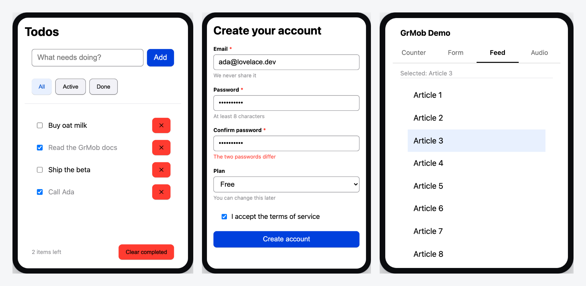
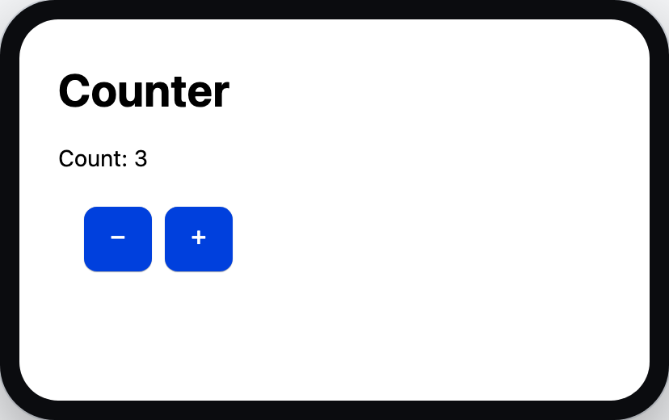
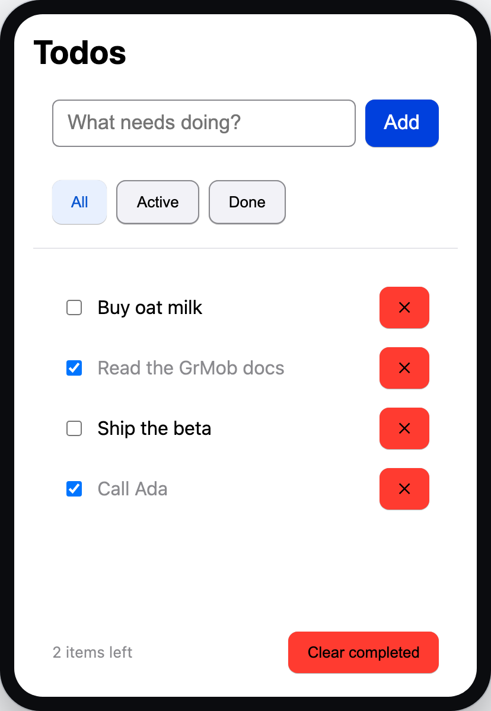
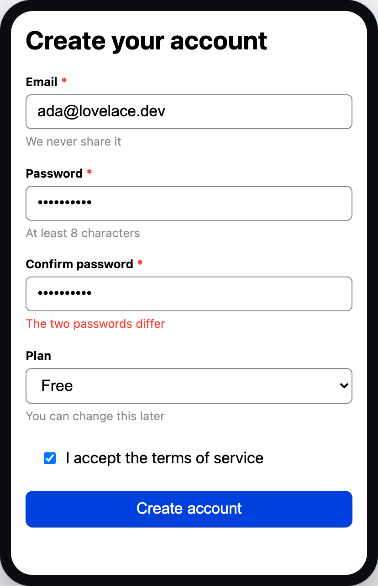
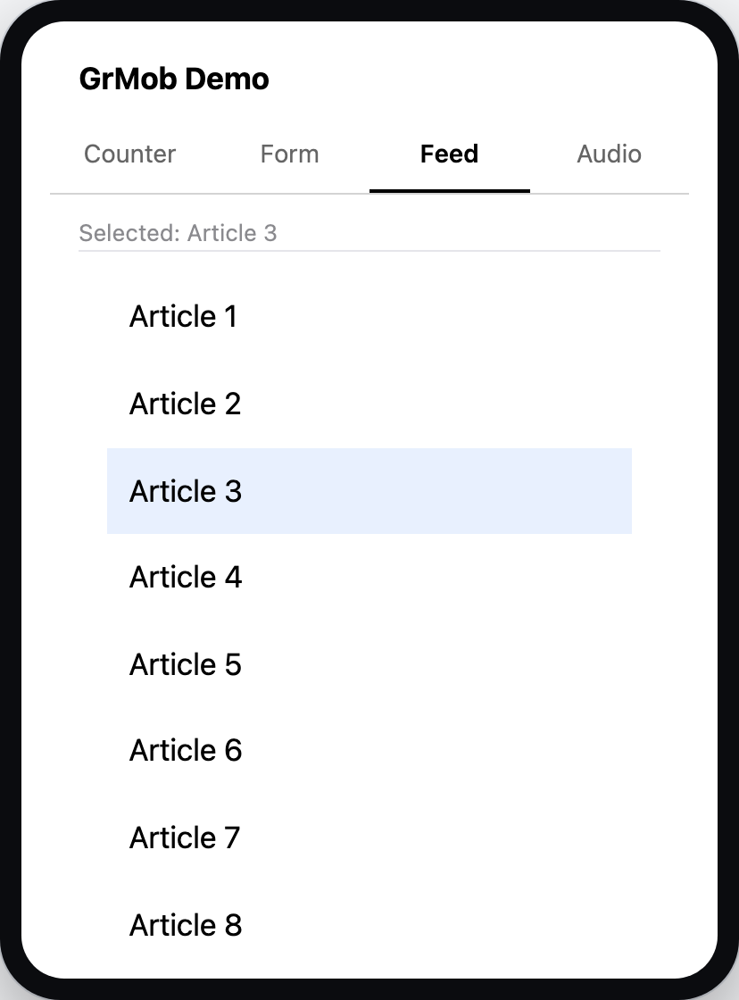
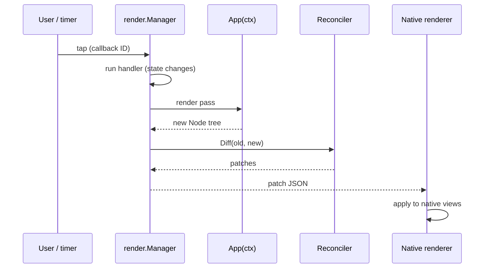
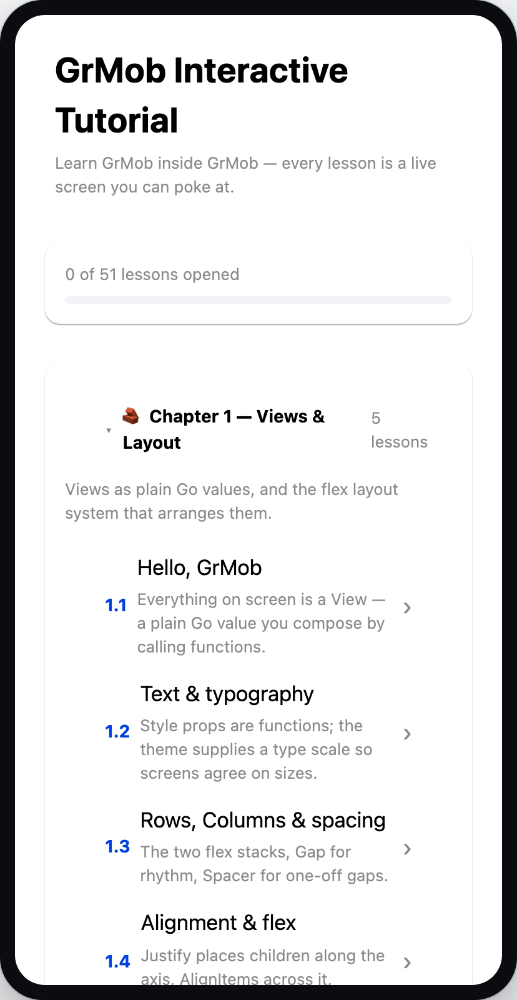
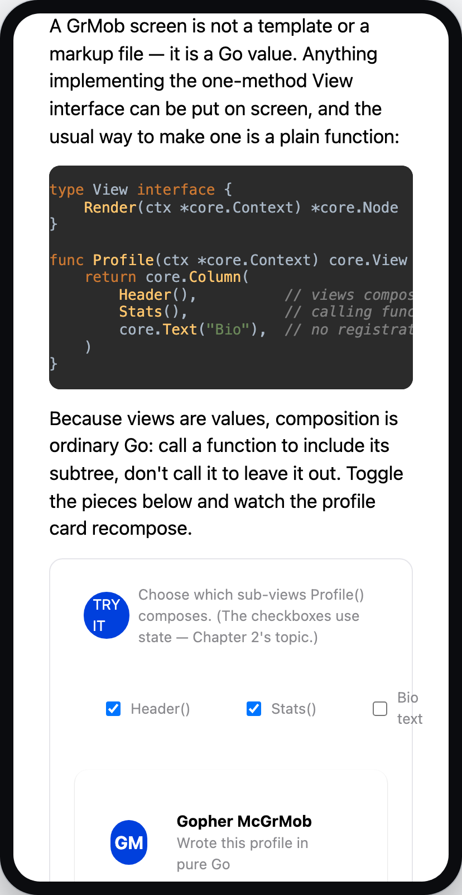

# GrMob

**Native mobile apps in pure, idiomatic Go.**

You write views, state and logic as ordinary Go functions. GrMob renders them
as real native components — Jetpack Compose on Android, SwiftUI on iOS — and
the same code runs in the browser through WebAssembly. There is no template
language, no JavaScript, no manual bridge to wire up.

<p align="center">
  
</p>

<p align="center">
  <em>Every screenshot in this README is a real GrMob app — the examples in this repository, driven through the same event path a finger takes and captured from the browser build. <code>wasm/shots</code> re-takes them; <code>internal/shotclaims</code> is what holds them to still being true.</em>
</p>

---

## Your first app

A GrMob app is a function from a context to a view. That is the whole idea —
here is a complete, working screen, and it is a real package in this
repository rather than a snippet: [`examples/counter`](examples/counter).

```go
// examples/counter/app.go
package counter

import (
    "fmt"

    "github.com/rohanthewiz/grmob/core"
)

func App(ctx *core.Context) core.View {
    count := core.NewState(ctx, 0)

    return core.SafeArea(
        core.Column(
            core.Gap(12),
            core.Padding(24),
            core.Text("Counter", core.FontSize(28), core.FontWeight(core.Bold)),
            core.Text(fmt.Sprintf("Count: %d", count.Get())),
            core.Row(
                core.Gap(8),
                core.Button("−", func() { count.Set(count.Get() - 1) }),
                core.Button("+", func() { count.Set(count.Get() + 1) }),
            ),
        ),
    )
}
```

<p align="center">
  
</p>

Three things are worth noticing, and they carry most of the framework:

1. **Views are values.** `core.Column(...)` returns a value; composing a screen
   is calling functions. To include a subtree, call the function that builds
   it; to leave it out, don't.
2. **`App` runs again on every render pass.** It reads state, builds a tree and
   returns. It never mutates the screen directly and must not block — that is
   what [hooks](docs/concepts/state-and-hooks.md) are for.
3. **`count.Set` is the entire update path.** Setting state marks the tree
   dirty; GrMob re-renders, diffs the new tree against the old, and sends only
   the differences to whichever renderer is attached.

To put that screen on a phone, one `init` registers it — that is the whole
integration contract, and the native shells and the browser host both use it.
The rest of `examples/counter/app.go` is these two declarations:

```go
func init() {
    mobile.Register(core.NewContext(), App)
}

// AppName gives gomobile a bindable symbol so this package links in.
func AppName() string { return "Counter" }
```

---

## Run it

GrMob is a Go module and needs Go 1.26+.

```bash
go get github.com/rohanthewiz/grmob
```

The fastest way to see a GrMob app is the browser build — no simulator, no
device, no npm:

```bash
./build.sh        # compiles the app to wasm/main.wasm
go run ./serve    # serves it on http://localhost:8080
```

While you are writing code, use the dev server instead. It rebuilds on every
save and hot-swaps the new module into the open page without a reload, keeping
your place on screen; a compile error shows as an overlay until the next good
build:

```bash
go run ./serve -dev
```

---

## A tour in three screens

### Lists, filters and derived state

The todo app is the first one that looks like a real app. State lives in the
root view; rows are pure functions of their data.

```go
// A controlled input: the value goes in, changes come out. The keyboard's
// return key and the Add button are two paths into the same handler.
components.InputRow{
    Value:       draft.Get(),
    Placeholder: "What needs doing?",
    OnChange:    func(v string) { draft.Set(v) },
    OnSubmit:    addTodo,
    Button:      components.Button{Label: "Add"},
},

// The list is virtualized — LazyColumn on Android, LazyVStack on iOS — so it
// stays cheap however long it grows. Rows are keyed by todo ID rather than by
// index, so inserting or deleting keeps the remaining rows intact.
core.List(
    core.FlexGrow(1),
    core.For(visible, func(t Todo, _ int) core.View {
        return todoRow(t, setDone, removeTodo)
    }),
)
```

<p align="center">
  
</p>

Nothing here refreshes the UI by hand. `visible` and the "2 items left" count
are recomputed from the todo list on every pass instead of being stored, so
they cannot drift out of sync with it. The full app is
[`examples/todoapp`](examples/todoapp), and
[Building a Todo App](docs/tutorial-todo.md) walks through it line by line.

### Forms that validate themselves

Validation is declared, not scattered through handlers. A form spec names its
fields, their rules, and *when* a complaint is allowed to appear:

```go
form := forms.UseForm(ctx, forms.Spec{
    // Each field explains itself once the user is done with it, and every
    // field speaks up on a submit attempt.
    Reveal: forms.RevealOnBlur,
    Fields: []forms.Field{
        {Name: "email", Rules: []forms.Rule{
            forms.Required("We need an address to reach you"),
            forms.Email(""), // "" takes the rule's own default message
        }},
        {Name: "password", Rules: []forms.Rule{
            forms.Required(""),
            forms.MinLen(8, "Use at least 8 characters"),
        }},
        {Name: "confirm", Rules: []forms.Rule{forms.Required("")}},
        {Name: "terms", Rules: []forms.Rule{
            forms.Accepted("Please accept the terms to continue"),
        }},
    },
    // The one check no single field can make, because it has to see another.
    Validate: func(v forms.Values) map[string]string {
        if v["confirm"] != v["password"] {
            return map[string]string{"confirm": "The two passwords differ"}
        }
        return nil
    },
})
```

<p align="center">
  
</p>

The reveal policy is the part worth dwelling on: `RevealOnTouch` would call an
address invalid two characters in, and the default `RevealOnSubmit` makes
someone fill in four fields before hearing about the first. See
[`examples/signup`](examples/signup) and
[Forms & Validation](docs/concepts/forms.md).

### Tabs, widgets and native lists

`components` is a widget library built on `core` — buttons, cards, chips,
tabs, accordions, form fields and more — so you are not hand-rolling a card
before you can build a screen.

```go
core.TabView(
    core.SelectedIndex(tab.Get()),
    core.OnTabChange(func(i int) { tab.Set(i) }),
    core.Tabs(
        core.Tab("Counter", ""),
        core.Tab("Form", ""),
        core.Tab("Feed", ""),
        core.Tab("Audio", ""),
    ),
    core.Content(counterTab(), formTab(), feedTab(), audioTab()),
)
```

<p align="center">
  
</p>

The tab strip is drawn by the renderer, not by your tree, so it looks and
behaves like the platform's own. This demo is
[`examples/mobileapp`](examples/mobileapp); the whole catalogue is in
[the widget library](docs/components.md).

---

## Conditional rendering

Because views are values, showing one thing or another is ordinary Go — but
`If`, `IfElse`, `Match` and `When` say it without breaking the flow of a tree:

```go
core.If(user.Get() != "", core.Text("Welcome, "+user.Get()))

core.IfElse(isLoading.Get(),
    core.Text("Loading..."),
    core.Text("Ready"),
)

core.Match(status.Get(),
    core.Case("success", core.Text("✅ Success")),
    core.Case("error", core.Text("❌ Error")),
    core.Default[string](core.Text("ℹ️ Idle")),
)

core.MatchBool(
    core.When(user.Get() == "", core.Text("👋 Welcome Guest")),
    core.When(user.Get() == "admin", core.Text("🛠️ Admin Panel")),
    core.Otherwise(core.Text("Logged in as "+user.Get())),
)
```

`MaybeProp` does the same job for a single optional child, style prop or
handler inside a container's argument list.

---

## Events

Any element can carry a callback, through the generic `On` helper or the
`ButtonWithEvent` constructor:

```go
core.Column(
    core.Text("Tap the box"),
    core.On("Click", func() { fmt.Println("Column clicked") }),
)

core.ButtonWithEvent("Hold", "TouchStart", func() {
    fmt.Println("Button touched")
})
```

Events and hardware calls need no manual bridge setup. See
[Events & Callbacks](docs/concepts/events.md).

---

## How a tap becomes a pixel



Every arrow has a page of its own:
[Architecture](docs/concepts/architecture.md) for the whole pipeline,
[Events & Callbacks](docs/concepts/events.md) for the dispatch path,
[Reconciliation](docs/concepts/reconciliation.md) for the diff.

---

## One app, four targets

Renderers turn the abstract `Node` tree into real UI and apply the
reconciler's patches to keep it current.

| Target | Renderer |
| --- | --- |
| **Android** | Jetpack Compose (`android/`) |
| **iOS** | SwiftUI (`ios/`) |
| **Browser** | the DOM, via WebAssembly and `wasm/grmob-runtime.js` |
| **HTML export** | `htmlout`, for previews and byte-for-byte snapshot tests |

Both native shells take an app package as their argument — any package whose
`init` calls `mobile.Register` drops in, and the examples all do:

```bash
go install golang.org/x/mobile/cmd/gomobile@latest golang.org/x/mobile/cmd/gobind@latest
gomobile init

android/build.sh ./examples/todoapp   # -> android/app/libs/grmob.aar
ios/build.sh ./examples/todoapp       # needs full Xcode; produces the xcframework
```

Then open `android/` in Android Studio, or the Xcode project under `ios/`.
The full walkthrough, including the bridge contract the shells implement, is
in [Native Android & iOS](docs/platforms/native.md).

---

## What's in the box

- **Declarative views** — compose with pure functions and fluent props
- **State & hooks** — `NewState`, `UseInterval`, `UseTimeout`, `UseEffect`,
  `UseMemo`, `UseReducer`, `UsePermission`
- **Styling & theming** — functional styling, centralized design tokens,
  inheritance
- **Widget library** — `components`: buttons, cards, chips, tabs, accordions,
  form fields
- **Forms** — validation rules, cross-field checks, reveal policies, server
  errors
- **Navigation** — a `Navigator` with modals and toasts
- **Permissions** — camera, microphone, location and the media store
- **Reactive runtime** — diffing engine with `patch` and `mount`, dirty-flag
  detection, cached subtrees
- **Robustness** — error boundaries and a zero-cost debug mode
- **WebAssembly** — the same app in the browser

### The source tree

- `core/` – Node, View, Context, State, Style, theming, navigation, focus, error boundaries, debug mode
- `hooks/` – `UseInterval`, `UseTimeout`, `UseEffect`, `UseMemo`, `UseReducer`
- `components/` – the widget library built on `core`
- `forms/` – form state and validation
- `permission/` – ask the platform for the camera, the microphone, location or the media store
- `reconcile/` – the diff engine that turns two trees into a patch list
- `render/` – the render manager: passes, dirty tracking, callback dispatch, patch pumping
- `mobile/` – the gomobile-bindable bridge the native shells talk to
- `android/`, `ios/`, `wasm/` – the Compose, SwiftUI and WebAssembly hosts
- `htmlout/`, `jsonout/` – exporters for previews, snapshot tests and tooling
- `examples/` – complete apps, including the interactive tutorial and the todo app

---

## Developing with GrMob

- Drive the whole engine from a plain Go test: `render.New` → `RenderInitial`
  → `DispatchCallback`. No simulator, no browser.
- Snapshot views as HTML with `htmlout` and pin them byte for byte.
- Inspect any render's patch set directly: `reconcile.Diff` returns plain
  `[]Patch` values, and `RenderAgain` / `TriggerCallback` hand the same set
  back as JSON.
- Turn on debug mode in development builds: it flags cursor drift, duplicate
  keys, unknown items and panics, and costs nothing when off.

Every renderer has a verify harness that replays the Go engine's own patch
transcripts against it, so all the targets stay in step:

```bash
go test ./...            # the engine, the exporter and every source pin
wasm/verify/run.sh       # the JS runtime, replayed — plus a headless-Chrome
                         #   pass for the four keyboard facts a shimmed DOM
                         #   cannot answer
ios/verify/run.sh        # the Swift data layer, replayed and type-checked
android/verify/run.sh    # the Kotlin decomposition, on a plain JVM
```

None of them needs a simulator, a device, npm or the network; each skips
rather than fails when the toolchain it wants is not installed.

One optional step does use the network, and nothing above depends on it. The
ARIA facts every accessibility guard is held to live in one generated fixture,
`aria/verify/testdata/aria.json`, produced from the W3C specification's own
machine-readable role definitions:

```bash
sh aria/fetch.sh         # the published spec — 1.4MB, deliberately not committed
go run ./aria/gen        # -> aria/verify/testdata/aria.json
```

The fixture is committed, so `go test ./...` reads it and never fetches
anything; the test that holds it to the specification skips when no download
is present. Generating it the first time corrected four facts that had been
hand-transcribed and that no test could contradict — see `aria/verify/doc.go`.

---

## Next: the full tutorial

<p align="center">
  
  &nbsp;&nbsp;
  
</p>

This README is the short version. The real introduction is the
**[interactive tutorial](docs/tutorial-interactive.md)** — a GrMob app that
teaches GrMob, in 51 lessons across 8 chapters. Every lesson is a live screen:
the explanation, the code under discussion, and a "TRY IT" panel wired to real
state and callbacks, from your first `Column` through theming, navigation and
error boundaries.

**Run it in your browser, right now:** <https://rohanthewiz.github.io/grmob/>

Or run it locally from [`examples/tutorial`](examples/tutorial):

```bash
go run ./serve -dev
```

| Chapter | Lessons | |
| --- | --- | --- |
| 1 — Views & Layout | 5 | Views as plain Go values, and the flex layout system |
| 2 — State, Events & Lists | 6 | `NewState`, callbacks, keyed and virtualized lists |
| 3 — Hooks & Effects | 5 | Timers, effects, memos and reducers |
| 4 — The Widget Library | 14 | Everything in `components`, screen by screen |
| 5 — Forms & Validation | 6 | Rules, cross-field checks and reveal policies |
| 6 — Navigation & Overlays | 5 | The `Navigator`, modals and toasts |
| 7 — Theming & Styling | 5 | Tokens, themes and style inheritance |
| 8 — Robustness | 5 | Error boundaries, debug mode and cached subtrees |

After that, [Building a Todo App](docs/tutorial-todo.md) is the in-depth,
start-to-finish walkthrough: the rules of hooks, controlled inputs with
Enter-to-submit, the virtualized keyed `List`, theming pitfalls, accessibility,
testing at three levels, and shipping the same Go code to the iOS simulator and
the Android emulator.

The rest of the documentation lives in [`docs/`](docs), starting with
[Getting Started](docs/getting-started.md).

---

## 📃 License

MIT License © 2026 Rohan Allison · © 2025 Ismael Matsinhe
