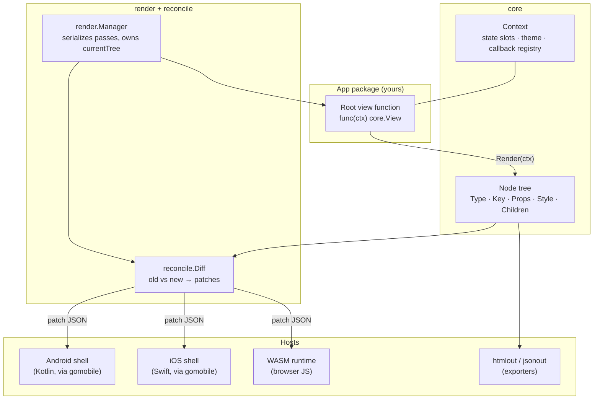
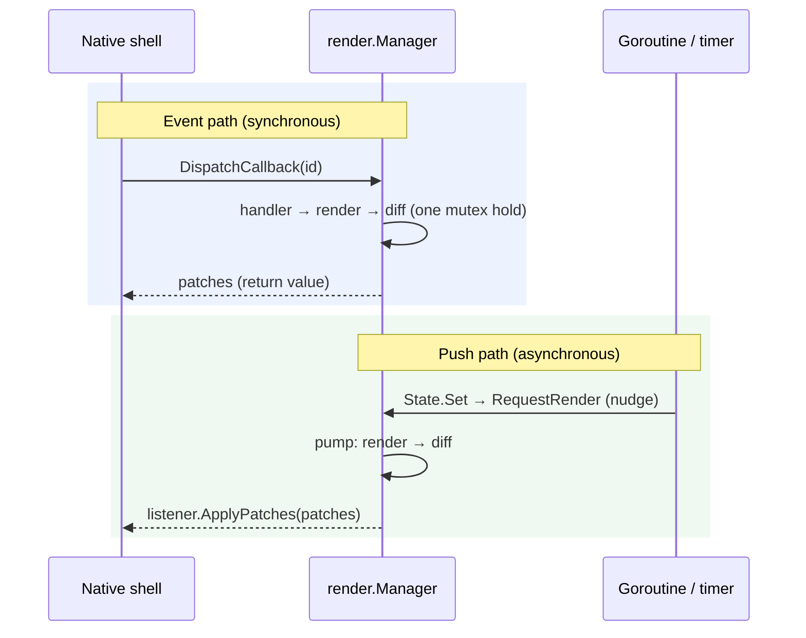

# Architecture

GrMob is a **build-then-diff** system: every render pass builds a fresh tree
of `Node` values, the reconciler diffs it against the previous tree, and only
the differences travel to the renderer. This page walks the pipeline from a
view function to pixels.

## The pieces



| Package | Role |
|---|---|
| `core` | The vocabulary: `View`, `Node`, `Context`, state, styles, themes, widgets, events, navigation |
| `reconcile` | `Diff(old, new, path)` — computes the patch set between two trees |
| `render` | `Manager` — drives render passes, serializes them, pushes async diffs |
| `hooks` | `UseEffect`, `UseInterval`, `UseTimeout` — side effects bound to hook slots |
| `components` | Struct-configured widget library built on the public core API |
| `mobile` | The gomobile-bindable bridge surface for the native shells |
| `wasm` | The browser runtime entry point |
| `htmlout`, `jsonout` | Tree exporters for previews, tests, and tooling |

## A render pass

`render.Manager` owns the pass. Every pass has the same boundary sequence,
whichever host triggered it:

1. **`BeginRenderPass`** — callback ID counters restart at zero, so an
   unchanged UI re-registers identical IDs (see
   [Events & Callbacks](events.md)).
2. **`Reset`** — every context's hook cursor returns to zero, so `NewState`
   calls re-bind to their slots (see [State & Hooks](state-and-hooks.md)).
3. **Render** — the root view function runs and returns a fresh `*Node` tree.
4. **`EndRenderPass`** — in [debug mode](debug-mode.md), hook usage is audited.
5. **`Diff`** — the new tree is compared with `currentTree`; patches out.
6. **`PurgeUnusedCallbacks`** — handlers for nodes that left the tree are dropped.

The `Node` is deliberately small:

```go
type Node struct {
    Type     string         // "Text", "Button", "Column", ...
    Key      string         // optional identity for keyed reconciliation
    Props    map[string]any // content, callback IDs, widget config
    Style    *Style
    Children []*Node
}
```

**Nodes are frozen once their render pass returns them.** Builders may
assemble a node freely while constructing it, but afterwards nothing may
write to it — the reconciler and the renderers only read. This immutability
contract is what makes [caching](caching.md) sound: `core.Cached` returns the
same pointer every pass, and `Diff` treats pointer equality as proof the
subtree is unchanged.

## Two paths to the screen

Patches reach a renderer on exactly one of two paths per pass:



- **Event path** — the shell calls a `Dispatch*` method; the handler and its
  follow-up render run under the manager's mutex, and the diff comes back as
  the return value. An event can never interleave with another pass.
- **Push path** — any goroutine calling `State.Set` (a timer tick, a network
  response) nudges the manager's pump through a buffered channel of size 1.
  Bursts coalesce: N rapid writes produce one render of the settled state.
  The diff is pushed to the registered `PatchListener`; native
  implementations hop to their UI thread before touching views.

A no-change render serializes as `[]`, and empty patch sets are never pushed.

## Positional identity

Patch targets are slash-delimited positional paths (`"root/0/2"`), and
callback IDs are per-pass sequence numbers (`"cb_3"`). Both share the same
stability granularity: an unchanged UI produces identical paths and IDs each
pass, while a structural change shifts later siblings — and the same nodes
get patches the positional differ would emit anyway. Identity-based node IDs
(enabling true move patches) are planned; see
[Reconciliation](reconciliation.md) for the current keyed-slot semantics.

## Lifecycle and cleanup

`render.Manager.Close()` is the one shutdown entry point: it stops the push
pump and closes the app's context tree, which runs every `ctx.OnClose`
cleanup — interval tickers, pending timeouts. Hosts that replace an app
(`mobile.Register` called again, the WASM runtime re-mounting) close the old
manager first, so background work can never keep rendering into a dead tree.
