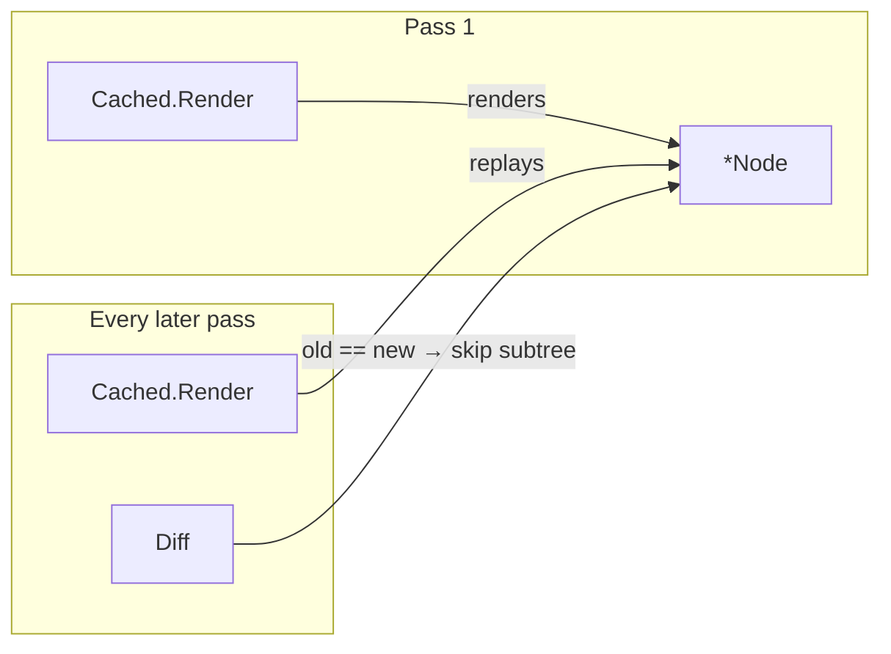

# Caching

`core.Cached` wraps a view so it renders **exactly once**; every later pass
returns the same `*Node` pointer. The payoff is in the reconciler: `Diff`
short-circuits on pointer equality, so a cached subtree costs zero re-render
*and* zero diff work per pass — a static nav bar or footer drops out of the
per-frame budget entirely.

```go
// Package level — constructed once, reused every pass.
var appHeader = core.Cached(core.Text("My App",
    core.FontSize(20), core.FontWeight(core.Bold)))

func App(ctx *core.Context) core.View {
    return core.Column(
        appHeader,      // free after the first pass
        contentFor(ctx),
    )
}
```



## Construct it once

The wrapper must be built **once** and reused across passes — typically a
package-level `var`. Constructing it inside a render body is a silent no-op:
the render body runs on every pass, so a `Cached` built there is a fresh
wrapper each time and caches nothing.

## What may be cached

A cached view renders on pass 1 and never again, so it must be a **pure
function of its construction arguments**:

1. **No hooks** (`NewState`, `UseChildContext`, `hooks.*`). Hooks advance
   the parent context's slot cursor positionally; a view that consumes slots
   on pass 1 but not pass 2 shifts every later component's slots.
2. **No callbacks** — no `Button`/`Input`/`Checkbox`, no
   `OnClick`/`OnChange` behavior props, nothing interactive. Callback IDs
   are per-pass sequence numbers; a cached subtree with callbacks both loses
   its own handlers (purged after the first skipped pass) and shifts the IDs
   of everything registered after it.
3. **No values that change between passes.** The first render's context —
   theme included — is baked into the node forever; a theme switch will not
   reach a cached subtree.
4. **Nothing may mutate the node after render** — the framework-wide Node
   contract; `Cached` merely raises the stakes, since the same pointer is
   the reconciler's "unchanged" evidence.

Rules 1 and 2 are enforced: with [debug mode](debug-mode.md) on, `Cached`
re-renders fresh every pass and flags hook slots or callback registrations
escaping through a cached render as concerns
(`cached-hooks`, `cached-callbacks`).

!!! tip "When to reach for it"
    Treat `Cached` as a profiling response, not a default. The build-then-diff
    pass is cheap; cache the static header when per-frame allocation or diff
    time actually shows up. `examples/mobileapp`'s `appHeader` is the living
    example.

Concurrent renders are safe: the single underlying render is serialized and
published with `sync.Once`, so every caller observes the fully built node.
