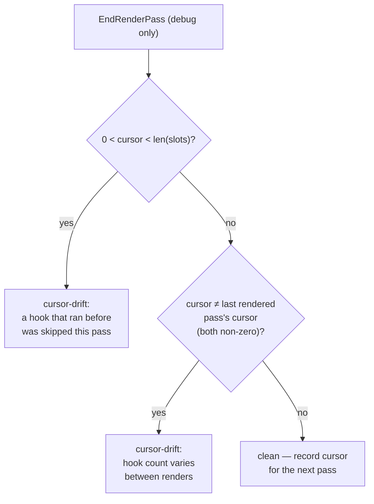

# Debug Mode

Positional hooks and positional reconciliation make a class of bugs
*silent*: nothing errors, the UI just misbehaves — state bleeds between
components, list rows swap identities. Debug mode turns those into detected,
reportable findings.

```go
core.SetDebugMode(true)     // flip once at startup in development builds
defer core.SetDebugMode(false)
```

The flag is process-wide and **zero-cost when off** — every check site guards
with a single atomic load.

## Concerns

Findings are recorded as **concerns**, deduplicated by kind + detail with a
count (checks run every pass, so a persistent bug increments one entry
rather than flooding):

```go
for _, c := range core.Concerns() { ... }   // sorted snapshot, for tests
fmt.Print(core.DumpConcerns())              // human-readable block
core.ClearConcerns()
```

```text
grmob debug: 2 concern(s)
  [cursor-drift] ×14 context 0xc0001a2000 ended the pass at cursor 1 with 2 slots allocated: ...
  [duplicate-key] ×14 Column has multiple children with key "row": ...
```

## What is checked

| Kind | Detects | The silent failure it prevents |
|---|---|---|
| `cursor-drift` | A context whose hook usage is inconsistent between passes | A conditional/loop-varying `NewState` shifting every later slot — state bleed |
| `duplicate-key` | Two siblings in one container with the same non-empty `Key` | Keyed reconciliation matching the wrong rows — identity attached to the wrong data |
| `cached-hooks` | A `core.Cached` view consuming hook slots | The cache stops consuming slots after pass 1, shifting later components |
| `cached-callbacks` | A `core.Cached` view registering callbacks | Purged handlers + shifted callback IDs for everything after the cached subtree |
| `unknown-container-item` | An argument to `Row`/`Column`/`Card`/`Box`/`List` that is neither a `StyleProp`, a `BehaviorProp` nor a `View` | `PropsAndChildren` is `any`, so a bare `core.Style` where `core.UseStyle(style)` was meant compiles and is silently dropped — a style that never took effect. A `nil` is exempt: that is [`MaybeProp`](views.md#one-optional-item-maybeprop)'s false path |
| `render-panic` | An [`ErrorBoundary`](error-boundaries.md) caught a panic and swapped in its fallback | The app kept running, which is the problem: a boundary high in the tree can hide a component that has been dead for weeks behind a plausible "unavailable" panel |
| `handler-panic` | An event handler panicked and `render.Manager` recovered it | Same silence, different phase — and a worse blast radius, since the handler was abandoned partway and app state may be half-updated |
| `duplicate-accessibility-id` | Two elements in one tree with the same `AccessibilityID` | Ids are document-global and nothing rewrites them, so the document is invalid and every `aria-controls` pointing there resolves to whichever the browser parsed first — a tab strip switching the wrong region, with nothing anywhere reporting it |
| `dangling-aria-reference` | An `AccessibilityControls` naming an id no element claims | Both exporters write the attribute anyway (an export has no index of its document; a patch is one element), so a reader following it announces a control that governs nothing — which sounds exactly like a control |
| `invalid-accessibility-id` | An `AccessibilityID` containing whitespace, or starting with the reserved `grmob-` prefix | An id is a single HTML token, so `"app panel"` is written verbatim into an invalid document that no `#id` selector or `getElementById` can find; and the prefix is where `core.TabView` mints its own tab and panel ids, so a collision breaks a wiring the app never wrote and never mentions |
| `inert-disclosure` | An `AccessibilityExpanded` on a node carrying neither `OnClick` nor `OnLongPress` | Compose says a disclosure with `expand()`/`collapse()` **actions**, which need a handler to perform, so the state is announced on both web targets and is silently nothing on Android. That is deliberate — an action nothing can perform is worse than none — and this is what says so at the call site |
| `partial-sort` | A `components.DataTable` sorting client-side (its active `Sort` names a column with a `Less`) while its `Pagination` declares a `PageCount` — the caller saying the server chose the rows | The table can only order the window it holds, so a header claiming an ordering over the table delivers one over a page of it. A partial sort looks exactly like a working sort; the rows that disprove it are the ones not fetched. Set `Sortable` without `Less` and put the sort in the query |

### Cursor drift, precisely

At the end of each render pass (`render.Manager` calls
`Context.EndRenderPass()` for you), every context in the tree is audited
with two comparisons:



The first comparison catches a *skipped* hook (slots only grow, so a cursor
stopping short means trailing slots went unread). The second catches the
*growth* direction, where an appearing hook appends its slot and the counts
line up — only the pass-over-pass cursor change reveals it. The non-zero
guards are deliberate: a `Scope` that renders on some passes and sits out
others (the navigation pattern) is **not** drift, and is never flagged.

### Duplicate keys

Checked at the single choke point every container's children pass through,
so the concern names the container (`Column`, `For`, `List` via its
container type, `Modal`, `TabView`, ...) and the offending key. Empty keys
never collide.

### Unknown container items

`Row`, `Column`, `Card`, `Box` and `List` take `...core.PropsAndChildren`,
which is an alias for `any` — the compiler will hand them literally anything,
and `containerNode` drops whatever it cannot classify as a `StyleProp`, a
`BehaviorProp` or a `View`. Nothing fails; the property just never appears.
Debug mode names the container and the Go type that was dropped:

```
[unknown-container-item] ×3 Row: argument of type core.Style is not a
StyleProp, BehaviorProp or View and was ignored
```

The usual causes are a bare `core.Style` in place of `core.UseStyle(style)`, a
`core.WhenClause` that never reached `MatchBool`, and a `*core.Node` where a
`core.View` was wanted.

An untyped `nil` is deliberately **not** reported: that is
[`core.MaybeProp`](views.md#one-optional-item-maybeprop)'s false path, and
dropping it is the point.

### The accessibility audit

The four accessibility kinds come from one walk of the **finished tree**, run by
`render.Manager` beside the cursor audit (`core.AuditTree`, which a hand-rolled
pass loop should call with the tree it just rendered).

A walk, rather than a guard in the exporters, because three of the four are
facts about *relationships between elements* and no renderer can see one:
`htmlout` writes an id as it walks past the node carrying it and has no index of
the document it is building, and the WASM runtime applies a patch to one element
and has no index at all. Both say so in their own comments — "a dangling IDREF
is inert" — and both are right that they cannot do better from where they sit.

The line for what belongs here is "would a reader be told something false, with
nothing anywhere saying so". Everything else in ARIA that this vocabulary can
express is already caught where it is written: a state on a role that cannot
carry it is dropped by both exporters *by design* and documented at each guard,
and a structural role over foreign children is a judgement about content that no
walk can make.

### Cached bypass

With debug mode on, `core.Cached` **bypasses its cache** and re-renders
fresh every pass — the same move element's `Cached` makes — so the checks
see the real subtree. The bypass also measures the two `Cached` constraint
violations directly, by sampling the hook cursor and the callback counters
around the render. Note the flip side: under the bypass the violations are
*reported* rather than *exhibited* — an app that only misbehaves with debug
mode **off** has likely tripped exactly these concerns.

## Using it in tests

Concerns are assertable, which makes hook-discipline regressions testable:

```go
func TestNoHookDrift(t *testing.T) {
    core.ClearConcerns()
    core.SetDebugMode(true)
    defer core.SetDebugMode(false)

    mgr := render.New(core.NewContext(), myapp.App)
    defer mgr.Close()
    mgr.RenderInitial()
    mgr.DispatchCallback("cb_0") // drive some passes
    mgr.RenderAgain()

    if cs := core.Concerns(); len(cs) != 0 {
        t.Fatalf("debug concerns raised:\n%s", core.DumpConcerns())
    }
}
```

Hosts that drive render passes by hand (no `render.Manager`) should call
`ctx.EndRenderPass()` after each render, paired with
`ctx.BeginRenderPass()` / `ctx.Reset()` before it, to get the cursor audit.
