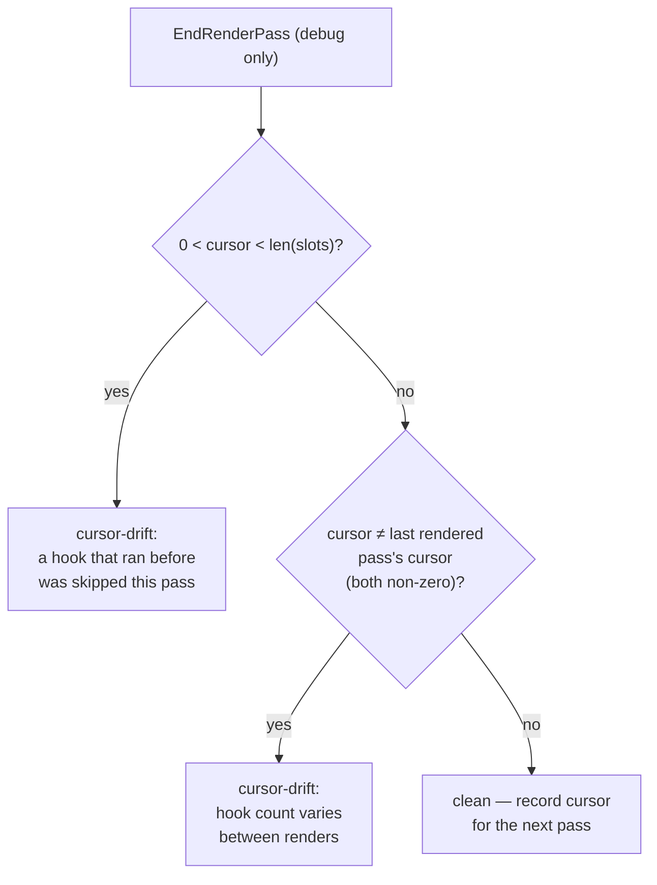

# Debug Mode

Positional hooks and positional reconciliation make a class of bugs
*silent*: nothing errors, the UI just misbehaves — state bleeds between
components, list rows swap identities. Debug mode turns those into detected,
reportable findings.

```go
core.SetDebugMode(true)     // flip once at startup in development builds
defer core.SetDebugMode(false)
```

The flag is process-wide and **zero-cost when off** — every check site guards
with a single atomic load.

## Concerns

Findings are recorded as **concerns**, deduplicated by kind + detail with a
count (checks run every pass, so a persistent bug increments one entry
rather than flooding):

```go
for _, c := range core.Concerns() { ... }   // sorted snapshot, for tests
fmt.Print(core.DumpConcerns())              // human-readable block
core.ClearConcerns()
```

```text
grmob debug: 2 concern(s)
  [cursor-drift] ×14 context 0xc0001a2000 ended the pass at cursor 1 with 2 slots allocated: ...
  [duplicate-key] ×14 Column has multiple children with key "row": ...
```

## What is checked

| Kind | Detects | The silent failure it prevents |
|---|---|---|
| `cursor-drift` | A context whose hook usage is inconsistent between passes | A conditional/loop-varying `NewState` shifting every later slot — state bleed |
| `duplicate-key` | Two siblings in one container with the same non-empty `Key` | Keyed reconciliation matching the wrong rows — identity attached to the wrong data |
| `cached-hooks` | A `core.Cached` view consuming hook slots | The cache stops consuming slots after pass 1, shifting later components |
| `cached-callbacks` | A `core.Cached` view registering callbacks | Purged handlers + shifted callback IDs for everything after the cached subtree |

### Cursor drift, precisely

At the end of each render pass (`render.Manager` calls
`Context.EndRenderPass()` for you), every context in the tree is audited
with two comparisons:



The first comparison catches a *skipped* hook (slots only grow, so a cursor
stopping short means trailing slots went unread). The second catches the
*growth* direction, where an appearing hook appends its slot and the counts
line up — only the pass-over-pass cursor change reveals it. The non-zero
guards are deliberate: a `Scope` that renders on some passes and sits out
others (the navigation pattern) is **not** drift, and is never flagged.

### Duplicate keys

Checked at the single choke point every container's children pass through,
so the concern names the container (`Column`, `For`, `List` via its
container type, `Modal`, `TabView`, ...) and the offending key. Empty keys
never collide.

### Cached bypass

With debug mode on, `core.Cached` **bypasses its cache** and re-renders
fresh every pass — the same move element's `Cached` makes — so the checks
see the real subtree. The bypass also measures the two `Cached` constraint
violations directly, by sampling the hook cursor and the callback counters
around the render. Note the flip side: under the bypass the violations are
*reported* rather than *exhibited* — an app that only misbehaves with debug
mode **off** has likely tripped exactly these concerns.

## Using it in tests

Concerns are assertable, which makes hook-discipline regressions testable:

```go
func TestNoHookDrift(t *testing.T) {
    core.ClearConcerns()
    core.SetDebugMode(true)
    defer core.SetDebugMode(false)

    mgr := render.New(core.NewContext(), myapp.App)
    defer mgr.Close()
    mgr.RenderInitial()
    mgr.DispatchCallback("cb_0") // drive some passes
    mgr.RenderAgain()

    if cs := core.Concerns(); len(cs) != 0 {
        t.Fatalf("debug concerns raised:\n%s", core.DumpConcerns())
    }
}
```

Hosts that drive render passes by hand (no `render.Manager`) should call
`ctx.EndRenderPass()` after each render, paired with
`ctx.BeginRenderPass()` / `ctx.Reset()` before it, to get the cursor audit.
