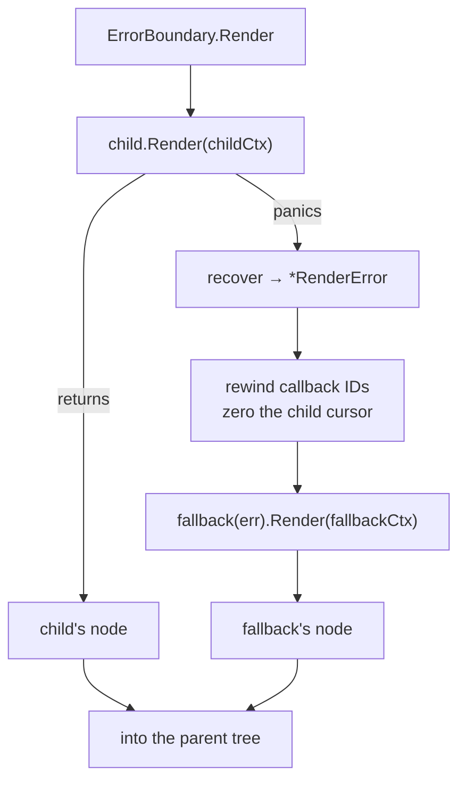

# Error Boundaries

A panic inside a component's `Render` used to be fatal. Render passes run on
the native event thread with a bridge call in flight, so the panic unwinds
straight out through JNI (Android) or cgo (iOS) and takes the **whole process**
with it — one bad index in one panel kills the app.

`core.ErrorBoundary` contains the damage to the subtree that caused it.

```go
core.ErrorBoundary(
    ProfilePanel(user),
    func(err error) core.View {
        log.Printf("profile panel failed: %v", err)
        return core.Text("Profile unavailable")
    },
)
```

`core.SafeRender(child)` is the same thing with the built-in fallback, for when
you only want the subtree to survive and have no opinion about what replaces
it.



## The fallback is also your notification hook

`ErrorBoundary` logs nothing itself. The fallback receives the full
`*RenderError` — panic value **and** the stack captured at the recover, which
still names the frame that panicked — and is the intended place to log, report
to a crash service, or degrade gracefully.

```go
type RenderError struct {
    Value any    // exactly what was passed to panic()
    Stack []byte // debug.Stack() from inside the recover
}
```

`Unwrap` exposes the panicked value when it is an error, so a fallback can
branch on it instead of string-matching a message:

```go
func(err error) core.View {
    if errors.Is(err, ErrOffline) {
        return OfflineBanner()
    }
    return core.Text("Something went wrong")
}
```

One caveat about "notification hook": the fallback is called on **every pass**
in which the child fails. A component that panics deterministically panics
again next frame, so a fallback that logs unconditionally logs at frame rate.
Rate-limit, or place the boundary high enough that failures are rare.

## It does not latch

React's error boundaries stay in the fallback until explicitly reset, because
there the failed subtree's component instances are unrecoverable. Nothing of
the sort is true here — grmob rebuilds the tree from scratch every pass, so a
child that panicked on a stale slice index simply renders normally on the next
pass once state settles.

The boundary therefore **retries every pass and heals on its own**. Latching
would turn a one-frame glitch into a permanently dead panel, which is worse
than the repeated-panic case above.

## What it repairs

A panic partway through a render leaves two pieces of per-pass bookkeeping
half-advanced. Both are *positional*, so leaving them where they fell would
corrupt components that have nothing to do with the failure:

| bookkeeping | left alone | symptom |
|---|---|---|
| hook slots | parent `ctx.Cursor` sits between the child's hooks | every later sibling reads the wrong slots — sibling state visibly swaps |
| callback IDs | the registry counters sit past the handlers the child managed to register | every later sibling's IDs shift; taps land on the wrong handler |

**Hook slots** are handled structurally rather than by rollback. The boundary
claims *two* child contexts — one for the child, one for the fallback — and
renders into those. A panic can then only strand a cursor inside the child's
own context, and the boundary occupies exactly two parent slots whether the
child succeeds, fails early, or fails late:

```
parent ctx slots:  [ ... | childCtx | fallbackCtx | ... ]
                            ^ a panic strands the cursor in here only
```

**Callback IDs** are a genuine rollback. The registry counters are snapshotted
before the child renders and rewound afterwards, and the liveness marks for the
IDs in between are dropped so the post-pass purge collects the abandoned
handlers. The boundary's ID footprint is then just its fallback's, independent
of how far the failed render got — and handlers belonging to a subtree that is
not on screen stop being dispatchable.

### Consequence: the child gets its own hook namespace

Because the child renders into a child context, its hook slots and its
`ctx.Scope` table are its own rather than the parent's. State is keyed by
position *within* a context, so this is transparent to the child itself — but a
component reaching for `ctx.Scope("x")` expecting to share a scope with
something **outside** the boundary will get a different scope. Shared app state
(navigation, callbacks, theme, config) lives on pointers copied into every
derived context and is unaffected.

## The default fallback

`core.DefaultErrorFallback` renders a bordered card in the theme's `Error`
role. The detail line is gated on [debug mode](debug-mode.md): a panic message
is developer-facing text — `runtime error: index out of range [7] with length
3` tells a user nothing and leaks internals into a screenshot — so a release
build shows only the generic line. The full `*RenderError` is available to a
custom fallback either way.

## The driver's safety nets

A boundary only covers what it wraps. `render.Manager` guards the rest.

**Render passes.** A panic that no boundary caught aborts the pass: the last
complete tree stays mounted and the pass emits `[]`. Three things deliberately
do *not* run afterwards — `currentTree` is not replaced, the callback purge is
skipped (it would delete the handlers of the tree still on screen, since the
partial pass marked only some IDs live), and the debug cursor audit is skipped
(it describes a completed pass). The initial pass has no last-good tree, so it
stands in a placeholder node; a `nil` tree would read as "not mounted" and park
the push pump forever.

**Event handlers.** Handlers run *between* passes, so no boundary in the tree
can see them — a nil dereference in an `OnClick` is as fatal as a panicking
`Render`. `Dispatch*` guards each handler. Recovery here is deliberately
partial: the handler's own work is abandoned wherever it stopped, so it may
have written some of its state and not the rest. Nothing can know what
half-applied means for your app, so the pass that follows renders whatever
state actually exists — strictly better than the same half-written state *plus*
a dead process.

Unlike `ErrorBoundary`, the driver **does** log, with the stack. A panic that
reaches it has no fallback to own it, and recovering silently would turn a
crash — loud, reported by every crash reporter on the platform — into a screen
that quietly stops updating.

## Debug mode

With [debug mode](debug-mode.md) on, both guards record concerns:

- `render-panic` — an `ErrorBoundary` caught a panic and swapped in its
  fallback. The app kept running, which is exactly why it needs reporting: a
  boundary placed high in the tree can hide a component that has been dead for
  weeks behind a plausible "unavailable" panel.
- `handler-panic` — a handler panicked and the driver recovered it.

## Where to put boundaries

Boundaries are cheap (two context slots) but not free, and one around the whole
app is barely better than no boundary at all — it replaces the entire screen.
Wrap at the granularity you would be willing to lose:

```go
core.Column(
    Header(ctx),                                  // trusted, no boundary
    core.SafeRender(FeedPanel(ctx)),              // network-driven, may fail
    core.ErrorBoundary(ChartPanel(ctx), chartFallback),
    NavBar(ctx),
)
```

Do not use them for expected failures. A missing record or a failed request is
control flow — return an empty state view. Boundaries are for the bug you did
not anticipate.
