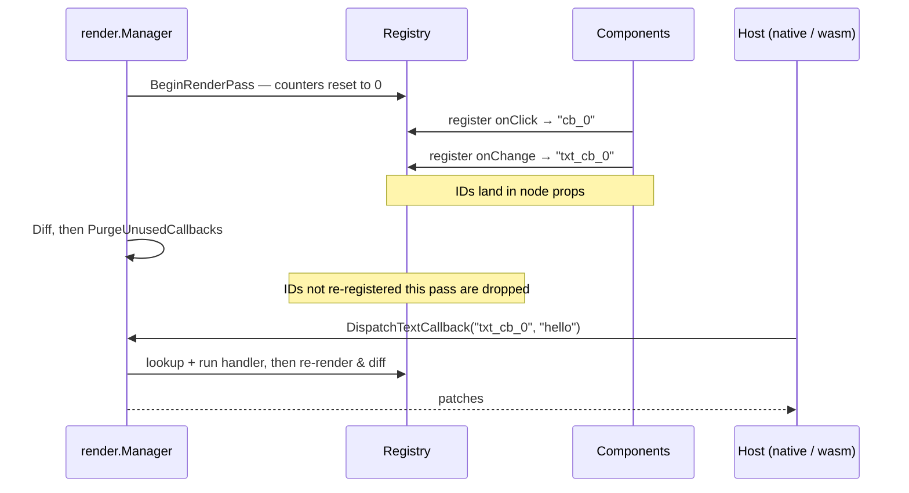

# Events & Callbacks

GrMob event handlers are ordinary Go closures. When a component registers
one (`Button`'s `onClick`, `Input`'s `onChange`, a container's `OnClick`
behavior prop), the framework stores the closure in a **callback registry**
on the context tree and stamps its ID into the node's props
(`"onClick": "cb_0"`). The renderer wires the native gesture to that ID; when
the user acts, the host dispatches the ID back and GrMob runs the closure.

## Callback kinds

Four value signatures, four ID namespaces:

| Kind | ID prefix | Carries | Typical source |
|---|---|---|---|
| void | `cb_N` | nothing | button tap, container click |
| text | `txt_cb_N` | `string` | input change / submit |
| bool | `bool_cb_N` | `bool` | checkbox toggle |
| int | `int_cb_N` | `int` | tab selection |

## The lifecycle of an ID



**IDs are per-pass sequence numbers.** `BeginRenderPass` resets the counters,
so the Nth callback registered in a pass is always `cb_N`. This is what keeps
IDs stable across renders: an unchanged UI re-registers the same IDs in the
same order — zero prop diffs — while each registration overwrites the map
entry with the latest closure, so handlers always capture current state.

**Unused IDs are purged.** After each diff, any callback not re-registered in
that pass is dropped: handlers for nodes that left the tree become silent
no-ops instead of firing for dead UI. A late native event racing a purge is
expected traffic, not an error.

!!! note "Stability granularity"
    Per-pass sequence IDs have the same stability as the reconciler's
    positional patch paths: a structural change that shifts later siblings
    also shifts their callback IDs — and those same nodes receive
    update-props patches regardless, so the renderer re-binds them. In the
    brief window around a structural re-render, an event dispatched against
    a stale tree can hit a re-used ID; identity-keyed IDs are the planned
    fix, alongside identity-based node paths.

## Attaching handlers

Leaf widgets take their primary handler as an argument:

```go
core.Button("Save", save)
core.Input(v, "placeholder", onChange)
core.Checkbox(done, onToggle)
```

Containers **and the input family** take **behavior props**, in any order,
mixed with style props:

```go
core.Row(
    core.OnClick(func() { open(item) }),      // tap anywhere on the row
    core.OnLongPress(func() { preview(item) }),
    ...,
)
core.Input(v, "placeholder", onChange,
    core.Padding(8),                          // style prop
    core.OnBlur(func() { check(v) }),         // behavior prop
)
core.On("TouchStart", fn)                     // generic form
```

A node may carry both `OnClick` and `OnLongPress`: renderers wire them as one
gesture recognizer, so a long press never also fires the click.

`core.Button` takes them too, which makes every leaf uniform — it was the
last one still restricted to style props, so the one node type that exists to
be pressed could not carry a gesture:

```go
core.Button("Delete", onDelete,
    core.BackgroundColor(theme.Danger),       // style prop
    core.OnLongPress(confirmDestructive),     // behavior prop
)
```

!!! note "The one call shape the widening broke"
    `core.Input` and friends, and now `core.Button`, used to take
    `...core.StyleProp`. Passing style props still compiles unchanged, but a
    wrapper that *collected* them into a `[]core.StyleProp` and spread it does
    not — Go will not spread a `[]StyleProp` into a `...PropsAndChildren`.
    Widen the wrapper's own slice to `[]core.PropsAndChildren`, or convert at
    the call site if the wrapper's public field should stay style-only
    (`components.Button` and `components.Chip` take the second route).

## Focus and blur

`core.OnFocus` and `core.OnBlur` report the input focus arriving at and
leaving a node. Both are plain void handlers — the edge itself is the whole
payload:

```go
core.Input(v, "you@example.com", onChange,
    core.OnFocus(func() { hintShown.Set(true) }),
    core.OnBlur(func() { validate(v) }),
)
```

Two props rather than one `func(bool)` because the two edges are almost never
handled together, and a node should carry only the one it cares about.

Three things to know:

- **They are wired on the text inputs.** Those are the only nodes a phone
  gives focus to. The props are attachable anywhere (`BehaviorProp` is
  uniform) and the HTML export carries them for every node, but a `Row` with
  `OnFocus` will never hear from Android or iOS.
- **Neither edge fires at mount.** A field appearing on screen has not gained
  or lost anything.
- **The two edges of one focus move are not ordered.** Android and iOS
  disagree on whether the blur on the field being left arrives before the
  focus on the field being entered, so a handler must read the field it
  belongs to rather than asking what is focused *now*.

For forms, [`RevealOnBlur`](forms.md) consumes this for you — the bound
builders attach `OnBlur` themselves under that policy.

## Setting focus

`OnFocus`/`OnBlur` make focus observable. `core.Focus` and
`core.DismissKeyboard` make it settable.

Name a field with a ref, then command it from anywhere:

```go
func LoginScreen(ctx *core.Context) core.View {
    password := core.UseFocusRef(ctx)

    return core.Column(
        core.InputWithSubmit(email.Get(), "you@example.com", email.Set,
            func() { core.Focus(password) },   // return key advances
        ),
        core.InputPassword(pw.Get(), "password", pw.Set,
            core.FocusTarget(password),
        ),
        core.Button("Sign in", submit),
    )
}
```

And put the keyboard away on a tap outside — the thing
[`KeyboardAware`](views.md) deliberately does not do:

```go
core.Box(
    core.OnClick(func() { core.DismissKeyboard(ctx) }),
    form,
)
```

`core.UseFocusRef` is a hook, so it obeys the [hook rules](hooks.md): call it
unconditionally, at the top. A ref built inline instead is a **new pointer
every pass**, so `FocusTarget` stamps one identity while `Focus` compares
against another and the field simply never focuses.

`DismissKeyboard` takes a `*core.Context` where `Focus` takes a ref, because a
dismiss names no node and so has nothing to carry the app instance.

### How a command actually travels

Go has exactly one channel to a screen: the render tree. So a command is not a
bridge call — it is props, diffed and patched like everything else.

```
Focus(ref) / DismissKeyboard(ctx)
        │  epoch++, target = ref (or nil)
        ▼
next render pass: every focusable leaf stamps
        focusEpoch  : N       ── the command generation
        focusAction : "focus" │ "blur" │ ""
        ▼
reconciler emits update-props for the leaves whose stamp changed
        ▼
renderer keys on focusEpoch *changing* and runs focusAction once
```

The epoch is a counter rather than a flag so a command can repeat: two
identical prop maps produce no patch, so focusing the already-focused field —
"try again after a failed submit" — would otherwise do nothing.

Four consequences worth knowing:

- **A field that mounts as the target takes focus.** That is what makes "push
  a screen and put the cursor in its search box" work, since the command is
  issued one pass before the field exists. The flip side: returning to that
  screen re-applies the command. Issue a `DismissKeyboard` if that is not
  wanted.
- **Every focusable leaf is re-stamped on every command**, so a dismiss with
  six fields on screen emits six `update-props` patches. Focus commands are
  rare and user-initiated, and the alternative — tracking the focused node in
  Go — would mean wiring `OnFocus` on every field always and waking a render
  pass on every keyboard change.
- **Until the first command, nothing is stamped at all.** An app that never
  touches focus renders exactly the trees it did before.
- **A `core.Cached` subtree never hears a command.** `Cached` returns the same
  `*Node` every pass and the reconciler treats pointer equality as proof
  nothing changed, so the stamp inside never moves. Cache above the fields, or
  not at all.

`core.Focus` aimed at a `Button` or `Checkbox` does nothing: neither platform
gives them keyboard focus, so they carry no stamp. The HTML export renders a
standing `"focus"` command as `autofocus`, which is the only thing a static
document can say about it.

## Dispatch paths by host

- **Native shells** call `mobile.TriggerCallback(id)` /
  `TriggerTextCallback` / `TriggerBoolCallback` / `TriggerIntCallback`.
  These run the handler *and* the follow-up render under the manager's mutex
  and return the patch JSON synchronously — an event can never interleave
  with a push-pump render pass.
- **The WASM runtime** delivers a loosely typed envelope
  (`{"callback": id, "value": ...}`) through `ctx.ReceiveEventPayload`, which
  sniffs the value's type and dispatches accordingly.
- **Tests** can use either: `render.Manager.Dispatch*` for the full
  event-to-patches loop, or `ctx.TriggerCallback` for handler-only checks.

Handlers may call `State.Set` freely — the resulting render request is
asynchronous, so nothing in the handler path re-enters the render mutex.

## Constraints worth knowing

- **Don't register callbacks inside `core.Cached` subtrees.** A cached view
  renders once and then stops consuming ID counter slots, which both purges
  its own handlers and shifts every later component's IDs. This is a hard
  constraint, detected by [debug mode](debug-mode.md). See
  [Caching](caching.md).
- **Handlers run app code, not framework code** — keep them quick, or hand
  long work to a goroutine that `Set`s state when done.
