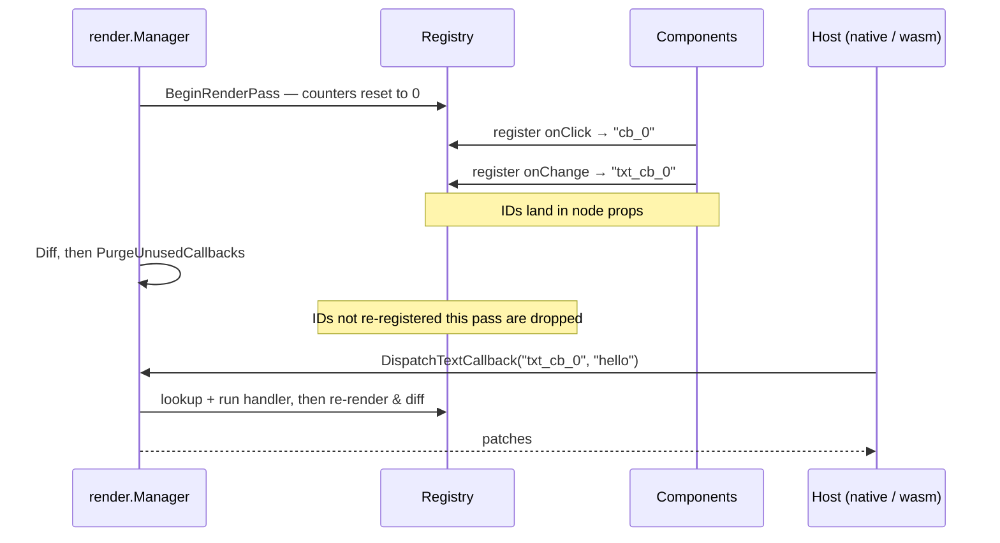

# Events & Callbacks

GrMob event handlers are ordinary Go closures. When a component registers
one (`Button`'s `onClick`, `Input`'s `onChange`, a container's `OnClick`
behavior prop), the framework stores the closure in a **callback registry**
on the context tree and stamps its ID into the node's props
(`"onClick": "cb_0"`). The renderer wires the native gesture to that ID; when
the user acts, the host dispatches the ID back and GrMob runs the closure.

## Callback kinds

Four value signatures, four ID namespaces:

| Kind | ID prefix | Carries | Typical source |
|---|---|---|---|
| void | `cb_N` | nothing | button tap, container click |
| text | `txt_cb_N` | `string` | input change / submit |
| bool | `bool_cb_N` | `bool` | checkbox toggle |
| int | `int_cb_N` | `int` | tab selection |

## The lifecycle of an ID



**IDs are per-pass sequence numbers.** `BeginRenderPass` resets the counters,
so the Nth callback registered in a pass is always `cb_N`. This is what keeps
IDs stable across renders: an unchanged UI re-registers the same IDs in the
same order — zero prop diffs — while each registration overwrites the map
entry with the latest closure, so handlers always capture current state.

**Unused IDs are purged.** After each diff, any callback not re-registered in
that pass is dropped: handlers for nodes that left the tree become silent
no-ops instead of firing for dead UI. A late native event racing a purge is
expected traffic, not an error.

!!! note "Stability granularity"
    Per-pass sequence IDs have the same stability as the reconciler's
    positional patch paths: a structural change that shifts later siblings
    also shifts their callback IDs — and those same nodes receive
    update-props patches regardless, so the renderer re-binds them. In the
    brief window around a structural re-render, an event dispatched against
    a stale tree can hit a re-used ID; identity-keyed IDs are the planned
    fix, alongside identity-based node paths.

## Attaching handlers

Leaf widgets take handlers as arguments:

```go
core.Button("Save", save)
core.Input(v, "placeholder", onChange)
core.Checkbox(done, onToggle)
```

Containers (and any node) take **behavior props**:

```go
core.Row(
    core.OnClick(func() { open(item) }),      // tap anywhere on the row
    core.OnLongPress(func() { preview(item) }),
    ...,
)
core.On("TouchStart", fn)                     // generic form
```

A node may carry both `OnClick` and `OnLongPress`: renderers wire them as one
gesture recognizer, so a long press never also fires the click.

## Dispatch paths by host

- **Native shells** call `mobile.TriggerCallback(id)` /
  `TriggerTextCallback` / `TriggerBoolCallback` / `TriggerIntCallback`.
  These run the handler *and* the follow-up render under the manager's mutex
  and return the patch JSON synchronously — an event can never interleave
  with a push-pump render pass.
- **The WASM runtime** delivers a loosely typed envelope
  (`{"callback": id, "value": ...}`) through `ctx.ReceiveEventPayload`, which
  sniffs the value's type and dispatches accordingly.
- **Tests** can use either: `render.Manager.Dispatch*` for the full
  event-to-patches loop, or `ctx.TriggerCallback` for handler-only checks.

Handlers may call `State.Set` freely — the resulting render request is
asynchronous, so nothing in the handler path re-enters the render mutex.

## Constraints worth knowing

- **Don't register callbacks inside `core.Cached` subtrees.** A cached view
  renders once and then stops consuming ID counter slots, which both purges
  its own handlers and shifts every later component's IDs. This is a hard
  constraint, detected by [debug mode](debug-mode.md). See
  [Caching](caching.md).
- **Handlers run app code, not framework code** — keep them quick, or hand
  long work to a goroutine that `Set`s state when done.
