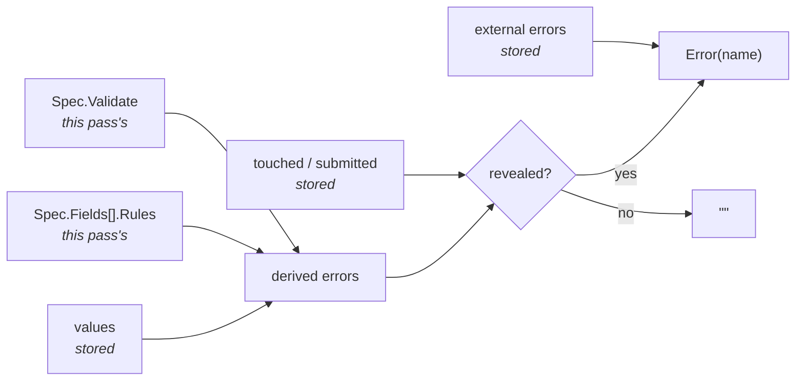

# Forms & Validation

`components.FormField` has always had an `Error` slot, and until now nothing
ever filled it. Package `forms` is what fills it: a vocabulary of rules, a hook
that owns a form's values and decides **when** its errors become visible, and
bound input builders that tie a field's value and its `onChange` to the same
name in one call.

```go
form := forms.UseForm(ctx, forms.Spec{
    Fields: []forms.Field{
        {Name: "email", Rules: []forms.Rule{
            forms.Required("We need an address to reach you"),
            forms.Email(""),
        }},
        {Name: "password", Rules: []forms.Rule{
            forms.Required(""),
            forms.MinLen(8, "Use at least 8 characters"),
        }},
    },
})

components.FormField{
    Label: "Email",
    Hint:  "We never share it",
    Error: form.Error("email"),
    Input: form.Input("email", "you@example.com"),
}

components.Button{
    Label: "Create account",
    OnTap: form.OnSubmit(func(v forms.Values) { createAccount(v) }),
}
```

The complete worked example is `examples/signup` — rules, cross-field checks,
a checkbox, a server error, and the reset.

## Errors are derived, never stored

The record behind `UseForm` holds the **values**, which fields have been
**touched**, whether a **submit** has been attempted, and any **external**
errors handed in from outside (plus the bookkeeping of which names have had
their `Initial` applied). It does *not* hold the errors the rules produce.
Those are recomputed from `(values, spec)` on every read.



That is the whole reason this design has no staleness bugs. A stored error map
has to be invalidated on every write, every rule change, and every cross-field
dependency — miss one and a field shows an error it has already fixed. A
derived map cannot be stale by construction.

The cost is that a form with *n* fields evaluates its rules *n* times per
render pass, since `Error` is called once per field. Rules are string checks
and forms are a handful of fields, so this is nanoseconds — and it buys away an
entire class of bug.

## The spec is re-read every pass

Only the record survives between renders. The `Spec` — fields, rules, the
cross-field `Validate`, the reveal policy — is whatever *this* render handed to
`UseForm`. So a rule may close over live state (a maximum that depends on
another hook, a list fetched at runtime) and take effect on the next pass with
no re-registration.

!!! warning "`UseForm` is a hook"
    It consumes exactly one slot on the context it is given, so the
    [rules of hooks](state-and-hooks.md#the-rules-of-hooks) apply: call it
    unconditionally, in a stable position, every pass — above any branch that
    renders a different screen. [Debug mode](debug-mode.md) reports a violation
    as cursor drift.

## When errors appear

Validating as the user types is hostile: the second character of an address is
not yet a valid address, and saying so is scolding someone for not having
finished. The rule of thumb is **reward early, punish late** — say nothing
until the user claims to be done, then stay live so every correction is
confirmed the instant it lands.

| `Spec.Reveal` | A field's error is visible when |
|---|---|
| `RevealOnSubmit` *(zero value)* | the first `Submit` has been attempted |
| `RevealOnTouch` | that field has been edited — **or** a `Submit` has been attempted |
| `RevealAlways` | always, from the first render |

The policies are cumulative, not exclusive: a submit reveals everything under
all three. A policy where "on touch" kept hiding an untouched field's error
after a submit would produce a form that refuses to submit and shows no reason.

`RevealOnTouch` suits a field whose format is unguessable and worth correcting
mid-flight — a card number, a one-time code. `RevealAlways` is mostly for tests
and for a form being shown *because* it is already wrong.

!!! danger "Do not disable the submit button on `!form.Valid()`"
    Under the default policy that is a dead end: nothing explains itself until
    a submit, and no submit can happen while the button is disabled — so the
    user gets a form that refuses to work and refuses to say why. Let the
    submit run and fail; failing is the event that turns the explanations on.
    [`core.Disabled`](styling-and-theming.md) belongs on a submit that is
    **in flight**, not on one that is invalid.

## Rules

A `Rule` is `func(value string) string` — the message, or `""` when there is
nothing wrong. Every built-in takes its message as its last argument, and an
empty message falls back to the rule's own English default, so a prototype
does not have to invent nine strings before it can see a form work.

| Rule | Rejects |
|---|---|
| `Required(msg)` | empty, or nothing but whitespace |
| `MinLen(n, msg)` / `MaxLen(n, msg)` | fewer / more than *n* **runes** |
| `Email(msg)` | anything not shaped like an address |
| `Pattern(re, msg)` | anything `re` does not match |
| `Integer(msg)` | anything `strconv.Atoi` rejects |
| `Range(lo, hi, msg)` | not a whole number in `[lo, hi]` |
| `OneOf(msg, allowed...)` | anything outside the set |
| `Accepted(msg)` | a checkbox that is not ticked |

An app's own checks are written inline — a rule is a plain function, with no
interface to implement:

```go
{Name: "handle", Rules: []forms.Rule{
    forms.Required(""),
    func(v string) string {
        if reserved[strings.ToLower(v)] {
            return "That handle is taken by the system"
        }
        return ""
    },
}}
```

Two behaviors worth knowing:

**The first failing rule wins.** A field shows one line of feedback — that is
all `FormField` has room for — so ordering the rules is choosing which
complaint is the most useful one. `Required` belongs first.

**Every rule except `Required` and `Accepted` is silent about an empty value.**
Emptiness is `Required`'s subject and nobody else's. Otherwise an *optional*
field carrying `MinLen(8)` would complain before the user typed anything, and a
*required* one carrying both would have two opinions about the same empty
string.

!!! tip "Validated numbers use `core.Input`, not `core.NumericInput`"
    `NumericInput`'s change callback parses with `strconv.Atoi` and **drops the
    event** when the text does not parse, so an unparseable value never reaches
    the form and `Integer` can never fire. A validated numeric field is a text
    field with a rule.

`Pattern` takes a compiled `*regexp.Regexp`, not an expression string, because
a `Spec` is rebuilt on every render pass — a rule that compiled its own pattern
would run `regexp.Compile` on every pass of every form. Hoist it:

```go
var postcode = regexp.MustCompile(`^[0-9]{5}$`)
...
forms.Pattern(postcode, "Five digits")
```

## Cross-field checks

`Spec.Validate` is the pass that sees every value at once — the checks no
single field's rules can make.

```go
Validate: func(v forms.Values) map[string]string {
    if v["confirm"] != v["password"] {
        return map[string]string{"confirm": "The two passwords differ"}
    }
    return nil
},
```

It runs after every field's rules, and its messages fill in **only for fields
that do not already have one**. Field rules win because they are the more
specific complaint: if `confirm` is empty, "Required" is what the user needs to
read, not "the two passwords differ" — which is true, unhelpful, and what a
last-writer-wins merge would show.

A key need not name a declared field. A key nothing renders is a form-level
error, which a banner above the fields reads with `form.Error("form")` or
whatever name the app picks.

## Submitting

`form.Submit(handler)` checks the form, records the attempt either way, and
calls `handler` with a **private copy** of the values only if it is clean. It
reports whether it was valid. `form.OnSubmit(handler)` is the same thing
adapted to the void-callback shape a `Button.OnTap`, an `InputRow.OnSubmit`, or
the keyboard's return key takes.

The handler runs on the calling goroutine — the native event thread, for a tap
— so a submit that talks to a network hands off. The values are already a copy,
so the goroutine may outlive the render pass:

```go
form.Submit(func(v forms.Values) {
    go func() {
        if errs := api.CreateAccount(v); errs != nil {
            form.SetErrors(errs)   // safe from any goroutine
            return
        }
        created.Set(v.Trimmed("email"))
    }()
})
```

## Errors from the server

`form.SetErrors` installs the errors a client could not have computed —
uniqueness, authorization, business rules.

```go
form.SetErrors(map[string]string{"email": "That address is already registered"})
```

They behave differently from rule errors in three ways, all following from
where they came from:

- **They ignore the reveal policy.** A message that came back from a submit is
  by definition post-submit.
- **They outrank a rule's message on the same field**, being the newer
  information.
- **Each is dropped as soon as that field changes.** The server's verdict was
  about the old text, so the message disappears as the user starts fixing it —
  not after another round trip.

The set is replaced wholesale rather than merged, so `SetErrors(nil)` clears
them, which is what a retry should do before it starts.

## Values are text

`forms.Values` is `map[string]string`, and it is a plain map type — read a
field with `v["email"]`. Strings all the way down is deliberate: every event
the framework carries from a native control is a string on the wire, and
keeping the raw text is what makes validation possible at all. `"12x"` has to
survive long enough for `Integer` to complain about it, and a `map[string]int`
has nowhere to put it.

The methods are for the values that are not text:

```go
v.Trimmed("email")      // string, space stripped — Required trims, so a
                        // valid value may still be padded
v.Bool("terms")         // checkbox; anything not "true" is false
v.Int("quantity")       // (int, bool) — the ok is real, the field is free text
v.Float("amount")       // (float64, bool)
```

A checkbox that starts ticked is declared `Field{Name: "terms", Initial: "true"}`.

## Bound builders

The unbound spelling names a field three times, in three roles, and nothing
checks that the three agree:

```go
// Copy a field, change two of the three, and this is what you get:
Error: form.Error("email"),
Input: core.Input(form.Value("email"), "...", form.OnChange("phone")),
```

That is a text box that will not accept typing, with no error anywhere. The
bound builders write the name once:

```go
form.Input("email", "you@example.com")
form.InputWithSubmit("code", "Promo code", applyCode)   // return key submits
form.Password("password", "••••••••")
form.TextArea("bio", 4)
form.Checkbox("terms")
```

They forward their style props to the core builder, so a bound control is the
core control, not a restricted version of it. A control with no binding — a
picker, a slider, `core.NumericInput` — is still built by hand out of
`form.Value` and `form.OnChange`, which stay exported for exactly that.

## Prefilling and resetting

`Field.Initial` seeds a value the first time that name is seen, and again after
`Reset`. It is **not** re-applied on later renders, so a field the user has
cleared stays cleared even though the spec still names a default. A name that
first appears on a later pass — a conditional section, a row added to a
repeating group — still gets its `Initial` on the pass it appears.

`form.Reset()` returns the form to its declaration: every field back to its
`Initial`, nothing touched, nothing submitted, no external errors. Initials are
re-read from *this pass's* spec, which is also how a form is populated from
data that arrives late — render the loaded values as `Initial` and reset once
they land.

## The required marker

`components.FormField` draws an asterisk after the label when its `Required`
field is set — and the value to set it to comes from the form:

```go
components.FormField{
    Label:    "Email",
    Required: form.Required("email"),
    Error:    form.Error("email"),
    Input:    form.Input("email", "you@example.com"),
}
```

`form.Required(name)` is **derived**, like the errors: it runs the field's
rules against `""` and answers whether any of them complains. There is no
`Field.Required` flag to declare, on purpose — a flag would be a second claim
about the same field, correct only while someone keeps it in step with the
rules, and the failures it allows are precisely the ones the marker exists to
prevent: a starred field that submits empty, an unstarred one that will not.

Three things follow from deriving it:

- **Any rule that speaks about an empty value counts**, not only `Required`.
  `Accepted` does — an unticked box is `"false"`, never `""` — so a
  terms-of-service checkbox reads as required, which it is. So does an app's
  own closure that rejects `""`.
- **The answer is as live as the rules.** A rule that only applies in some app
  state takes its marker with it when it goes, with no bookkeeping.
- **`Spec.Validate` is not consulted.** A cross-field requirement ("confirm is
  needed once password is set") is not a property of the field, and the probe
  has no other field's value to hand it. Mark those by hand.

The marker needs a label to sit beside, so a field that borrows its label from
elsewhere — the checkbox row above, whose title belongs to the `ListRow` —
has to carry its own.

## The rest of the surface

| | |
|---|---|
| `form.Value(name)` / `form.SetValue(name, v)` | one field's text |
| `form.Checked(name)` | one field as a bool |
| `form.OnChange(name)` / `form.OnToggle(name)` | the handlers, for unbound controls |
| `form.Values()` | an independent copy of every field |
| `form.Error(name)` / `form.Errors()` | what the user should see |
| `form.Valid()` | would this submit? — reveal-blind |
| `form.Touched(name)` / `form.Submitted()` | the reveal inputs, readable |
| `form.Required(name)` | does this field reject an empty value? |

`SetValue` marks the field touched and drops any external error against it —
both follow from the one fact that the value changed, whoever changed it. It is
safe to call from any goroutine, as are `SetErrors` and `Submit`.
