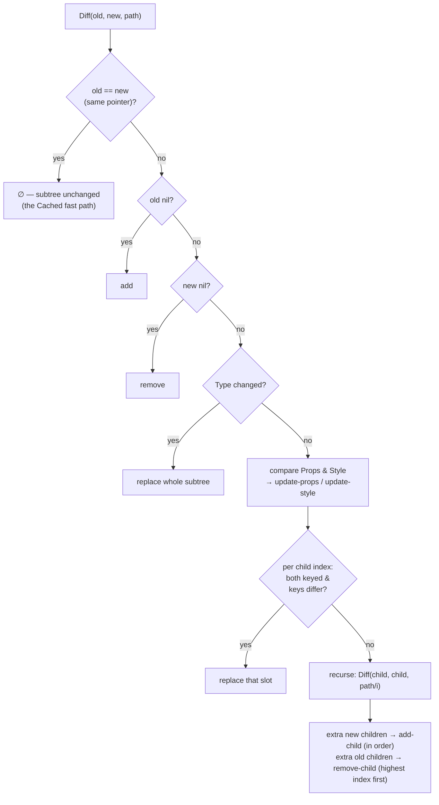

# Reconciliation

The reconciler is the bridge between "render everything from scratch" (how
your code thinks) and "change almost nothing" (how the screen updates).
`reconcile.Diff(old, new, path)` compares two `Node` trees in a single
top-down pass and returns the patch list that transforms one into the other.

## Patches

```go
type Patch struct {
    Type     string // "add", "remove", "replace", "update-props",
                    // "update-style", "add-child", "remove-child"
    TargetID string // positional path, e.g. "root/1/0"
    Changes  any    // *Node for add/replace, props map or *Style for updates
}
```

`TargetID` is a slash-delimited positional path from the root. Because paths
are positional rather than identity-based, **patch order matters**: renderers
must apply patches in the exact order emitted. Sibling removals in
particular are emitted highest-index-first, so applying one removal never
shifts the index of a later removal target in the same batch.

## The algorithm



Design choices worth knowing:

- **Pointer equality short-circuits.** Nodes are frozen after render (the
  immutability contract on `core.Node`), so the same pointer *is* proof of an
  unchanged subtree. This is the fast path [`core.Cached`](caching.md) buys:
  a cached view returns the identical `*Node` every pass, and its whole
  subtree costs one comparison instead of a deep walk.
- **A type change replaces the subtree.** Morphing one widget kind into
  another is neither cheaper nor safer than rebuilding it.
- **Props compare by content** (`reflect.DeepEqual` per value — props can
  hold slices and maps, which `==` would panic on). **Styles compare by
  value**, not pointer: every render re-allocates every `Style`, so pointer
  comparison would flag every styled node as changed on every render and turn
  the "minimal" diff into a full-tree broadcast.
- **Children match by index**, with a keyed guard: when both occupants of an
  index carry keys and the keys differ, the slot is replaced rather than
  diffed. Diffing across different keys would leak state between logically
  distinct items — the classic un-keyed-list bug this guards against.

## What keys do (and don't do) today

`Keyed(id, child)` gives a node identity. Today that identity powers the
keyed-slot guard above and the native lazy containers' row-state tracking
(`List` rows keep native state attached to the same data across reorders).

What keys do **not** yet produce is *move* patches. Positional `TargetID`s
cannot express "index 3 moved to index 1" safely — the first applied move
would invalidate the paths of every patch after it. A keyed mismatch
therefore rebuilds the slot: visually correct, though the replaced subtree
loses transient native state (focus, scroll offset). True move patches
require identity-based node IDs and are planned alongside that change.

## Cost model — what a render pass really costs

| Situation | Cost |
|---|---|
| Nothing changed | One tree build + one full-tree compare, `[]` out (never pushed) |
| One text changed | Same walk, one `update-props` patch |
| A style changed | One `update-style` patch (value-compared, so only real changes) |
| A `Cached` subtree | Zero build, zero compare — one pointer check |
| Type changed / keyed slot changed | One `replace` carrying the new subtree |

The build-then-diff design deliberately trades a per-pass tree allocation for
diffable retained structure. When a static region shows up in a profile,
[`core.Cached`](caching.md) removes it from both the build and the compare.
