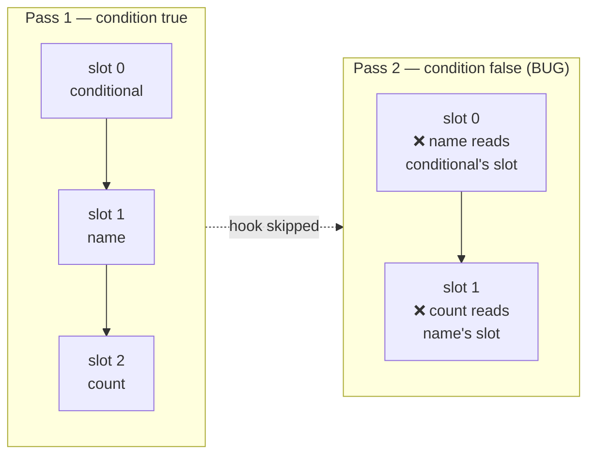

# State & Hooks

GrMob state is **slot-based**, like React hooks: each `Context` owns an array
of slots and a cursor. Every `NewState` call takes the slot at the current
cursor and advances it; at the start of each render pass the cursor resets to
zero. The same call site therefore reads the same slot on every pass —
*provided the calls happen in the same order every time*.

```go
func App(ctx *core.Context) core.View {
    name  := core.NewState(ctx, "")   // slot 0
    count := core.NewState(ctx, 0)    // slot 1

    return core.Column(
        core.Input(name.Get(), "Your name", func(v string) { name.Set(v) }),
        core.Button("+1", func() { count.Set(count.Get() + 1) }),
    )
}
```

`NewState` returns typed accessors:

- `Get()` — reads the slot (safe from any goroutine).
- `Set(v)` — writes the slot, marks the tree dirty, and requests a render.
  That request is all the plumbing there is: the render manager's pump picks
  it up and pushes the resulting diff to the renderer.

`Set` is safe to call from timers, network handlers, or any goroutine. A
burst of writes coalesces into one render of the settled state.

## The rules of hooks

Because slot identity is **positional**, hooks have the same rules as React's:

1. **Call hooks unconditionally** — never inside `if`, and never in a loop
   whose length varies between passes.
2. **Call them in the same order every pass.**
3. **Top of the component** is the conventional place.

Break the rules and slots shift silently: a skipped `NewState` makes every
later call read its *neighbor's* slot — state "bleeds" between unrelated
components with no error anywhere.



[Debug mode](debug-mode.md) detects exactly this — a pass whose cursor is
out of step with the slot count, or whose hook count differs from the
previous pass — and reports it as a **cursor-drift concern**. Keep debug mode
on during development.

## Where state should live

Prefer state **high** in the tree — often the root component — passed down as
values and closures:

```go
// Root: owns the data
todos := core.NewState(ctx, []Todo{})
setDone := func(id int, done bool) { /* copy, mutate, todos.Set */ }

// Row: pure function of its data — safe inside For
func todoRow(t Todo, setDone func(int, bool)) core.View { ... }
```

Per-row `NewState` inside a list that grows, shrinks, or reorders would read
another row's slot after any structural change. Rows should be pure functions
of their item.

Update state **immutably**: build a fresh slice/struct and `Set` it, rather
than mutating in place. The reconciler diffs the previous tree against the
new one; values shared by pointer across renders would let a handler mutate
what the previous pass already captured.

## Scoping state

Two tools give a component (or a screen) its own slot array:

- **`ctx.Scope(key)`** — a *named* child context, created on first use and
  stable forever after. A scope that renders on some passes and not others
  shifts nothing, because its slots are its own — which makes it the tool for
  a branch that appears and disappears within one screen.

    ```go
    func SettingsPanel(ctx *core.Context) core.View {
        sctx := ctx.Scope("settings")
        volume := core.NewState(sctx, 50)
        ...
    }
    ```

    Routes do **not** need this. [`Navigator`](navigation.md) already renders
    each stack frame into a scope of its own, so a screen's hooks are isolated
    from every other screen's without asking.

- **`core.UseChildContext(ctx)`** — a *positional* child context: it occupies
  a hook slot itself, so it follows the rules of hooks like any other hook.

## Side effects: the hooks package

Render functions must stay pure — `hooks` is where time, side effects, and
derived state go. All of them are slot-backed, so they follow the rules of
hooks.

```go
import "github.com/rohanthewiz/grmob/hooks"
```

### `hooks.UseEffect(ctx, effect, deps...)`

Runs `effect` on mount and again whenever `deps` change between renders
(compared with `reflect.DeepEqual`); with no deps it runs exactly once for
the lifetime of the slot. The effect runs on its own goroutine so a slow
effect cannot stall the render pass; anything it changes via `State.Set`
reaches the screen through the normal render path.

```go
hooks.UseEffect(ctx, func() {
    posts, err := fetchPosts(userID)
    if err == nil { postsState.Set(posts) }
}, userID) // re-runs when userID changes
```

### `hooks.UseInterval(ctx, fn, interval)`

Runs `fn` on a ticker. Re-renders refresh the callback, so ticks always run
the latest closure (current state captures, not the mount render's). The
ticker stops when the context closes.

### `hooks.UseTimeout(ctx, fn, delay)`

Runs `fn` once after `delay`; does not re-arm on re-render; cancelled by
context close.

### `hooks.UseMemo(ctx, compute, deps...)`

Returns the result of `compute`, recomputing only when `deps` change
(`reflect.DeepEqual`); with no deps it computes once for the lifetime of the
slot. Unlike `UseEffect` it runs **inline** on the render goroutine — its
result is needed to build the view.

```go
visible := hooks.UseMemo(ctx, func() []Todo {
    return filterAndSort(todos.Get(), filter.Get())
}, todos.Get(), filter.Get())
```

Reach for it when the work is expensive *relative to a render pass* —
sorting or filtering a large slice, parsing, building a derived index — since
a render function re-runs in full on every pass. `compute` must be pure, and
the returned value is handed back unchanged on every cache hit, so treat it
as read-only.

There is no `UseCallback`. Memoizing a closure only pays off in a framework
that skips subtrees on unchanged prop identity; here the
[reconciler](reconciliation.md) diffs the rendered tree instead, so a stable
closure buys nothing.

### `hooks.UseReducer(ctx, reducer, initial)`

State that evolves through named actions instead of raw writes. Returns the
current state and a `dispatch`; `dispatch` applies the reducer to the live
state and requests a render, exactly as `State.Set` does.

```go
type action int
const (increment action = iota; reset)

count, dispatch := hooks.UseReducer(ctx, func(s int, a action) int {
    switch a {
    case increment: return s + 1
    case reset:     return 0
    }
    return s
}, 0)

core.Button("+1", func() { dispatch(increment) })
```

`dispatch` is safe from any goroutine, and unlike the hand-rolled
`s.Set(reduce(s.Get(), a))` it is **atomic**: the reducer runs under the
hook's own lock, so two concurrent dispatches both land instead of one
overwriting the other. That sequencing is the reason to prefer it over
`NewState` for multi-step or multi-source state.

Two rules follow from that lock:

- The reducer must return a **new** state value rather than mutating the one
  it is given — earlier renders still hold the old one.
- The reducer must **not** dispatch. It runs while the lock is held, so a
  re-entrant dispatch deadlocks; chain actions from an event handler or a
  `UseEffect` instead.

`initial` is evaluated every render but only the first pass's value is kept,
the same as `core.NewState`.

## Lifecycle & cleanup

Background resources register cleanup with the context:

```go
ctx.OnClose(func() { ticker.Stop() })
```

`render.Manager.Close()` closes the context tree, running every registered
cleanup — this is how interval tickers and pending timeouts die with the app
instead of leaking into a replaced one. The hooks package wires this for you;
you only need `OnClose` for resources you manage yourself.

## Persistence

State lives in memory; persistence is explicit and yours. The
[todo tutorial](../tutorial-todo.md) shows the recommended shape: an embedded
[bytdb](https://github.com/rohanthewiz/bytdb) store behind the app's mutation
helpers (memory first, disk second), seeded from a snapshot at open, with the
writable directory supplied by the native shell via `mobile.SetDataDir`.
With no data directory registered — web preview, bare tests — the app runs
in-memory unchanged.
