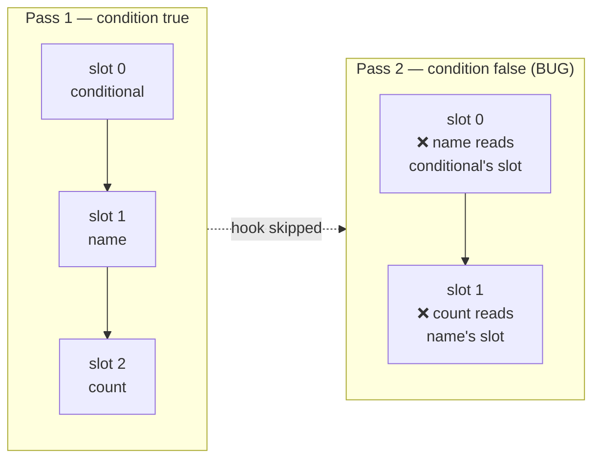

# State & Hooks

GrMob state is **slot-based**, like React hooks: each `Context` owns an array
of slots and a cursor. Every `NewState` call takes the slot at the current
cursor and advances it; at the start of each render pass the cursor resets to
zero. The same call site therefore reads the same slot on every pass —
*provided the calls happen in the same order every time*.

```go
func App(ctx *core.Context) core.View {
    name  := core.NewState(ctx, "")   // slot 0
    count := core.NewState(ctx, 0)    // slot 1

    return core.Column(
        core.Input(name.Get(), "Your name", func(v string) { name.Set(v) }),
        core.Button("+1", func() { count.Set(count.Get() + 1) }),
    )
}
```

`NewState` returns typed accessors:

- `Get()` — reads the slot (safe from any goroutine).
- `Set(v)` — writes the slot, marks the tree dirty, and requests a render.
  That request is all the plumbing there is: the render manager's pump picks
  it up and pushes the resulting diff to the renderer.

`Set` is safe to call from timers, network handlers, or any goroutine. A
burst of writes coalesces into one render of the settled state.

## The rules of hooks

Because slot identity is **positional**, hooks have the same rules as React's:

1. **Call hooks unconditionally** — never inside `if`, and never in a loop
   whose length varies between passes.
2. **Call them in the same order every pass.**
3. **Top of the component** is the conventional place.

Break the rules and slots shift silently: a skipped `NewState` makes every
later call read its *neighbor's* slot — state "bleeds" between unrelated
components with no error anywhere.



[Debug mode](debug-mode.md) detects exactly this — a pass whose cursor is
out of step with the slot count, or whose hook count differs from the
previous pass — and reports it as a **cursor-drift concern**. Keep debug mode
on during development.

## Where state should live

Prefer state **high** in the tree — often the root component — passed down as
values and closures:

```go
// Root: owns the data
todos := core.NewState(ctx, []Todo{})
setDone := func(id int, done bool) { /* copy, mutate, todos.Set */ }

// Row: pure function of its data — safe inside For
func todoRow(t Todo, setDone func(int, bool)) core.View { ... }
```

Per-row `NewState` inside a list that grows, shrinks, or reorders would read
another row's slot after any structural change. Rows should be pure functions
of their item.

Update state **immutably**: build a fresh slice/struct and `Set` it, rather
than mutating in place. The reconciler diffs the previous tree against the
new one; values shared by pointer across renders would let a handler mutate
what the previous pass already captured.

## Scoping state

Two tools give a component (or a screen) its own slot array:

- **`ctx.Scope(key)`** — a *named* child context, created on first use and
  stable forever after. A scope that renders on some passes and not others
  shifts nothing, because its slots are its own — which makes it the tool for
  a branch that appears and disappears within one screen.

    ```go
    func SettingsPanel(ctx *core.Context) core.View {
        sctx := ctx.Scope("settings")
        volume := core.NewState(sctx, 50)
        ...
    }
    ```

    Routes do **not** need this. [`Navigator`](navigation.md) already renders
    each stack frame into a scope of its own, so a screen's hooks are isolated
    from every other screen's without asking.

- **`core.UseChildContext(ctx)`** — a *positional* child context: it occupies
  a hook slot itself, so it follows the rules of hooks like any other hook.

## Side effects: the hooks package

Render functions must stay pure — `hooks` is where time, side effects, and
derived state go. All of them are slot-backed, so they follow the rules of
hooks.

```go
import "github.com/rohanthewiz/grmob/hooks"
```

### `hooks.UseEffect(ctx, effect, deps...)`

Runs `effect` on mount and again whenever `deps` change between renders
(compared with `reflect.DeepEqual`); with no deps it runs exactly once for
the lifetime of the slot. The effect runs on its own goroutine so a slow
effect cannot stall the render pass; anything it changes via `State.Set`
reaches the screen through the normal render path.

```go
hooks.UseEffect(ctx, func() {
    posts, err := fetchPosts(userID)
    if err == nil { postsState.Set(posts) }
}, userID) // re-runs when userID changes
```

### `hooks.UseInterval(ctx, fn, interval)`

Runs `fn` on a ticker. Re-renders refresh the callback, so ticks always run
the latest closure (current state captures, not the mount render's). The
ticker stops when the context closes.

### `hooks.UseTimeout(ctx, fn, delay)`

Runs `fn` once after `delay`; does not re-arm on re-render; cancelled by
context close.

### `hooks.UseDebounce(ctx, delay)`

Returns a `*Debouncer` whose `Call(fn)` cancels whatever was pending and
re-arms the delay, so only the last call in a burst actually fires. Unlike
`UseInterval` the delay is re-read every render, so a duration driven by
state takes effect on the next `Call`. `Cancel()` drops a pending call;
`Pending()` reports whether one is scheduled.

```go
d := hooks.UseDebounce(ctx, 250*time.Millisecond)

components.SearchField{
    Value: query.Get(),
    OnChange: func(s string) {
        query.Set(s)                      // now: the field is controlled
        d.Call(func() { runSearch(s) })   // in 250ms, if the typing stopped
    },
    OnSubmit: func() { d.Cancel(); runSearch(query.Get()) },
}
```

It is a separate hook from `UseTimeout` rather than a flag on it because the
two differ in exactly the thing they are about: `UseTimeout` arms once per
mount and stays fired, deliberately; a debounce is *defined* by re-arming.

A delay of zero or less runs `fn` synchronously, so a caller can turn the
debounce off from state without a second code path. `Cancel` promises no
*further* call, not an undo: `time.Timer.Stop` reports false once the timer
has fired, and by then `fn` may already be running.

### `hooks.UseMemo(ctx, compute, deps...)`

Returns the result of `compute`, recomputing only when `deps` change
(`reflect.DeepEqual`); with no deps it computes once for the lifetime of the
slot. Unlike `UseEffect` it runs **inline** on the render goroutine — its
result is needed to build the view.

```go
visible := hooks.UseMemo(ctx, func() []Todo {
    return filterAndSort(todos.Get(), filter.Get())
}, todos.Get(), filter.Get())
```

Reach for it when the work is expensive *relative to a render pass* —
sorting or filtering a large slice, parsing, building a derived index — since
a render function re-runs in full on every pass. `compute` must be pure, and
the returned value is handed back unchanged on every cache hit, so treat it
as read-only.

There is no `UseCallback`. Memoizing a closure only pays off in a framework
that skips subtrees on unchanged prop identity; here the
[reconciler](reconciliation.md) diffs the rendered tree instead, so a stable
closure buys nothing.

### `hooks.UseReducer(ctx, reducer, initial)`

State that evolves through named actions instead of raw writes. Returns the
current state and a `dispatch`; `dispatch` applies the reducer to the live
state and requests a render, exactly as `State.Set` does.

```go
type action int
const (increment action = iota; reset)

count, dispatch := hooks.UseReducer(ctx, func(s int, a action) int {
    switch a {
    case increment: return s + 1
    case reset:     return 0
    }
    return s
}, 0)

core.Button("+1", func() { dispatch(increment) })
```

`dispatch` is safe from any goroutine, and unlike the hand-rolled
`s.Set(reduce(s.Get(), a))` it is **atomic**: the reducer runs under the
hook's own lock, so two concurrent dispatches both land instead of one
overwriting the other. That sequencing is the reason to prefer it over
`NewState` for multi-step or multi-source state.

Two rules follow from that lock:

- The reducer must return a **new** state value rather than mutating the one
  it is given — earlier renders still hold the old one.
- The reducer must **not** dispatch. It runs while the lock is held, so a
  re-entrant dispatch deadlocks; chain actions from an event handler or a
  `UseEffect` instead.

`initial` is evaluated every render but only the first pass's value is kept,
the same as `core.NewState`.

### `forms.UseForm(ctx, spec)`

A form's values, plus the decision about when its errors become visible. It
lives in its own package because validation is a vocabulary rather than a
primitive, but it is a hook like any other — one slot, called unconditionally,
in a stable position.

```go
form := forms.UseForm(ctx, forms.Spec{
    Fields: []forms.Field{
        {Name: "email", Rules: []forms.Rule{forms.Required(""), forms.Email("")}},
    },
})
```

Like `UseReducer` it keeps its state behind a mutex-guarded record reached by
pointer, so writes from a native event thread are atomic and it asks for its
own renders. Unlike every other hook here it stores **nothing derived**: the
errors are recomputed from the values and the current spec on every read.
See [Forms & Validation](forms.md).

### Sensors: `UseHeading`

A sensor is a third kind of thing beside a node and a service: it is
*subscribed* rather than commanded, and it costs battery while it is on. So
the interesting question is not what the reading looks like but who is allowed
to turn it off.

```go
h := hooks.UseHeading(ctx)   // starts the compass; releases it on close
```

**Start and stop are refcounted, not toggled.** Two screens can each hold the
sensor and each let go; the magnetometer stops when the *second* one does. A
plain on/off flag makes the opposite bug easy and silent — a badge and a
compass screen both start it, the screen is popped, and the badge quietly
stops updating with nothing in any log.

**`Received` and `Available` are two different facts.** "No reading yet" wants
a spinner; "this device has no compass" wants a different screen, and a
spinner there spins forever. One boolean could not say both.

**Put a compass on its own route.** Hooks have no unmount signal, so the
subscription is released on `ctx.Close` rather than when the component leaves
the tree — the same limit `UseInterval` and `UseAudio` carry. For those the
cost is a redundant render; here it is a sensor left running, which a user can
measure. A navigation frame has its own cleanup registry, so popping the route
releases the reference for real.

**On iOS Safari the browser will not hand over orientation events unless the
request came from a tap.** `core.StartHeading` is where that request is made,
so a hook mounting on navigation may be refused — and when it is, the reason
comes back as `Available: false` with a message, which is what a "tap to
enable the compass" button is for.

Below the hook, `core.CurrentHeading`/`core.OnHeading` are the un-scoped pair,
for a subscriber that wants the reading without owning the sensor's lifetime.

### Permissions: `UsePermission` and `UsePermissionLive`

A permission is a fourth kind of thing: it is *asked*, and the answer outlives
the asking. The `permission` package is shaped like the sensor above minus the
reference counting — two one-way channels with a record in between — so a
screen reads state rather than holding a callback, and a prompt the user leaves
standing for a minute strands nothing.

```go
switch hooks.UsePermission(ctx, permission.Location) {   // checks; never prompts
case permission.Granted:     return mapView(ctx)
case permission.Prompt:      return askButton()          // Request from a tap
case permission.Denied:      return openSettingsHint()
case permission.Unavailable: return nil
default:                     return components.Skeleton{}   // the check is in flight
}
```

**`Check` and `Request` are two operations and collapsing them is wrong in
either direction.** A check that prompts puts the OS dialog on screen as a side
effect of a screen mounting, which is the surest route to a permanent refusal;
a request that only checks leaves a button that does nothing. The hook checks,
and asking stays yours — from a gesture, because every platform here either
requires that or punishes the alternative.

**Four statuses, and the fourth is the one people leave out.** `Denied` is
fixable in the system settings; `Unavailable` is not — a device with no camera,
an iOS parental restriction, an Android permission the manifest never declared,
an app with no host attached at all. A screen offering "Open Settings" for both
sends someone to a page with no switch on it. `Unknown` is the zero value: the
check is asynchronous, so the first pass has no answer and must draw a
placeholder. A headless run — a Go test, a static export, an unwired embedder —
resolves to `Unavailable` immediately rather than sitting on `Unknown`, so a
permission-gated screen under test takes a real branch instead of spinning.

**The status values are the W3C Permissions API's own spellings**, for the
reason `core.Role`'s are ARIA's: the browser host then needs no mapping table,
and iOS and Android each map their richer enums onto it.

**Nothing tells an app that a permission changed while it was in the
background,** on any of the three platforms. A user is refused, taps your
"Open Settings" button, grants it there, and comes back — and with
`UsePermission` the screen still says the camera is off, because the hook's one
check happened on mount. The button that fixed the problem is the thing still
telling them it is broken.

`hooks.UsePermissionLive` is the same hook plus a re-check on every return to
the foreground, and it is what a screen drawing a `Denied` state wants:

```go
switch hooks.UsePermissionLive(ctx, permission.Camera) { … }
```

For a long time the objection to it was that a hook cannot see whether its
screen is still the one on top, so a stack of five screens would fire five
checks per resume. That assumed a *screen* has to own the re-check. Nothing
about the question is per-screen — there is one device with one camera — so the
owner is the permission: `permission.WatchForeground` reference-counts by kind,
exactly as `core.StartHeading` does for the sensor, and five watchers of the
camera produce one `check` per resume between them. An app with no live watcher
takes no lifecycle subscription at all.

A resume that changed nothing costs one system event out and one host event
back and stops there, because the record notifies only on a *change* — so a
watched screen does not re-render every time the user switches apps and back.
`UsePermission` stays for the screens that want the narrower thing; use the
live one by default.

**This is not a second way to do what a capability already does.**
`core.StartHeading` makes the browser's motion prompt itself, deliberately, so
there is no separate API to forget. `permission` exists for the two things that
cannot serve: showing a rationale *before* the OS dialog, and reading a status
back to draw a settings row. The compass is the case that named it — iOS
reports `Heading.True` only once location has been granted, and the compass
host prompts for nothing on purpose.

Below the hook, `permission.Current`/`permission.On` are the un-scoped pair,
`permission.IsGranted` the one-line read.

## Lifecycle & cleanup

Background resources register cleanup with the context:

```go
ctx.OnClose(func() { ticker.Stop() })
```

`render.Manager.Close()` closes the context tree, running every registered
cleanup — this is how interval tickers and pending timeouts die with the app
instead of leaking into a replaced one. The hooks package wires this for you;
you only need `OnClose` for resources you manage yourself.

## Persistence

State lives in memory; persistence is explicit and yours. The
[todo tutorial](../tutorial-todo.md) shows the recommended shape: an embedded
[bytdb](https://github.com/rohanthewiz/bytdb) store behind the app's mutation
helpers (memory first, disk second), seeded from a snapshot at open, with the
writable directory supplied by the native shell via `mobile.SetDataDir`.
With no data directory registered — web preview, bare tests — the app runs
in-memory unchanged.
