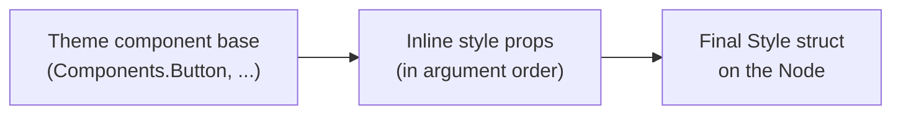

# Styling & Theming

Styling in GrMob is pure configuration: a `Style` struct on each node,
assembled functionally from **style props**, with **themes** supplying the
defaults. No stylesheets, no cascade — what a node renders with is exactly
what its final `Style` struct says.

## Style props

Every widget accepts a variadic tail of `StyleProp`s:

```go
core.Text("Welcome",
    core.FontSize(18),
    core.TextColor("#333"),
    core.Padding(12),
)
```

A `StyleProp` is just a function over the node's style:

```go
type StyleProp interface{ Apply(*Style) }
```

Props apply in order, later ones overwriting the fields they touch. The
built-in set covers typography (`FontSize`, `FontWeight`, `TextColor`),
surfaces (`BackgroundColor`, `BorderRadius`, `Shadow`, `BorderColor`,
`BorderWidth`), box model (`Padding`, `Margin`, `Width`, `Height`,
`MinWidth`, `MaxWidth`, ...), flex layout (`FlexGrow`, `FlexShrink`,
`FlexBasis`, `Gap`, `Justify`, `AlignItemsProp`, `FlexDir`, `FlexWrap`),
positioning (`ZIndex`, `Left`, `Right`, `Bottom`), plus `Transition(ms,
easing)` for animated style changes and `Disabled(bool)` for the platform's
inert state.

`AlignItemsProp` takes the CSS values, `core.AlignItemsStretch` included: a
stretched child is sized to the container's cross axis rather than placed
along it, which both native renderers now implement (Compose has no stretch
alignment, so the children carry a fill modifier; SwiftUI's flex layout
proposes the cross extent directly).

### What each target honors

Most of `Style` means the same thing everywhere. Three groups do not, and the
difference is structural rather than an oversight:

| group | Android | iOS | WASM DOM | `htmlout` |
|---|---|---|---|---|
| typography, color, box model, borders, `Shadow`, `Gap`, `RowGap`/`ColumnGap`, `Justify`, `AlignItems`, `FlexWrap`, `Transition`, accessibility, `Disabled` | yes | yes | yes | yes |
| `Position` + `Top`/`Right`/`Bottom`/`Left`/`ZIndex`, `MinWidth`/`MaxWidth`/`MinHeight`/`MaxHeight`, `Overflow`, `WhiteSpace`, `AlignSelf`, `FlexBasis`, `FlexShrink`, `FlexDirection` | — | — | yes | yes |
| `HoverStyle`, `FocusStyle`, `PseudoStates` | — | — | — | — |

The second row is CSS the natives have no direct equivalent for — Compose and
SwiftUI take a stack's axis from the node type and have no out-of-flow
placement model — so a layout that leans on it will not look the same on
device. The third row merges correctly on `Style` and is read by nothing: an
inline style cannot express a pseudo-state, so the web targets need a
generated stylesheet, not another declaration.

`RowGap` and `ColumnGap` moved up into the first row once the natives learned
to read them, and `FlexWrap` with them: both are things a stack can express
(a Compose `Arrangement.spacedBy`, a SwiftUI stack `spacing`, a `FlowRow` /
wrapping `Layout`), unlike the out-of-flow placement the rest of the second
row asks for. They mean on every target what they mean in CSS — the axis
longhand wins over the isotropic `Gap`, and `row-gap` is the space *between
rows*, so it is a vertical stack's spacing and a wrapping row's line
spacing.

`BorderColor`/`BorderWidth` are drawn only when **both** are set — a width
with no color and a color with no width each draw nothing, on every target.
Two node-specific escapes from that rule are closed rather than documented as
quirks. A `core.Button` draws its own container on both natives, so it is
handed a style with the box-drawing fields stripped and each one fed back
through the platform control's own slot; the border used to be stripped and
not fed back, which is why `components.Button`'s outlined emphasis had no rule
on device. And on the web a `<button>`, an `<input>`, a `<textarea>` and a `<select>` carry
the *user agent's* border, which no `BorderWidth(0)` could remove, because
emitting no declaration is exactly what leaves the browser in charge — so both
DOM renderers now write `border:none` for the node types a browser draws a
frame on. The set is keyed by node type because five of them share `<input>`
and only three want it: a `Checkbox` and a `Slider` are drawn in their entirety
by the browser, and their border is the control rather than chrome the Go style
owns.

The text fields joined that set only once both bundled themes gave
`Components.Input` and `Components.TextArea` a border — resetting one nothing
replaces would have left every web field an unmarked rectangle, which is what
both phones already showed. The tone is a *control boundary* and not the
palette's `Border` hairline: a divider between rows may be 1.26:1 and a rule
that identifies a control may not, since WCAG 1.4.11 puts a 3:1 floor under it.
`components.DatePicker`'s trigger inherits the whole frame off the same
`Components.Input` base, so a picker between two text fields wears what they
wear.

`core.Select` joins on the same test, and the deciding fact is what the *other*
three targets do. Neither native builds it from a platform picker control —
SwiftUI's `.pickerStyle(.menu)` and Material's `ExposedDropdownMenuBox` each
draw a frame and an indicator that no Go style can remove — so each draws the
style's own box and hangs a menu off it. The frame is the theme's on three
targets out of four, and the web was again the one place a second one was being
drawn underneath. Only the frame is reset: a `<select>`'s drop-down indicator
is the thing that says the control is a picker, `border` does not touch it, and
it stays.

`Padding` and `Margin` carry a `Horizontal`/`Vertical` pair alongside the four
sides (`core.PaddingHorizontal(16)`). A side left at zero takes its axis's
shorthand; an explicit side wins. All four targets resolve it the same way,
including the one edge the rule cannot express — a zero value carries no "was
it set?" bit, so `PaddingHorizontal(16)` plus `PaddingLeft(0)` cannot ask for a
zero left inset.

`Display` splits across two CSS properties on the web, matching what the
natives do with it: `DisplayNone` removes the node entirely (no pixels, no
space), while `DisplayHidden` keeps its space and drops its pixels — SwiftUI's
`.opacity(0)`, Compose's alpha 0, and CSS's `visibility: hidden`.

`Align` is the odd one, because it carries two roles. On a `Text` it is the
text alignment; on a container it is the cross-axis fallback consulted when
`AlignItems` is unset. `AlignStart`, `AlignCenter` and `AlignEnd` mean
something in both roles, `AlignJustify` only in the first, and `AlignStretch`
and `AlignBaseline` only in the second — so `core.TextAlignments()` names the
subset a text renderer is required to handle, and the other two are expected to
fall through wherever text is being drawn. Every renderer is held to that list;
`Align(AlignJustify)` used to justify text on Android alone, and
`Align(AlignStretch)` on a Column used to stretch on iOS alone. Both now agree
across all four targets. The cross-axis fallback is read only on a vertical
axis (a Column, not a Row), on both natives alike, because `Align` began life
as a text concept.

### Accessibility props

Accessibility semantics ride on `Style` so every builder supports them
without signature changes, and so changes to them patch like any visual
property:

```go
core.Button("✕", del,
    core.AccessibilityLabel("Delete "+t.Title))
core.Box(hairline, core.AccessibilityHidden())   // decorative — skip in screen readers
core.AccessibilityHint("Filters the task list")  // describes the result of activating
core.AccessibilityRole(core.RoleHeading)         // says what the node *is*
core.AccessibilityHeadingLevel(2)                // and how deep it sits
core.AccessibilityNestingLevel(2)                // the same question for a nested list item
core.AccessibilitySelected(core.SelectedOn)      // and whether this control is *on*
core.AccessibilityID("app-panel")                // names this element so another can point at it
core.AccessibilityControls("app-panel")          // ...and the pointing
```

Renderers map them to `contentDescription` (Android),
`accessibilityLabel` / `accessibilityHint` / `accessibilityHidden` (iOS), and
`aria-label` / `aria-description` / `aria-hidden` (WASM DOM and `htmlout`).

`AccessibilityHidden` wins alone on every target: it prunes the node and its
subtree from the accessibility tree, which makes a label on the same node
contradictory rather than additive, so the label is dropped.

#### `AccessibilityRole`

A label says what a node is *called* and a hint says what activating it
*does*; the role says what it **is**. Without one, every container is a `div`
on the web and a plain view on both natives, so a carefully labelled screen
still reads as a flat run of text — a tappable `Box` is not announced as a
control, a section title is not a heading, and a grid of cells is not a table.

`core.Role`'s values are ARIA's own spellings, which is what lets both web
targets emit them verbatim as `role=`:

| | |
|---|---|
| tabular | `RoleTable` `RoleRowGroup` `RoleRow` `RoleColumnHeader` `RoleCell` |
| collections | `RoleList` `RoleListItem` |
| selectable collections | `RoleListBox` `RoleOption` |
| tabs | `RoleTab` `RoleTabList` |
| landmarks | `RoleBanner` `RoleNavigation` `RoleSearch` `RoleToolbar` |
| live regions | `RoleStatus` `RoleAlert` `RoleLog` |
| content | `RoleHeading` `RoleButton` `RoleLink` `RoleImg` |
| naming | `RoleGroup` |

The two natives map what their vocabularies can express — `heading` and
`columnheader` become a header trait / `heading()`, `button` becomes
`.isButton` / `Role.Button`, `link` becomes `.isLink` (the one place SwiftUI's
vocabulary is the richer of the two), `search` becomes `.isSearchField`, `img`
becomes `.isImage` / `Role.Image`, and `status` / `alert` / `log` become Compose
live regions — and name the rest as explicit no-ops, so a role that does
nothing there is a decision on record rather than an oversight. See
`core/role.go` for the full table and `mobile/verify/role_test.go` for the
check that holds both natives to it.

The tab pair is the one row where the two natives disagree about *which half*
they can say: Compose has `Role.Tab` for the control and nothing for the strip,
SwiftUI has `.isTabBar` for the strip and nothing for the control. Neither
vocabulary could have supplied the pair, which is a small argument for the set
being ARIA's. Both are for a **hand-built** strip; `core.TabView` writes these
two, the `tabpanel` half and the `aria-controls`/`aria-labelledby` wiring
between them from the node type. There is deliberately no `RoleTabPanel` — a
panel is one end of a relationship, the node type already owns both ends, and
the WASM runtime relies on `tabpanel` not being a `core.Role` to tell its own
wiring apart from an author's. A hand-built strip states the relationship with
`AccessibilityID` / `AccessibilityControls` instead; see below.

`RoleStatus` and `RoleLog` are both polite live regions and differ in the shape
of the content, not in how loudly they interrupt: a status is one advisory that
is *replaced* ("Saved", "3 new items"), a log is a record that is *appended to*
and whose order is meaningful (a chat transcript, a console). A transcript
marked `status` announces correctly and reads back as one region that has just
changed entirely.

`RoleButton` and `RoleLink` are a real distinction, not a synonym: a button
does something *here*, a link goes somewhere else, and nothing in the tree
carries the difference on its own — `core.OpenURL` is a callback like any
other, so a row that dials a number and a row that files a form are the same
tappable `Box` until one of them says which it is.

Roles are never inferred: a `Box` with an `OnTap` is a button only if it says
so, because a widget that wraps a tappable row in a tappable card would
otherwise announce two nested buttons. `AccessibilityHidden` wins over a role
for the same reason it wins over a label.

##### `RoleGroup`, and the one role you get without asking

`RoleGroup` is the exception to "never inferred", and it exists because a name
on a plain container did not work on the web at all.

Every layout node exports as a `<div>` or a `<span>`, whose implicit ARIA role
is `generic`, and ARIA **prohibits an accessible name on `generic`** — browsers
enforce it by pruning the name out of the accessibility tree. So this:

```go
core.Box(core.AccessibilityLabel("Unread messages"), …)
```

was read out perfectly by VoiceOver and TalkBack (both honour a label on any
node) and announced by nothing on either web target. Two targets fine, two
silent, which is what let it ship: the two that worked are the two you are most
likely to be testing on. It hit every `ListRow` with an `AccessibilityLabel`,
every `Accordion` header, every named `StatTile` and `Skeleton`.

Both web targets now **supply** `role="group"` to a node that has a name, no
role of its own, and a generic tag. Nothing changes at your call sites; the
name simply starts being announced. An author who says anything more specific
wins — the fallback only ever fills an empty slot.

`group` is the smallest role that makes a name legal, and that is why it is the
one chosen: it is nameable, it is *not* a landmark (so a named row does not
join the list of regions a reader jumps between), it requires no particular
children, and it does not make the children it has presentational. It says
these things belong together and this is what they are called, and nothing
else — which is what lets it be given to a container nothing has looked inside.
`region` would add six entries to a screen's table of contents; `button` would
claim a control and would silence a heading inside it; `img` claims the node is
a picture whose parts should be hidden, which is true of `components.Compass`
and false of a list row.

You can also set it yourself, which is worth doing where the grouping is the
point rather than the name being rescued.

Neither native does anything with it, and for the opposite of the usual reason:
they do not *need* it. A `contentDescription` and an `accessibilityLabel` are
honoured on any node, so the role that unlocks the name on the web buys them
nothing.

The **listbox pair** is the collection pair's selectable cousin, and the
difference is not a shade of meaning: `aria-selected` is scoped to `gridcell`,
`option`, `row`, `tab` and `columnheader` and *not* to `listitem`, so a list
item that says it is chosen says it into a void on both web targets. A list is
content; a listbox is a control, and only the control side has the state. That
is why `components.ListRow` spelled `", selected"` into its own accessible name
for three versions of the widget — `RoleButton` would have made it a foreign
child of the enclosing list, and `RoleListItem` cannot carry the state at all.
`ListRow.Selectable` is the door this pair opened.

A listbox in ARIA's full pattern also takes keyboard focus and moves an active
option with the arrow keys. `core.Role` is a vocabulary and nothing in `core`
stamps a `tabindex` or reads an arrow key, so that half is the author's on the
web; on both phones it costs nothing, because VoiceOver and TalkBack navigate a
collection by swipe. Neither native names a listbox or an option at all — both
spell a chosen item as the *state* instead, and honour it on any node.

An `option` takes `aria-selected` and no `aria-level`; a `listitem` takes
`aria-level` and no `aria-selected`. A row is therefore one or the other, never
both. ARIA's role for an item that is both is `treeitem` inside a `tree`, which
`core.Role` deliberately does not carry: a tree is a third pattern with its own
expansion state and keyboard contract, and nothing here has one.

**A structural role owns what is inside it.** The tabular five and the two
collection pairs are not labels on a container — they are claims about what it
holds. `role="list"` says its children are listitems; `role="listbox"` says its
children are options; `role="table"` says its children are rows, or rowgroups
holding rows. A reader acts on that claim: it
announces a count, it offers item-by-item navigation, it reads structure rather
than text.

Two things break the claim, and both are worse than no role:

- **A gap in the chain** — an unroled element between the container and its
  items. `role="table"` around a plain `div` around the rows reports a table
  with *no rows*. That is what `RoleRowGroup` exists to close.
- **A foreign child** — a footer, a section heading, a spinner sharing the
  container with the items. ARIA specifies the children a role requires and not
  what to do with any others, so the odd child's fate is an implementation's
  choice rather than a promise.

So **a container that mixes items with chrome cannot take a structural role**.
Move the chrome outside the container, or leave the container roleless — its
contents are then announced as the text they are, which is what they were
before roles existed. A paged list whose "Load more" footer sits inside the
`core.List` is the common shape: it is not a list, whatever it looks like.

`RoleTabList` makes the same claim — a strip that also holds a count or an add
button is not a tablist. `RoleTab` does not: it describes one control, the way
`RoleButton` does, and only the strip around it claims what it contains.

The landmarks, live regions and content roles carry no such promise. A banner
or a navigation region owns whatever it likes, and `RoleHeading` / `RoleButton`
/ `RoleLink` / `RoleImg` describe the node itself.

#### `AccessibilityHeadingLevel`

`RoleHeading` says a node *is* a heading; the level says where it sits — 1 for
the screen's own name, 2 for a section inside it, down to 6.

```go
core.Text("March",
    core.AccessibilityRole(core.RoleHeading),
    core.AccessibilityHeadingLevel(2))
```

Without a level, a screen with a bar title above a run of section bands
announces a flat list of peers, and a reader navigating by heading cannot tell
the screen's name from a band inside it.

##### The package's heading outline

`components` fills the range in rather than leaving it to call sites, so the
ordinary screen needs none:

| widget | tier | fixed? |
|---|---|---|
| `AppBar.Title` | 1 | **yes** — an AppBar is the screen's own bar, so there is nothing above it to be a section of |
| `GroupHeader` (via `GroupedList` / `DataTable`) | 2 | no — `HeadingLevel` |
| `Card.Title` | 2 | no — `HeadingLevel` |
| `Accordion.Title` | 3 | no — `HeadingLevel` |

A widget can state its own tier only where its position is fixed, and only the
bar's is. The other three are *usually* where the table says and can
legitimately be anywhere: a grouped list inside a card is a tier deeper than
the card, a screen made entirely of accordions has them at the top, and a
bandless feed on a screen with no bar starts at 1. So those three take a
`HeadingLevel` field whose zero value is the tier above, and levels 4 to 6 are
a caller's to reach.

Two shared rules. The field applies to the **default** content only — a
`Card.Header` or an `Accordion.Header` replaces the line and is yours to
describe — and the role rides the **words**, never the row around them, so a
band's heading is named "March" rather than "March, 12" and an accordion's is
"Advanced options" rather than "▸ Advanced options".

A **negative** level asks for a heading with no tier at all. It needs no case
in the resolution: an out-of-range level is dropped rather than clamped (see
below), so it survives to the exporters and is written by none of them, which
is exactly what every heading in the package announced before it had a tier.

| target | what it becomes |
|---|---|
| HTML / WASM | `aria-level` |
| iOS | `.accessibilityHeading(.h1 … .h6)` |
| Android | nothing — Compose's `heading()` takes no argument and the semantics package has no level property |

Two rules, and neither is defensive coding:

- **It is read only alongside `RoleHeading`.** That is ARIA's own scoping —
  `aria-level` is defined for `heading`, `listitem` and `row`, and notably not
  for `columnheader`, which is why a `DataTable`'s column headers take the role
  and no tier.
- **Out-of-range values are dropped, not clamped.** `0` is the zero value and
  means "a heading, tier unstated" — what every heading was before the field
  existed. A `7` has no spelling on any target that can express a level, and
  rewriting it to a `6` would assert a structure the caller never described.

It is a separate `int` rather than a `RoleHeading2` … `RoleHeading6` set for a
decisive reason: `core.Role`'s values are ARIA's spellings, and there is no
`role="heading2"`, so lettered constants would cost both web targets the
mapping table the vocabulary was chosen to avoid — plus twelve native arms that
would all land on the heading primitive the plain `heading` arm already
reaches.

#### `AccessibilityNestingLevel`

`aria-level` serves three roles, not one. The other two are `listitem` and
`row`, where it means depth inside a nested collection rather than a tier in an
outline, and that is this field:

```go
core.Box(
    core.AccessibilityRole(core.RoleListItem),
    core.AccessibilityNestingLevel(2),
    core.Text("Compline"))
```

Without it, a correctly roled nested list still announces flat — "list, twelve
items" for something the eye reads as three groups of four.

| target | what it becomes |
|---|---|
| HTML / WASM | `aria-level` |
| iOS | nothing — SwiftUI has no nesting-depth property |
| Android | nothing — Compose's `collectionItemInfo` states an item's index within *one* collection, not its depth within nested ones |

**Why a second field and not a wider first one.** Both become the same
attribute, so one `AccessibilityLevel` reading all three roles was the obvious
alternative. It cannot carry the fact that the two are validated differently:
a heading stops at 6 because that is as far as `h1`–`h6` and SwiftUI's
`.h1`–`.h6` go, while ARIA asks a nesting depth only to be an integer of 1 or
more. One field needs one rule, and either rule is wrong for the other half —
capping a depth at 6 flattens a legitimate tree, and lifting the heading cap
exports a tier nothing can honor.

The two can never contend for the attribute, because the exporters dispatch on
the role and a node has exactly one. Set both fields and the role decides which
is read; the other is simply not looked at.

**The widget that spends it** is `components.ListRow`, through its
`NestingLevel` field, which makes the row a `listitem` at that depth. It is the
one thing a flattened outline cannot say any other way: a list is a flat run of
siblings — which is also what makes it virtualizable — so an indent is pixels a
screen reader never sees, and the nesting has to travel as data.

```go
core.List(
    core.AccessibilityRole(core.RoleList),          // the caller's half
    components.ListRow{Title: "Gospels", NestingLevel: 2},
    components.ListRow{Title: "Matthew", NestingLevel: 3, Style: indent},
)
```

The field is **opt-in**, and the two halves are set in different places on
purpose. A `listitem` is owned by a `list` (see "a structural role owns what is
inside it" under [`AccessibilityRole`](#accessibilityrole)), and a row cannot see
its own container — so the caller roles the list and the widget states the
depth, and a row asked for no depth stays the unroled box it has always been.
An orphan `listitem` names a structure that is not there, which is the failure
the ownership rule exists to prevent.

One cost, stated because it is real: a row inside a `role="list"` must not also
be a `role="button"`, so a tappable row in an outline announces as an item at a
depth rather than as a control. That is the same foreign-child rule that kept
[`AccessibilitySelected`](#accessibilityselected) off `ListRow` until
`RoleOption` existed, read from the other side.

The two are still exclusive, and now for a sharper reason than availability: a
depth's role is `listitem`, one of aria-level's three, and a selection's is
`option`, which takes `aria-selected` and no level. A row is a depth *or* a
choice — `ListRow.Selectable` is where that precedence is written down.

#### `AccessibilitySelected`

Whether a control is **on** — the applied filter chip, the tab that is showing,
the chosen day in a calendar. A role says what a control is and a label says
what it is called; neither can say that this one of five is the live one.

```go
core.Box(
    core.AccessibilityRole(core.RoleTab),
    core.AccessibilitySelected(core.SelectedWhen(i == current)),
    core.Text(label),
)
```

`core.SelectedState` has three values, not two, and the third is the point:

| | |
|---|---|
| `SelectedUnset` | the zero value. A `Box`, a heading, a run of text — no claim, no attribute, which is what every node was before the field existed |
| `SelectedOn` | the chip that is applied, the tab that is showing |
| `SelectedOff` | a control that *could* be on and is not |

A bool has one spelling for the last two, and losing the distinction is not
cosmetic: a tablist where only the live tab carries a state announces the other
four as plain tabs, so the strip reads as one tab and four pieces of furniture.
Set the state on **every** control in a group — `core.SelectedWhen(bool)` is
the conversion, and it exists because the tempting hand-rolled version sets
`SelectedOn` and leaves the rest silent.

**One field, two attributes** — the mirror of the level pair above, resolved by
the same switch on the role:

| role | attribute |
|---|---|
| `option`, `tab`, `row`, `columnheader` | `aria-selected` |
| `button` (or a `core.Button` node) | `aria-pressed` |
| anything else | nothing at all |

ARIA has two words because it draws a real distinction. Selection is *one of
these* — a tab among tabs, and choosing one unchooses the rest. Pressed is
*this one, on or off* — a toggle answering only for itself. A filter chip is
pressed; a tab is selected.

`option` is the arm a row reaches for. It is the only role in the vocabulary
that lets a *collection item* carry a selection — `listitem`, which describes
the same visual row, is not scoped for either attribute — and it is why
`components.ListRow.Selectable` exists and why the widget appended `",
selected"` to its own name before it did.

That is why `components.SegmentedControl` becomes a tab strip with two props
and no new field: give the row `RoleTabList` and the segment template
`RoleTab`, and the state each `Chip` already sets goes out as `aria-selected`
instead. Neither widget knows which arrangement it is in.

| target | what it becomes |
|---|---|
| Android | `selected = true` / `false` in the semantics lambda |
| iOS | the `.isSelected` trait when on; SwiftUI has no word for *off*, so an unselected control looks like an unstated one there |
| HTML / WASM | `aria-selected` or `aria-pressed`, per the table above |

**Pair it with a role.** ARIA does not define either attribute for a generic
element, so a state on an unroled `Box` is dropped by screen readers exactly as
an accessible name on one is. Neither native scopes it, so such a state reaches
both of them and neither web target; the web is the strict one because ARIA is.
A `core.Button` is the one exception and needs no role, because the node type
already is one.

The *name* half of that failure is now rescued for you (`RoleGroup` above) and
the state half is not, which is deliberate rather than half-finished. `group`
fits any container, so supplying it invents nothing; there is no role that
carries a selection and fits any container — the four that do are `option`,
`tab`, `row` and `columnheader`, and choosing among them would be the exporter
deciding what your node is. A name is a fact you already stated; a role is not.

#### `AccessibilityID` and `AccessibilityControls`

The vocabulary's only two **references**. Everything else on `Style` is a
value — a name, a hint, a role, a level — and these two say that *this element*
points at *that element*.

```go
// the strip
core.Row(core.AccessibilityRole(core.RoleTabList),
    components.Chip{Label: "Home", Style: []core.StyleProp{
        core.AccessibilityRole(core.RoleTab),
        core.AccessibilitySelected(core.SelectedWhen(tab == "home")),
        core.AccessibilityID("home-tab"),
        core.AccessibilityControls("app-panel"),
    }},
    …
)

// the region it switches
core.Box(
    core.AccessibilityID("app-panel"),
    core.AccessibilityLabel("Home"),
    page,
)
```

`AccessibilityID` becomes the `id` attribute; `AccessibilityControls` becomes
`aria-controls`. Both are written verbatim, both directions, on the two web
targets.

##### Why only these two, when half of ARIA is IDREF-shaped

`aria-labelledby`, `aria-describedby`, `aria-owns` and
`aria-activedescendant` are all references too, and adding them all would ask
every app to mint and track document-global ids for things there is a shorter
way to say. The line:

> A reference prop earns its place only when what it points at cannot be said
> as a value.

`aria-labelledby` points at *text*, and `AccessibilityLabel` already carries
text. `aria-describedby` points at text, and `AccessibilityHint` already
carries text (as `aria-description`, the same idea in value form). Neither
reference buys you anything but a saved copy of a string you are holding.
`aria-controls` points at *another element*, and no string stands in for one.

##### What asked for it

A tab strip built by hand. `core.TabView` mints its own ids and writes the
whole tab/panel wiring from the node type, so the wired case needed nothing —
but a strip assembled out of chips or buttons, which is what you build when you
want a different-looking bar, could say `role="tab"` and `role="tablist"` and
then had no way at all to say which region each tab shows. A reader announces
three tabs governing nothing. `examples/social`'s bottom bar is the worked
example.

##### Two rules worth knowing

**Uniqueness is yours**, exactly as in hand-written HTML: the framework does
not rewrite your string, so two elements given the same `AccessibilityID` are
two elements with the same id. The `grmob-` prefix is reserved for
`core.TabView`'s own minted ids.

**A `TabView` page carrying an `AccessibilityID` is left unwired.** You have
claimed the slot the wiring needs for its own `id`, and something else on the
page is pointing at your string, so the wiring stands down rather than taking
it — the same rule an authored role follows there.

Neither native reads either key. There is no such relationship in SwiftUI's or
Compose's semantics vocabulary, and neither reader needs one: both navigate a
strip by swiping to the next element rather than by following a reference. The
near miss is `accessibilityIdentifier` / `testTag`, and both are *test*
selectors rather than accessibility properties — mapping onto them would make
every hand-built tab a test handle and still announce nothing.

#### Roles a node type carries for itself

Some semantics are not the author's to state. `core.Button` is a `<button>` and
a real control on both natives, so nobody has to say `button` — `RoleButton`
exists for the *other* case, a `Box` or `Row` with an `OnTap`.

`core.Modal` is the same shape, and has no vocabulary entry at all. Both
natives present it through a platform dialog (a SwiftUI sheet, a Compose
`Dialog`) that announces itself; the two DOM renderers drew a plain `div`, so
the overlay was the one target where a dialog was not a dialog. Both now write
`role="dialog"` and `aria-modal="true"` as part of the Modal chassis, beside
the fixed-overlay rules. A closed modal needs no special case — it is
`display:none`, which takes it out of the accessibility tree entirely.

There is deliberately no `RoleDialog`. Adding one would hand the author work
that three of the four targets already do unasked, and would cost two native
arms that could only be empty — which in this vocabulary means "this platform
cannot say it", the opposite of the truth here. An author who sets
`AccessibilityRole` on a hand-built Modal node still wins, on the same
principle the chassis follows for style: the framework's default goes first.

### `Disabled`

`core.Disabled(bool)` rides `Style` for the same reason — one prop, every
builder — and every renderer hands it to the platform's own disabled state
rather than emulating one:

```go
core.Button("Send", submit, core.Disabled(draft == ""))
core.Input(v, "Email", onChange, core.Disabled(sending.Get()))
```

| target | what it becomes |
|---|---|
| Android | `enabled = false` on the material3 control; the gesture modifier is dropped from a tappable box |
| iOS | `.disabled(true)` |
| HTML / WASM | the `disabled` attribute on form controls; `aria-disabled` + `pointer-events: none` elsewhere |

Two consequences worth knowing:

- **It announces itself.** VoiceOver says "dimmed", TalkBack reads the
  disabled property, a browser reports the attribute. Do *not* also append
  `", disabled"` to an accessibility label — that announces the state twice.
- **It propagates.** Disabling a container disables its subtree, on all three
  targets. That is what makes "freeze this section while the form submits" a
  single declaration.

What it does **not** do is change any colors. How a disabled control looks is
a palette decision — `components.Button` spends the theme's `Surface` and
`TextSecondary` on it — while `Disabled` says only what the control *is*.

Note the signature: `Disabled(false)` is meaningful, unlike the no-argument
`AccessibilityHidden()`. `UseStyle` treats a zero value as "not set", so
passing `false` through the prop is the only way to force a node that already
carries the flag back to enabled.

## Reusable styles

Define base styles as values and apply them with `UseStyle`:

```go
var headerStyle = core.Style{FontSize: 22, FontWeight: core.Bold}

core.Text("Dashboard", core.UseStyle(headerStyle))
```

`Style.With(other)` composes two styles (shallow merge of `other`'s set
fields onto a copy):

```go
core.UseStyle(primaryButton.With(core.Style{BorderRadius: 8}))
```

!!! note "UseStyle merges non-zero fields"
    `UseStyle` copies every field of `Style` that is set (non-zero) and
    leaves the rest of the target alone — that is what lets a role style
    layer onto theme defaults without blanking them out. `HoverStyle`,
    `FocusStyle` and `PseudoStates` merge recursively, field by field and
    key by key, so a value describing only `":hover"` will not delete a
    `":focus"` already present.

    The one consequence is that a zero value is indistinguishable from
    "not set", so you cannot *clear* a field through `UseStyle`. Use a
    direct prop for that — `core.Padding(0)` and
    `core.FontSize(0)` assign unconditionally.

    (Before 2026-08-31 this merged only fourteen fields; `Width`,
    `Height`, `Top`, the flex group and the accessibility fields were
    silently dropped. If you worked around that with dedicated props,
    nothing breaks — the props still win, since they run in argument
    order.)

## Themes

A `Theme` centralizes the design system:

```go
type Theme struct {
    Colors     ColorPalette      // Primary, Secondary, Background, Surface,
                                 // TextPrimary, TextSecondary, Error,
                                 // Border, Success, Warning, and the four
                                 // on-light tones
    Typography Typography        // Title, Subtitle, Body, Caption (each a Style)
    Spacing    SpacingScale      // XS SM MD LG XL
    Components ComponentDefaults // base Style per widget: Button, Card, Input, ...
}
```

Widgets resolve their base look from the theme, then apply your props on
top. The priority order, lowest to highest:



### Color roles

Name the *role*, never the literal, and one theme swap restyles the tree:

| role | meaning |
|---|---|
| `Primary`, `Secondary` | brand slots — a theme may tint these anything |
| `Background`, `Surface` | page ground and the raised/muted **fill** on top of it |
| `TextPrimary`, `TextSecondary` | ink and de-emphasized ink |
| `Error`, `Success`, `Warning` | the status triad — meaning, not brand |
| `Border` | strokes and hairlines: rules between rows, card outlines — a **divider**, not a control boundary |
| `PrimaryOnLight`, `SuccessOnLight`, `WarningOnLight`, `ErrorOnLight` | the same four roles again, dark enough to be read as **ink** on a light surface |

Two distinctions the names do not make obvious:

- **`Border` is not `Surface`.** `Surface` is a fill, and on a light theme
  the two are near neighbors — a `Surface`-tinted hairline drawn on a
  `Surface` panel is invisible. `Border` exists so a stroke has its own knob.
- **`Success` is not `Secondary`,** even though `DefaultTheme` happens to
  tint both the same green. `Secondary` is a brand slot a theme is free to
  make teal or magenta (`MaterialTheme` makes it teal), while `Success`
  carries meaning — a magenta "saved" badge is a bug.
- **`Border` is not a field's edge.** It used to name input borders too. A
  rule *between* things is decoration and both bundled themes spend a very
  pale hex on it (1.26:1 and 1.32:1 against white); the edge that says *this
  rectangle is a field you can type in* is the only thing identifying a
  control, which WCAG 1.4.11 puts a 3:1 floor under. One hex cannot be both,
  for the same reason a role's fill tone cannot also be its ink. So the field
  frames live in `Components.Input` and `Components.TextArea`, where each theme
  states its own boundary tone, and the palette carries no role for it —
  nothing outside those two spends it, and a widget that wants to look like a
  text field reads the `Input` base itself, which is how `DatePicker`'s trigger
  gets its radius, its fill and its edge in one prop.

`Border`, `Success` and `Warning` were added on 2026-08-31, after the other
seven. A theme written before that leaves them empty, and an empty color is
not "the default" — it is *no color*. So read those three through their
resolver methods, which fall back to `core.FallbackBorder` / `FallbackSuccess`
/ `FallbackWarning` (`DefaultTheme`'s own values):

```go
core.BorderColor(ctx.Theme().Colors.BorderColor())   // not .Colors.Border
bg := ctx.Theme().Colors.SuccessColor()
```

The original seven need no resolver and deliberately have none: every theme
that exists predates them, so none can be missing.

#### The on-light tones

A palette role is one hex, and one hex cannot do both jobs a role is asked to
do:

- **As a fill**, with an ink chosen over it, a mid-tone works.
  `components.Variant.Ink` resolves that ink (see
  [the ink over a fill](#the-ink-over-a-fill) below), and a filled `Badge` or
  `Button` clears WCAG AA on both bundled themes.
- **As ink itself** — an outlined button's label and rule, a loud chip's
  outline, a banner's leading glyph — the backdrop is whatever the widget was
  placed on, which the widget cannot see, and a mid-tone loses.

Measured against each bundled theme's own white `Background`, five of the eight
role colors failed the 4.5:1 body-text floor:

| role | Default | Material |
|---|---|---|
| primary | 4.02:1 → **7.56:1** | 7.63:1 (already ink) |
| success | 2.22:1 → **5.40:1** | 5.13:1 (already ink) |
| warning | 2.20:1 → **5.28:1** | 3.08:1 → **5.60:1** |
| error | 3.55:1 → **5.38:1** | 7.33:1 (already ink) |

The widgets had the number and not the authority: darkening a role until it
passes would repaint a hex the theme author chose — `DefaultTheme`'s 4.02:1
blue is Apple's own system blue, i.e. the *default* case. So the second tone is
the theme's to declare and the widget's to spend.

```go
ink := ctx.Theme().Colors.PrimaryOnLightColor()   // by role
ink = ctx.Theme().Colors.OnLight(someAccent)      // by colour, for a widget
                                                  // that holds a hex and no
                                                  // name for it
```

`components.Variant.OnLight(theme)` is the same lookup keyed by variant, and is
what `Button`'s outlined and ghost treatments, `Chip`'s loud prominence and
`Banner`'s edges now spend.

An unset tone falls back to **its own role**, not to a constant — a softer
fallback than `Border`/`Success`/`Warning` get, because those degrade to a
visible default (an empty color is no color) while an absent on-light tone has
a perfectly good, merely paler, answer beside it. So a theme written before
these fields renders exactly as it always did.

"Light" means the theme's own `Background`, which is `#FFFFFF` for both bundled
themes. A dark theme's role colors are usually already legible on its dark
ground, so it leaves these empty and the fallback does the right thing — which
is why these are four extra fields rather than a second palette every theme has
to fill in twice.

#### The ink over a fill

The other half of the same problem: a widget that *paints* a role needs a label
colour to go over it, and the palette names none. `components.Variant.Ink`
answers, in two steps and in this order.

**Ask the theme.** `Components.Button` is the one place a palette states a fill
and an ink *together* — a filled button is the control a theme cannot describe
without answering the question — so a fill that matches `Button.Background`
takes `Button.TextColor`. It is a reverse lookup, like `Colors.OnLight` one
property over, and it is why `components.Chip` reads its accent off the Button
base rather than off `Colors.Primary`: a theme whose buttons are not
primary-coloured has said something, and the button is where it said it.

**Otherwise measure.** For a colour the theme has paired nothing with — a
status role, an explicit `Badge.Color` — the more legible of the theme's two
ink roles wins on WCAG contrast. That is what keeps white off `DefaultTheme`'s
`Success` (2.22:1) and `Warning` (2.20:1), where a fixed pairing would have
shipped a badge nobody can read.

Measurement alone is the wrong rule for a role the theme has an opinion about,
and `DefaultTheme`'s `Primary` is the case that shows it: against `#007AFF`
white measures 4.02:1 and black 5.23:1, so a pure contrast rule picks **black**
— while every filled `components.Button` in the framework paints white, because
that is the pair the theme declares. `components.Calendar` used to compute its
selected day's ink and so drew a black numeral on iOS system blue. No third ink
role was added to settle it, and the reason is arithmetic rather than taste:
nothing a theme could name would outscore black on a mid-tone, so any fix
expressed as another *candidate* would have lost the same comparison. The
question had to change.

The honest cost is that white on `#007AFF` is below AA for body text. That is
not a regression being waved through — it is the number every filled button has
always painted. Raising it is the theme's move (a darker `Button` base, or
Apple's accessible blue `#0040DD`, which this palette already carries as
`PrimaryOnLight`), and it would lift the buttons and the calendar together. One
widget quietly disagreeing with the theme fixed nothing and hid the question.

!!! note "A theme with no `Components.Button` has declared no pairing"
    Its fills are measured like any other colour, including for the default
    variant, which used to be exempt and return `Colors.Background` whatever it
    was given. Two things changed with the exemption: `Badge{Color: "#FFF9C4"}`
    with no variant now gets dark ink on pale yellow instead of white, which is
    what `Badge`'s own documentation always promised.

!!! warning "`ComponentDefaults` has no resolvers either — and *can* be missing"
    The same reasoning does not extend to `Theme.Components`. It is a plain
    struct literal, so a theme may simply not set `Button` (or `Card`, or
    `Input`), and the zero `Style` that results is genuinely no styling rather
    than a default. `examples/fintechapp` shipped for months with no
    `Components` block at all, invisibly, because every widget in it was
    hand-styled at the call site — the omission surfaced only when its action
    row moved onto [`components.Button`](../components.md#button), whose zero
    value deliberately applies nothing so a theme's own base carries through.

    When you write a theme, fill in `Components.Button` at minimum.

Two themes ship with the framework: `core.DefaultTheme` (iOS-flavored) and
`core.MaterialTheme`. Install one at the root:

```go
ctx := core.NewContext().WithTheme(core.DefaultTheme)
```

or scope one to a subtree:

```go
core.WithTheme(core.MaterialTheme,
    settingsPanel,
)
```

Inside a component, read the theme from the context — never hard-code what
the theme already names:

```go
t := ctx.Theme()
core.Text("Hello", core.UseStyle(t.Typography.Title))
core.Box(core.BackgroundColor(t.Colors.Surface))
core.Column(core.Gap(float64(t.Spacing.MD)))
```

With no theme installed, `ctx.Theme()` falls back to `DefaultTheme`.

### Overriding a theme base

Theme base styles sometimes need a paired override. The classic case from the
tutorial: the default `Button` base paints a white label on primary blue, so
a destructive button must override *both* colors together —

```go
core.Button("✕", remove,
    core.TextColor("#FFFFFF"),
    core.BackgroundColor(dangerRed),
)
```

— overriding only one leaves an illegible pairing. When you find yourself
repeating an override, either promote it into a custom `Theme` or wrap it in
a component (see the [widget library](../components.md) for the idiom).

## Rotation

`Rotate(deg)` turns a node clockwise about its own centre.

```go
core.Box(core.Width("48px"), core.Height("48px"), core.Rotate(-heading))
```

It is a **paint** transform on all four targets, not a layout one: the box
keeps the size and position it laid out with and only its pixels turn, so a
rotated node never reflows its siblings. All four also agree on degrees and on
clockwise-positive, which is why this is one float rather than a `Transform`
type — the moment translate and scale join it the platforms stop agreeing on
composition order and the type has to say what it means.

| target | mapping |
|---|---|
| htmlout / WASM | `transform: rotate(Ndeg)`, origin `50% 50%` |
| Compose | `Modifier.rotate(N)`, about the layout bounds' centre |
| SwiftUI | `.rotationEffect(.degrees(N), anchor: .center)` |

**Centre only.** There is no transform-origin: a caller who needs to swing a
node about some other point wraps it in a box whose centre is that point,
which costs one node and works identically everywhere.

**The angle is not normalised.** 370 and 10 point the same way and are not the
same animation — under a [transition](#transitions) the first sweeps 20 degrees
forwards and the second unwinds 340 the other way. Folding the value into
[0, 360) would take that choice away and pick the wrong one for a compass,
which would unwind the whole rose every time the bearing passed north.
`core.AngleDelta` is the arithmetic for accumulating an unwrapped angle.

## Transitions

`Transition(durationMs, easing)` animates subsequent style changes on the
node (easings: `core.EaseInOut` and friends). Because selection changes and
similar interactions arrive as `update-style` patches, a transition makes
the patched change glide instead of snap:

```go
core.Button(label, onTap,
    core.Transition(200, core.EaseInOut),
    core.BackgroundColor(bg), // animates when bg changes between renders
)
```
