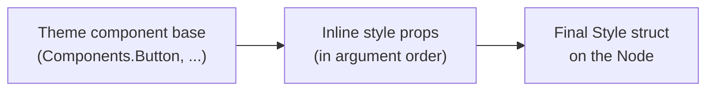

# Styling & Theming

Styling in GrMob is pure configuration: a `Style` struct on each node,
assembled functionally from **style props**, with **themes** supplying the
defaults. No stylesheets, no cascade — what a node renders with is exactly
what its final `Style` struct says.

## Style props

Every widget accepts a variadic tail of `StyleProp`s:

```go
core.Text("Welcome",
    core.FontSize(18),
    core.TextColor("#333"),
    core.Padding(12),
)
```

A `StyleProp` is just a function over the node's style:

```go
type StyleProp interface{ Apply(*Style) }
```

Props apply in order, later ones overwriting the fields they touch. The
built-in set covers typography (`FontSize`, `FontWeight`, `TextColor`),
surfaces (`BackgroundColor`, `BorderRadius`, `Shadow`, `BorderColor`,
`BorderWidth`), box model (`Padding`, `Margin`, `Width`, `Height`,
`MinWidth`, `MaxWidth`, ...), flex layout (`FlexGrow`, `FlexShrink`,
`FlexBasis`, `Gap`, `Justify`, `AlignItemsProp`, `FlexDir`, `FlexWrap`),
positioning (`ZIndex`, `Left`, `Right`, `Bottom`), plus `Transition(ms,
easing)` for animated style changes and `Disabled(bool)` for the platform's
inert state.

`AlignItemsProp` takes the CSS values, `core.AlignItemsStretch` included: a
stretched child is sized to the container's cross axis rather than placed
along it, which both native renderers now implement (Compose has no stretch
alignment, so the children carry a fill modifier; SwiftUI's flex layout
proposes the cross extent directly).

### What each target honors

Most of `Style` means the same thing everywhere. Three groups do not, and the
difference is structural rather than an oversight:

| group | Android | iOS | WASM DOM | `htmlout` |
|---|---|---|---|---|
| typography, color, box model, borders, `Shadow`, `Gap`, `RowGap`/`ColumnGap`, `Justify`, `AlignItems`, `FlexWrap`, `Transition`, accessibility, `Disabled` | yes | yes | yes | yes |
| `Position` + `Top`/`Right`/`Bottom`/`Left`/`ZIndex`, `MinWidth`/`MaxWidth`/`MinHeight`/`MaxHeight`, `Overflow`, `WhiteSpace`, `AlignSelf`, `FlexBasis`, `FlexShrink`, `FlexDirection` | — | — | yes | yes |
| `HoverStyle`, `FocusStyle`, `PseudoStates` | — | — | — | — |

The second row is CSS the natives have no direct equivalent for — Compose and
SwiftUI take a stack's axis from the node type and have no out-of-flow
placement model — so a layout that leans on it will not look the same on
device. The third row merges correctly on `Style` and is read by nothing: an
inline style cannot express a pseudo-state, so the web targets need a
generated stylesheet, not another declaration.

`RowGap` and `ColumnGap` moved up into the first row once the natives learned
to read them, and `FlexWrap` with them: both are things a stack can express
(a Compose `Arrangement.spacedBy`, a SwiftUI stack `spacing`, a `FlowRow` /
wrapping `Layout`), unlike the out-of-flow placement the rest of the second
row asks for. They mean on every target what they mean in CSS — the axis
longhand wins over the isotropic `Gap`, and `row-gap` is the space *between
rows*, so it is a vertical stack's spacing and a wrapping row's line
spacing.

`Padding` and `Margin` carry a `Horizontal`/`Vertical` pair alongside the four
sides (`core.PaddingHorizontal(16)`). A side left at zero takes its axis's
shorthand; an explicit side wins. All four targets resolve it the same way,
including the one edge the rule cannot express — a zero value carries no "was
it set?" bit, so `PaddingHorizontal(16)` plus `PaddingLeft(0)` cannot ask for a
zero left inset.

`Display` splits across two CSS properties on the web, matching what the
natives do with it: `DisplayNone` removes the node entirely (no pixels, no
space), while `DisplayHidden` keeps its space and drops its pixels — SwiftUI's
`.opacity(0)`, Compose's alpha 0, and CSS's `visibility: hidden`.

`Align` is the odd one, because it carries two roles. On a `Text` it is the
text alignment; on a container it is the cross-axis fallback consulted when
`AlignItems` is unset. `AlignStart`, `AlignCenter` and `AlignEnd` mean
something in both roles, `AlignJustify` only in the first, and `AlignStretch`
and `AlignBaseline` only in the second — so `core.TextAlignments()` names the
subset a text renderer is required to handle, and the other two are expected to
fall through wherever text is being drawn. Every renderer is held to that list;
`Align(AlignJustify)` used to justify text on Android alone, and
`Align(AlignStretch)` on a Column used to stretch on iOS alone. Both now agree
across all four targets. The cross-axis fallback is read only on a vertical
axis (a Column, not a Row), on both natives alike, because `Align` began life
as a text concept.

### Accessibility props

Accessibility semantics ride on `Style` so every builder supports them
without signature changes, and so changes to them patch like any visual
property:

```go
core.Button("✕", del,
    core.AccessibilityLabel("Delete "+t.Title))
core.Box(hairline, core.AccessibilityHidden())   // decorative — skip in screen readers
core.AccessibilityHint("Filters the task list")  // describes the result of activating
```

Renderers map them to `contentDescription` (Android),
`accessibilityLabel` / `accessibilityHint` / `accessibilityHidden` (iOS), and
`aria-label` / `aria-description` / `aria-hidden` (WASM DOM and `htmlout`).

`AccessibilityHidden` wins alone on every target: it prunes the node and its
subtree from the accessibility tree, which makes a label on the same node
contradictory rather than additive, so the label is dropped.

### `Disabled`

`core.Disabled(bool)` rides `Style` for the same reason — one prop, every
builder — and every renderer hands it to the platform's own disabled state
rather than emulating one:

```go
core.Button("Send", submit, core.Disabled(draft == ""))
core.Input(v, "Email", onChange, core.Disabled(sending.Get()))
```

| target | what it becomes |
|---|---|
| Android | `enabled = false` on the material3 control; the gesture modifier is dropped from a tappable box |
| iOS | `.disabled(true)` |
| HTML / WASM | the `disabled` attribute on form controls; `aria-disabled` + `pointer-events: none` elsewhere |

Two consequences worth knowing:

- **It announces itself.** VoiceOver says "dimmed", TalkBack reads the
  disabled property, a browser reports the attribute. Do *not* also append
  `", disabled"` to an accessibility label — that announces the state twice.
- **It propagates.** Disabling a container disables its subtree, on all three
  targets. That is what makes "freeze this section while the form submits" a
  single declaration.

What it does **not** do is change any colors. How a disabled control looks is
a palette decision — `components.Button` spends the theme's `Surface` and
`TextSecondary` on it — while `Disabled` says only what the control *is*.

Note the signature: `Disabled(false)` is meaningful, unlike the no-argument
`AccessibilityHidden()`. `UseStyle` treats a zero value as "not set", so
passing `false` through the prop is the only way to force a node that already
carries the flag back to enabled.

## Reusable styles

Define base styles as values and apply them with `UseStyle`:

```go
var headerStyle = core.Style{FontSize: 22, FontWeight: core.Bold}

core.Text("Dashboard", core.UseStyle(headerStyle))
```

`Style.With(other)` composes two styles (shallow merge of `other`'s set
fields onto a copy):

```go
core.UseStyle(primaryButton.With(core.Style{BorderRadius: 8}))
```

!!! note "UseStyle merges non-zero fields"
    `UseStyle` copies every field of `Style` that is set (non-zero) and
    leaves the rest of the target alone — that is what lets a role style
    layer onto theme defaults without blanking them out. `HoverStyle`,
    `FocusStyle` and `PseudoStates` merge recursively, field by field and
    key by key, so a value describing only `":hover"` will not delete a
    `":focus"` already present.

    The one consequence is that a zero value is indistinguishable from
    "not set", so you cannot *clear* a field through `UseStyle`. Use a
    direct prop for that — `core.Padding(0)` and
    `core.FontSize(0)` assign unconditionally.

    (Before 2026-08-31 this merged only fourteen fields; `Width`,
    `Height`, `Top`, the flex group and the accessibility fields were
    silently dropped. If you worked around that with dedicated props,
    nothing breaks — the props still win, since they run in argument
    order.)

## Themes

A `Theme` centralizes the design system:

```go
type Theme struct {
    Colors     ColorPalette      // Primary, Secondary, Background, Surface,
                                 // TextPrimary, TextSecondary, Error,
                                 // Border, Success, Warning
    Typography Typography        // Title, Subtitle, Body, Caption (each a Style)
    Spacing    SpacingScale      // XS SM MD LG XL
    Components ComponentDefaults // base Style per widget: Button, Card, Input, ...
}
```

Widgets resolve their base look from the theme, then apply your props on
top. The priority order, lowest to highest:



### Color roles

Name the *role*, never the literal, and one theme swap restyles the tree:

| role | meaning |
|---|---|
| `Primary`, `Secondary` | brand slots — a theme may tint these anything |
| `Background`, `Surface` | page ground and the raised/muted **fill** on top of it |
| `TextPrimary`, `TextSecondary` | ink and de-emphasized ink |
| `Error`, `Success`, `Warning` | the status triad — meaning, not brand |
| `Border` | strokes and hairlines: rules, card outlines, input borders |

Two distinctions the names do not make obvious:

- **`Border` is not `Surface`.** `Surface` is a fill, and on a light theme
  the two are near neighbors — a `Surface`-tinted hairline drawn on a
  `Surface` panel is invisible. `Border` exists so a stroke has its own knob.
- **`Success` is not `Secondary`,** even though `DefaultTheme` happens to
  tint both the same green. `Secondary` is a brand slot a theme is free to
  make teal or magenta (`MaterialTheme` makes it teal), while `Success`
  carries meaning — a magenta "saved" badge is a bug.

`Border`, `Success` and `Warning` were added on 2026-08-31, after the other
seven. A theme written before that leaves them empty, and an empty color is
not "the default" — it is *no color*. So read those three through their
resolver methods, which fall back to `core.FallbackBorder` / `FallbackSuccess`
/ `FallbackWarning` (`DefaultTheme`'s own values):

```go
core.BorderColor(ctx.Theme().Colors.BorderColor())   // not .Colors.Border
bg := ctx.Theme().Colors.SuccessColor()
```

The original seven need no resolver and deliberately have none: every theme
that exists predates them, so none can be missing.

!!! warning "`ComponentDefaults` has no resolvers either — and *can* be missing"
    The same reasoning does not extend to `Theme.Components`. It is a plain
    struct literal, so a theme may simply not set `Button` (or `Card`, or
    `Input`), and the zero `Style` that results is genuinely no styling rather
    than a default. `examples/fintechapp` shipped for months with no
    `Components` block at all, invisibly, because every widget in it was
    hand-styled at the call site — the omission surfaced only when its action
    row moved onto [`components.Button`](../components.md#button), whose zero
    value deliberately applies nothing so a theme's own base carries through.

    When you write a theme, fill in `Components.Button` at minimum.

Two themes ship with the framework: `core.DefaultTheme` (iOS-flavored) and
`core.MaterialTheme`. Install one at the root:

```go
ctx := core.NewContext().WithTheme(core.DefaultTheme)
```

or scope one to a subtree:

```go
core.WithTheme(core.MaterialTheme,
    settingsPanel,
)
```

Inside a component, read the theme from the context — never hard-code what
the theme already names:

```go
t := ctx.Theme()
core.Text("Hello", core.UseStyle(t.Typography.Title))
core.Box(core.BackgroundColor(t.Colors.Surface))
core.Column(core.Gap(float64(t.Spacing.MD)))
```

With no theme installed, `ctx.Theme()` falls back to `DefaultTheme`.

### Overriding a theme base

Theme base styles sometimes need a paired override. The classic case from the
tutorial: the default `Button` base paints a white label on primary blue, so
a destructive button must override *both* colors together —

```go
core.Button("✕", remove,
    core.TextColor("#FFFFFF"),
    core.BackgroundColor(dangerRed),
)
```

— overriding only one leaves an illegible pairing. When you find yourself
repeating an override, either promote it into a custom `Theme` or wrap it in
a component (see the [widget library](../components.md) for the idiom).

## Transitions

`Transition(durationMs, easing)` animates subsequent style changes on the
node (easings: `core.EaseInOut` and friends). Because selection changes and
similar interactions arrive as `update-style` patches, a transition makes
the patched change glide instead of snap:

```go
core.Button(label, onTap,
    core.Transition(200, core.EaseInOut),
    core.BackgroundColor(bg), // animates when bg changes between renders
)
```
