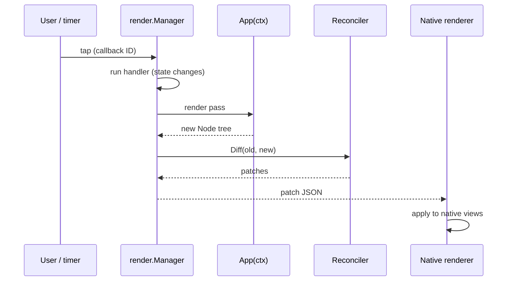

# Getting Started

## Install

GrMob is a Go module; requires Go 1.26+.

```bash
go get github.com/rohanthewiz/grmob
```

## A first app

A GrMob app is a package with a root view function and an `init` that
registers it with the mobile bridge:

```go
// counter/app.go
package counter

import (
    "fmt"

    "github.com/rohanthewiz/grmob/core"
    "github.com/rohanthewiz/grmob/mobile"
)

func init() {
    mobile.Register(core.NewContext(), App)
}

// AppName gives gomobile a bindable symbol so the package (and its init)
// links into the native library. Function-typed App is not bindable itself.
func AppName() string { return "Counter" }

func App(ctx *core.Context) core.View {
    count := core.NewState(ctx, 0)

    return core.SafeArea(
        core.Column(
            core.Gap(12),
            core.Text("Counter", core.FontSize(28), core.FontWeight(core.Bold)),
            core.Text(fmt.Sprintf("Count: %d", count.Get())),
            core.Row(
                core.Gap(8),
                core.Button("−", func() { count.Set(count.Get() - 1) }),
                core.Button("+", func() { count.Set(count.Get() + 1) }),
            ),
        ),
    )
}
```

Three things to notice:

1. **`App` runs on every render pass.** It reads state, builds a view tree,
   and returns. It must not block or spawn work directly — that is what
   [hooks](concepts/state-and-hooks.md) are for.
2. **`NewState` is a positional hook.** Call it unconditionally, in the same
   order, every pass. The [rules of hooks](concepts/state-and-hooks.md#the-rules-of-hooks)
   explain why, and [debug mode](concepts/debug-mode.md) catches violations.
3. **`count.Set` is all the plumbing there is.** Setting state marks the tree
   dirty and requests a render; the diff reaches the screen through whichever
   renderer is attached.

## Run it — fastest feedback first

### 1. Drive it from a test (no simulator, no browser)

`render.Manager` is the same engine the native shells use, and it works in a
plain Go test:

```go
func TestCounter(t *testing.T) {
    mgr := render.New(core.NewContext(), counter.App)
    defer mgr.Close()

    tree := mgr.RenderInitial() // full tree JSON
    // Find the "+" button's callback ID in the tree, then:
    patches := mgr.DispatchCallback("cb_1") // tap → handler → re-render → diff
    // assert on the patch JSON
}
```

`examples/todoapp/app_test.go` shows this pattern at three levels of depth,
including asserting on exported HTML via [`htmlout`](platforms/exporters.md).

### 2. Preview in the browser

The WASM runtime mounts any registered app in a page. See
[WebAssembly](platforms/wasm.md) for the build and host-page contract:

```bash
GOOS=js GOARCH=wasm go build -o main.wasm ./wasm
```

### 3. Ship it to a phone

Both native shells bind the `mobile` bridge package plus your app package with
gomobile — the build scripts take the app package as an argument:

```bash
android/build.sh ./counter   # produces android/app/libs/grmob.aar
ios/build.sh ./counter       # produces the xcframework for the Xcode project
```

Details, prerequisites, and the bridge contract are in
[Native Android & iOS](platforms/native.md).

## The render loop at a glance



Every arrow in that diagram has a dedicated page:
[Architecture](concepts/architecture.md) for the whole pipeline,
[Events & Callbacks](concepts/events.md) for the dispatch path,
[Reconciliation](concepts/reconciliation.md) for the diff.

## Next steps

- Work through the [Todo App tutorial](tutorial-todo.md) — it covers
  controlled inputs, keyed lists, theming, accessibility, persistence with
  bytdb, and testing.
- Browse the [widget library](components.md) before hand-rolling a card,
  chip, or form field.
- Turn on [debug mode](concepts/debug-mode.md) in development builds.
