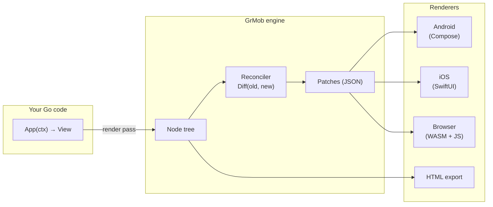

# GrMob

**GrMob** is a framework for building native mobile apps in pure, idiomatic Go.
You write views, state, and logic as Go functions; GrMob renders them natively
on Android (Jetpack Compose shell) and iOS (SwiftUI shell), in the browser via
WebAssembly, or to plain HTML for previews and tests.

```go
func App(ctx *core.Context) core.View {
    count := core.NewState(ctx, 0)

    return core.Column(
        core.Text(fmt.Sprintf("Taps: %d", count.Get())),
        core.Button("Tap me", func() { count.Set(count.Get() + 1) }),
    )
}
```

That is a complete GrMob app: a function from context to view. Tapping the
button sets state, GrMob re-renders, diffs the new tree against the old one,
and ships a minimal patch set to whichever renderer is attached.

## How it fits together



## Feature highlights

- **Declarative views** — compose UI from pure functions: `Column`, `Row`,
  `Card`, `List`, `Text`, `Button`, `Input`, and friends, plus conditional
  helpers (`If`, `IfElse`, `Match`, `For`, `MaybeProp`) that keep render logic reading
  like prose.
- **Hook-based state** — `NewState`, `hooks.UseEffect`, `hooks.UseInterval`,
  `hooks.UseTimeout`; state changes mark the tree dirty and re-render
  automatically, including from timers and background goroutines.
- **Minimal updates** — a reconciler diffs retained `Node` trees and emits
  positional patches, so an unchanged screen costs nothing and a one-field
  change patches one node.
- **Theming** — a `Theme` carries palette, typography, spacing, and
  per-component base styles; widgets read it from the context, so restyling an
  app is a data change. The palette names *roles* — `Primary`/`Secondary` for
  brand, `Error`/`Success`/`Warning` for status, `Border` for strokes — and
  widgets like `Badge{Variant:}` and `Button{Variant:}` select a role rather
  than a color.
- **Widget library** — the [`components` package](components.md) adds
  struct-configured widgets with composition slots: `Screen`, `Button`,
  `InputRow`, `SegmentedControl`, `Card`, `ListRow`, `Separator`, `Avatar`,
  `ProgressBar`, `Chip`, `Badge`, `FormField`, `Accordion`, `Tabs`.
- **Debug mode** — opt-in runtime checks catch the silent failure modes of
  positional hooks (cursor drift, duplicate sibling keys, misused caches) and
  report them as inspectable concerns. See [Debug Mode](concepts/debug-mode.md).
- **One codebase, four targets** — the same app package ships to Android and
  iOS through a gomobile bridge, runs in the browser through WASM, and exports
  HTML for tests and tooling.

## Where to go next

| I want to… | Read |
|---|---|
| Build and run something in five minutes | [Getting Started](getting-started.md) |
| Learn the framework end to end | [Tutorial — Todo App](tutorial-todo.md) |
| Understand the render pipeline | [Architecture](concepts/architecture.md) |
| Manage state correctly | [State & Hooks](concepts/state-and-hooks.md) |
| Ship to a phone | [Native Android & iOS](platforms/native.md) |

## License

MIT License © 2026 Rohan Allison · © 2025 Ismael Matsinhe
