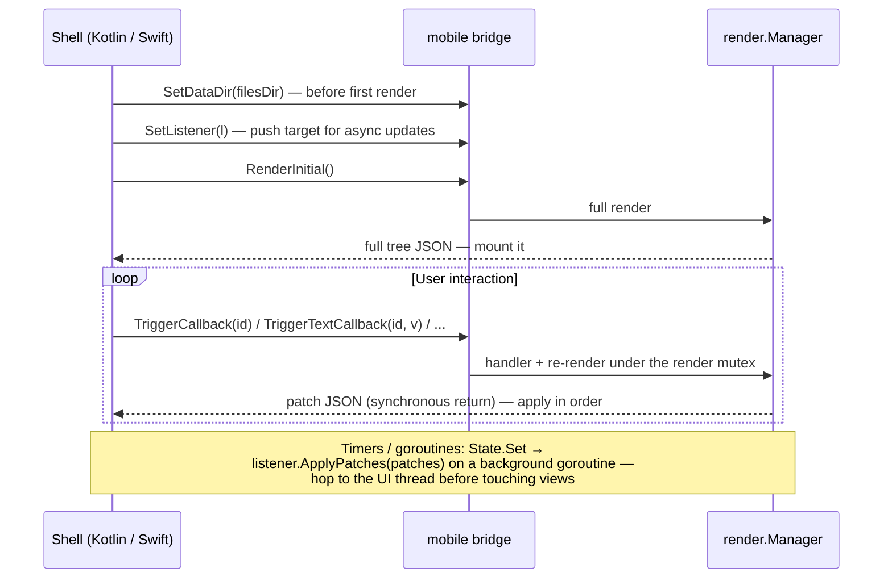

# Native Android & iOS

The native targets run your Go app inside a thin platform shell: Go renders
and diffs; Kotlin/Swift apply patches to real platform views. The connection
is the `mobile` package — a gomobile-bindable bridge that narrows the
framework surface to strings, bools, and one single-method interface
(gomobile cannot bind function parameters, generics, or maps).

## The contract

Your app package registers itself in an `init`:

```go
func init() { mobile.Register(core.NewContext(), App) }

// gomobile only links a bound package that exports at least one bindable
// symbol; App (function-typed) is not bindable, so export something trivial:
func AppName() string { return "My App" }
```

The shell then drives the bridge:



**Delivery guarantee:** each render pass produces its diff exactly once, on
exactly one of the two paths (synchronous return or push). Apply everything
you receive from either path, in arrival order, and the native tree stays
consistent. Patch semantics — positional paths, ordering rules — are in
[Reconciliation](../concepts/reconciliation.md#patches).

| Bridge function | Purpose |
|---|---|
| `Register(ctx, root)` | Install the app (from Go `init`). Re-registering closes the previous manager |
| `SetDataDir(path)` | Writable sandbox dir for Go-side persistence (Application Support on iOS, `filesDir` on Android). Call before `RenderInitial` |
| `SetListener(l)` | Attach the async push target (`ApplyPatches(string)`) |
| `RenderInitial()` | Full tree JSON for the first mount |
| `TriggerCallback(id)` / `TriggerTextCallback` / `TriggerBoolCallback` / `TriggerIntCallback` | Event dispatch; returns the resulting patches |
| `RenderAgain()` | Escape hatch for shells that drive rendering themselves |
| `SetSystemEventListener(l)` | Sink for app→host system events (`toast`, `open_url`, `audio`); `OnSystemEvent(name, payloadJSON)` |
| `ReportHostEvent(name, payloadJSON)` | Host→app events that answer no callback (`audio_status`, `lifecycle`); returns the resulting patches like `Trigger*` |

## Building — Android

Prerequisites: Android SDK + NDK, and gomobile:

```bash
go install golang.org/x/mobile/cmd/gomobile@latest golang.org/x/mobile/cmd/gobind@latest
gomobile init
```

Then:

```bash
android/build.sh ./examples/todoapp   # any package whose init calls mobile.Register
```

The script binds `./mobile` plus your app package into
`android/app/libs/grmob.aar` (it defaults `ANDROID_HOME` /
`ANDROID_NDK_HOME` to the standard macOS locations if unset). Open
`android/` in Android Studio and run the `app` module — the Kotlin shell in
`android/app/src` implements the renderer against the bridge contract above.

From the command line, use the committed Gradle wrapper (it downloads its own
pinned Gradle, so no system install is required):

```bash
cd android && ./gradlew assembleDebug
adb install -r app/build/outputs/apk/debug/app-debug.apk
```

## Building — iOS

Requires **full Xcode** (not just Command Line Tools) — gomobile drives
`xcodebuild`:

```bash
sudo xcode-select -s /Applications/Xcode.app
ios/build.sh ./examples/todoapp
```

This produces the xcframework consumed by the Xcode project under `ios/`
(`project.yml` / SwiftUI shell in `ios/GrMob`).

## Shipping a different app

Both build scripts take the app package as their first argument. Any Go
package whose `init` calls `mobile.Register` (and exports one bindable
symbol) drops into the same shells — that is the whole integration contract,
and it's why the examples are structured as packages, not mains.

## Text grids

`core.TextGrid` renders one monospace `Text` per row: Compose builds an
`AnnotatedString` of `SpanStyle` runs in `FontFamily.Monospace`, SwiftUI an
`AttributedString` in the `.monospaced` design. Rows never wrap; a grid wider
than the screen scrolls horizontally. Both natives draw a dim run by fading
its colour, so a dim run with no colour of its own (and no grid `TextColor`)
renders at full weight.

## Audio

`core.AudioLoad`, `AudioPlay`, `AudioPause`, `AudioToggle`, `AudioSeek`,
`AudioSkip`, `AudioSetRate` and `AudioStop` drive one player per process,
behind the platform's own media session — so background playback, the
lock-screen card, headset buttons and CarPlay/Android Auto come from the OS
rather than from the app. A screen reads the player with `hooks.UseAudio`,
which re-renders it on every status tick:

```go
status := hooks.UseAudio(ctx)
core.Slider(status.Position, 0, status.Duration, nil,
    core.OnSliderChangeEnd(core.AudioSeek))
core.Button(map[bool]string{true: "Pause", false: "Play"}[status.State == core.AudioPlaying],
    core.AudioToggle)
```

Two channels carry it:

```
app ──SendSystemEvent("audio", {command: load|play|pause|seek|skip|rate|stop})──▶ shell
app ◀──ReportHostEvent("audio_status", {url, state, position, duration, rate, error})── shell
```

The second is new with this feature and generic: `core.ReceiveHostEvent`
fans any named host→app event out to `core.OnHostEvent` subscribers after
core's own consumers, and `mobile.ReportHostEvent` is its one bridge entry
point (`GrMobWASM.HostEvent` in the browser). Shells dispatch it on the same
serial executor as `Trigger*` calls and apply the returned patches the same
way. The app lifecycle rides the same channel; see [Lifecycle](#lifecycle).

| Shell | Player | Session | Background |
|---|---|---|---|
| Android | Media3 ExoPlayer in `GrMobAudioService` (a `MediaSessionService`), driven through a `MediaController` from `AudioPlayer.kt` | Media3's own notification | `FOREGROUND_SERVICE_MEDIA_PLAYBACK` + `WAKE_LOCK`; the service is declared in the manifest |
| iOS | `AVPlayer` in `AudioPlayer.swift` | `MPNowPlayingInfoCenter` + `MPRemoteCommandCenter` | `UIBackgroundModes: [audio]` (project.yml) and a `.playback` audio session |
| Browser | `HTMLAudioElement` in `grmob-runtime.js` | the Media Session API | the tab |

Status arrives twice a second while playing. `AudioLoad` and `AudioStop`
update `core.CurrentAudioStatus` optimistically (loading / idle) so the very
next render already shows the right track; everything else is the shell's
word. `examples/mobileapp`'s Audio tab exercises the whole surface.

## Lifecycle

`core.CurrentLifecycle()` reports whether the app is on screen —
`LifecycleActive`, `LifecycleInactive` or `LifecycleBackground` —
`core.OnLifecycle` subscribes to transitions, and `hooks.UseLifecycle`
re-renders a component on each one. The case that put it on the roadmap is
a client reconnecting on resume: a phone that spent an hour in the
background comes back with a dead socket, and without this the app learns
that from its first failed write rather than from the foregrounding itself.

```go
// Wherever the connection lives, outside the tree:
core.OnLifecycle(func(s core.LifecycleState) {
    if s == core.LifecycleActive { conn.Resume() }
})
```

The vocabulary is SwiftUI's `ScenePhase`, the most finely divided of the
three hosts; the others map onto it:

| Shell | Source | active | inactive | background |
|---|---|---|---|---|
| iOS | `scenePhase`, read at the `App` (`AppLifecycle.swift`) | `.active` | `.inactive` | `.background` |
| Android | `ProcessLifecycleOwner` (`AppLifecycle.kt`) | `ON_RESUME` | `ON_PAUSE` | `ON_STOP` |
| Browser | Page Visibility API (`grmob-runtime.js`) | visible | — | hidden |

Android deliberately observes the *process*, not the Activity: an Activity
is torn down and rebuilt on every rotation, and an app subscribed to
reconnect on resume would redial every time the phone turned. The process
owner delays `ON_PAUSE`/`ON_STOP` by a short grace period and cancels them
when another Activity of the app takes over, so they mean "the user left".

It travels as the `"lifecycle"` host event with one key, `state`; core
consumes it into the record before app subscribers to the raw event run,
the same ordering `audio_status` has, and drops a repeat of the current
state, so subscribers hear transitions only. The initial state is active —
an app that has just started is on screen — and a shell that disagrees says
so with its first report. `mobile/verify` holds the three shells' spellings
of the event and its states to core's.

## Permissions

`permission.Check(p)` and `permission.Request(p)` travel as the `"permission"`
system event with two keys — `command` and `kind` — and each host answers over
the `"permission"` host event with `kind` and `status`. Go validates both keys
on arrival and drops anything it cannot read rather than guessing: every wrong
guess has a cost, since `granted` opens a device the OS did not authorise,
`denied` hides a feature that works, and `unavailable` sends a user to a
settings page with no switch on it.

The vocabulary is the browser's, so the browser needs no mapping table and
these two hosts each map their own richer enum onto it.

| Go | iOS | Android |
|---|---|---|
| `Granted` | `.authorized` / `.authorizedWhenInUse` / `.authorizedAlways`, and Photos' `.limited` | `PERMISSION_GRANTED` |
| `Prompt` | `.notDetermined` | `PERMISSION_DENIED`, no rationale, never asked by this install |
| `Denied` | `.denied` | `PERMISSION_DENIED` with a rationale, or after this install has asked |
| `Unavailable` | `.restricted` — a parental control or an MDM profile | the permission is missing from the manifest |

Photos' `.limited` maps to `Granted` because the app really can read the
photos the user picked; which ones is the picker's business, not this
channel's.

**Android has to reconstruct three states out of two.** `checkSelfPermission`
answers GRANTED or DENIED and nothing else, and
`shouldShowRequestPermissionRationale` is false both for "never asked" and for
"don't ask again" — so the shell tracks whether this install has asked, and
breaks the tie towards `Denied`. Reporting `Prompt` for a permanently refused
permission would leave a screen offering a button that does nothing.

That flag is in `SharedPreferences`, in the shell's own file, written on the
request path only. It used to be in memory, on the argument that a framework
shell should not write to disk unasked, and the cost was paid on every cold
start: a permanently refused permission read as `Prompt` until the next request
proved otherwise, so the first thing the user saw was a button offering to ask
and pressing it did nothing. What settled it is that the fact being remembered
is the *platform's* — "has this install ever asked for X" is bookkeeping
Android keeps and will not answer — and a quirk of one platform belongs in the
one file that knows about it rather than in every app built on top.

**A `denied` request still reaches the launcher.** Persisting the flag
introduces a failure the in-memory version could not have: Android 11+ revokes
permissions for apps the user has not opened in months and resets
don't-ask-again with them, so the flag on disk says "asked" while a request
would in fact show the dialog again. A request path that short-circuited on
`Denied` would lock the user out of a permission the system had just handed
back. So it short-circuits on `Granted` and `Unavailable` only — safe because
`registerForActivityResult` always delivers a result, so a permanent refusal
comes straight back as DENIED with nothing on screen.

**Nothing announces a permission changing in Settings**, on either phone. The
signal both platforms do send is the app returning to the foreground, which is
what `permission.WatchForeground` — and `hooks.UsePermissionLive` above it —
turns into a re-check. It is reference-counted by permission rather than by
screen, so five screens watching the camera produce one `check` per resume
between them and an app with no live watcher takes no lifecycle subscription at
all.

**Two build-time halves no Go code can supply.** An iOS prompt whose
`NS*UsageDescription` key is missing from `Info.plist` *terminates the app* at
the moment it would appear; an Android permission missing from
`AndroidManifest.xml` is auto-denied with nothing on screen. Both shells ship
the entries for all four permissions, `mobile/verify/permission_test.go` holds
them there, and the Android shell reports an undeclared permission as
`Unavailable` rather than `Denied` — it is a build the user cannot influence.

**Location asks for the narrower option on both.** iOS requests
when-in-use, not always: "always" is a second prompt Apple shows on its own
schedule after the app has demonstrably used location in the foreground, and
requesting it up front is how an app gets refused. Android requests
`ACCESS_COARSE_LOCATION` alone, so no precise/approximate chooser appears for a
promise the Go API did not make. One `permission.Location` constant means the
narrower thing everywhere, which is why there is no second constant for the
wider one.

**iOS needs an object where the others need a function.** `CLLocationManager`
reports an authorization change through its delegate rather than through a
completion handler, and a manager released while its prompt is up reports
nothing at all — so `Permissions.swift` is a singleton holding one. It is
deliberately not `HeadingSensor`'s manager: the compass asks for nothing on
purpose (an unexpected permission dialog is worse than a bearing a few degrees
off a map), and sharing the object would make one of those decisions the
other's.

**Android needs the Activity.** `registerForActivityResult` is an Activity API
whose registration must happen in `onCreate`, so `Permissions.attach` is called
from `MainActivity` rather than from `SystemEvents` — which keeps only an
application context, deliberately, so an Activity handed to it is not leaked.

## Persistence on device

Go code cannot discover the writable sandbox path itself — it is an OS-level
fact only the shell knows. The shell passes it via `SetDataDir` before the
first render; Go code reads it with `mobile.DataDir()` and opens its store
lazily on first render (the bound package's `init` runs before `SetDataDir`,
so don't open stores in `init`). With no data dir set — web preview, tests —
`DataDir()` returns `""` and persistence-aware apps run in-memory. See the
[tutorial's persistence chapter](../tutorial-todo.md) for the bytdb store
pattern.

## How the layout model reaches each platform

Go declares CSS-flavored layout; neither native toolkit speaks it natively.
Four of the mappings are worth knowing because they are where the platforms
needed real work rather than a lookup table.

### `FlexGrow` — proportional weights

Compose has `Modifier.weight`, which is proportional by construction, so a Row
child with `FlexGrow(3)` beside one with `FlexGrow(1)` has always split the
leftover space 75/25 there.

SwiftUI has no weight. The renderer used to give every grower a
`.frame(maxWidth: .infinity)`, which makes a stack split leftover space
**equally** — so the same declaration rendered 50/50 on iOS and 75/25 on
Android. `GrMobFlexStack`, a hand-written SwiftUI `Layout`, now runs the CSS
algorithm directly (`flex-basis: auto`, proportional grow, proportional
shrink) and replaces `HStack`/`VStack` for `Row`/`Column`. Two things came
along with it: `justify-content` is exact rather than emulated with hidden
`Spacer`s (`space-around` and `space-evenly` are different values again), and
the stack keeps SwiftUI's hug-unless-something-claims-the-space behavior, so
layouts that predate it render unchanged.

### `AlignItems: "stretch"`

A stretched child is *sized* to the container's cross axis, not *placed*
along it, so neither toolkit's alignment enum can express it — both have
start/center/end and nothing else.

- **iOS** — `GrMobFlexStack` proposes the full cross extent to each child.
- **Android** — the container hands each child a `fillMaxWidth()` (Column) or
  `fillMaxHeight()` (Row); a stretched Row is additionally pinned to
  `IntrinsicSize.Max` so its children stretch to the tallest sibling rather
  than to the whole screen. Intrinsic measurement is why a `List` inside a
  stretched `Row` is unsupported — a lazy list cannot report an intrinsic
  height. Give that Row an explicit `Height` instead.

Both renderers apply it to lazy lists too, where it is the only flex property
that means anything (a scrolling axis has no leftover space to divide).

**Stretch is the default on the vertical containers.** A `Column`, `List` or
`Scroll` with no `AlignItems` and no `Align` stretches its children, on both
natives, because that is the CSS default (`align-items: stretch`) and
therefore what the two DOM targets have always drawn: an `Input` in a Column
runs the full width in the browser, and on a phone it used to hug its
placeholder. Two kinds of child keep their own width, exactly as on the web:
one with an explicit `Width`, and one whose `Display` is inline — which is
how the bundled themes make `Button` and `Badge` hug their content (the web
runtime turns that into `width: fit-content`); `components.Button{FullWidth:
true}` asks for the stretch back. An explicit `AlignItems(AlignFlexStart)`
still packs. Rows keep their top-aligned default: the intrinsic-height
measurement above has real costs inside a List, so nothing turns it on
unasked.

### `ContentMode` on `Image`

```go
core.ImageWithMode(url, core.ContentModeFill, core.Width("64px"), core.Height("64px"))
```

`core.Image` keeps its old signature and its old rendering; the mode is a
required argument on the `WithMode` builder rather than an option buried in a
style list.

| `core.ContentMode` | SwiftUI | Compose | CSS |
|---|---|---|---|
| `Fit` (default) | `scaledToFit()` | `ContentScale.Fit` | `object-fit: contain` |
| `Fill` | `scaledToFill().clipped()` | `ContentScale.Crop` | `object-fit: cover` |
| `Stretch` | `resizable()` | `ContentScale.FillBounds` | `object-fit: fill` |
| `Center` | intrinsic size, clipped | `ContentScale.None` | `object-fit: none` |

`Fill` and `Center` crop on every target — an unclipped image would paint over
its siblings.

Note the three value columns have nothing in common: SwiftUI modifier chains,
Compose `ContentScale` cases, CSS keywords. Only the first column — the mode
names — is shared by all four renderers, so the DOM pair can be checked by
comparing tables while the natives can only be checked for **coverage**: does
every mode core declares have an arm of its own?

Coverage is the half that matters here, because both natives fold the
unrecognized case into `Fit` (neither SwiftUI nor Compose has CSS's "unset" to
fall back to). Without a check, adding a fifth `ContentMode` would draw as
`Fit` on iOS and Android while both DOM targets fell back to the browser
default — four renderers, two behaviors, no error anywhere.

`mobile/verify/contentmode_test.go` closes that. It reads the `switch mode` in
`Renderer.swift` and the `when (mode)` in `Renderer.kt` as text and holds their
arms up against `core.ContentModes()`. Reading rather than compiling is not a
shortcut: `default` and `else` make a string switch exhaustive by construction,
so "you forgot a mode" is not a type error in either language and never will
be — only something comparing the arms with Go's list can notice. Doing that in
Go is what puts the check inside a plain `go test ./...`, where it runs without
Xcode, without the Android SDK, and without anyone remembering a `run.sh`.

The price is a shape both functions must keep, stated in a comment beside each:
one arm per line, string literals first on the line, the catch-all last, and
every mode listed explicitly — including the one the catch-all would have
handled anyway. Every violation fails as a named error saying what changed,
rather than as an empty comparison that agrees with everything.

### `Alignment`, `JustifyContent` and `AlignItems`

The same coverage argument, applied to the three alignment types — and this
time it found live bugs rather than a hypothetical one.

These are unlike `ContentMode` in one way that matters. `htmlout` and the WASM
runtime emit `justify-content` and `align-items` **verbatim**: core's spellings
*are* the CSS ones, so the DOM pair cannot be wrong about a value it never
interprets. All of the drift risk is native, where eleven `switch`/`when`
dispatches across three files each turn a string into a SwiftUI or Compose
value, and each ends in a catch-all that renders *something*. A value with no
arm does not error — it packs to the start.

| core | iOS | Android |
|---|---|---|
| `JustifyContent` | `GrMobFlexSolver.leading` + `.gap` (arithmetic) | `horizontalArrangement` / `verticalArrangement` |
| `AlignItems` | `GrMobFlexSolver.crossOffset`, `crossAlignmentH` | Row / Column / List cross alignment |
| `Alignment` (as text) | `grMobTextAlignment` | `textStyle`'s `textAlign` |

`mobile/verify/alignment_test.go` holds each of them to `core.JustifyContents()`,
`core.AlignItemsValues()` or `core.TextAlignments()`. Two details are worth
knowing:

- **The iOS solver answers `justify-content` with two dispatches**, one for the
  offset before the run of children and one for the gap between them, and each
  returns 0 for the half the other owns. They are checked *separately*: a union
  of their arms would pass if each half answered for values it has no business
  answering for, and the arrangement that makes the solver readable is that each
  states its own complete opinion.
- **Several cross-axis dispatches serve two vocabularies at once.** `Style.Align`
  doubles as the fallback a container reads when `AlignItems` is unset, so a
  Column's switch legitimately carries `"start"`/`"end"` arms that are
  `core.Alignment` values, not `AlignItems` ones. Those are *permitted, not
  required* — `GrMobRow` deliberately declines the fallback, because `Align` is
  a text-alignment concept and has never been read for a Row's vertical axis.
  All four targets now draw that line in the same place: the DOM pair reads
  the same fallback through `htmlout/crossaxis.go`'s tables, gated to the
  same three container types and declining `Row` the same way (see
  [WebAssembly](wasm.md#the-cross-axis-fallback)).

#### What this found

`Align` was the worst-behaved prop in the framework: one value, four behaviors.
`core.Align(core.AlignJustify)` justified the text on Compose, rendered leading
on SwiftUI, exported no declaration at all from `htmlout`, and did nothing
whatsoever on the web — the WASM runtime **never read `Style.Align` in any
form**. All four are now held to `core.TextAlignments()`, and the web target
reads the prop at all for the first time (see
[WebAssembly](wasm.md#text-alignment)).

Coverage means a target has *said* what it does with a value, not that it can
honor it. SwiftUI genuinely cannot justify text — `TextAlignment` has three
members — so `grMobTextAlignment` carries an explicit `"justify"` arm that
falls back to leading and names the limit. An explicit arm is an answer;
silence is not.

`Align(AlignStretch)` on a Column was a second divergence, and one no coverage
test can reach: it stretched on iOS and did nothing on Android, because Compose
tested `alignItems` alone where SwiftUI consulted the `Align` fallback. That is
an equality test, not a dispatch — there are no arms to hold up against a list —
so it was found by reading and fixed by hand (`isColumnStretch`). The switch
checks reach the switches, and that is all they reach.

`Align(AlignStretch)` on a `List` was the same story again, this time with the
natives in perfect agreement — on the wrong answer. Each List's placement
dispatch reads the `Align` fallback, and its `"stretch"` arm defers to the fill
modifier in the item loop; each item loop tested `alignItems` alone. The value
took the arm's word for a fill that never happened: rows placed at the start
edge and stretched nowhere, while a Column with the identical style stretched.
Both loops now read the fallback-aware helper (`crossAxisValue` on iOS,
`isColumnStretch` on Android — a List's cross axis is horizontal like a
Column's), and `TestListStretchFillReadsTheAlignFallback` pins the loop to the
helper and the helper to the fallback — the one stretch equality a test now
reaches.

#### Known divergence, left alone

Compose's five distributing `Arrangement`s take no spacing argument, so a `Row`
with both a `Gap` and a `JustifyContent` loses the gap on Android. CSS treats
gap as a minimum that `justify-content` adds to, and the iOS solver does the
same (it carries `spacing` separately from `justify`).
`Arrangement.spacedBy(gap, alignment)` would fix the three packing values;
nothing expresses gap-plus-distribution for the `space-*` three without a custom
`Arrangement`. Not attempted, because it is a rendering change on the one target
this repo cannot build.

### `AccessibilityRole`

`core.AccessibilityRole(role)` becomes traits on iOS and semantics properties
on Android, and on both it is a partial mapping by design: `heading` and
`columnheader` become `.isHeader` / `heading()`, `button` becomes `.isButton`
/ `Role.Button`, `link` and `search` become `.isLink` and `.isSearchField`
(no Compose analog for either — its `Role` has no Link), and `status` /
`alert` become Compose live regions (no SwiftUI analog). The remaining twelve
— the tabular set, both collection pairs, the landmarks and `group` — have no
vocabulary on either platform and do nothing there while working on both web
targets.

`group` is worth telling apart from the other eleven, because it is empty for
the opposite reason. Those are silent because the platform has no way to say
the thing; `group` is silent because neither platform *needs* it. It exists
because ARIA prohibits an accessible name on the `generic` role a `<div>`
carries, so a labelled container was announced by nothing on the web — while a
`contentDescription` and an `accessibilityLabel` are honoured on any node here.
Both web exporters supply it automatically to a named, roleless node (see
[Styling & Theming](../concepts/styling-and-theming.md#rolegroup-and-the-one-role-you-get-without-asking)),
which means the role reaches both natives too and correctly does nothing.

Both renderers *name* every role anyway, in a `switch`/`when` with explicit
empty arms, so a role that does nothing is on record rather than lost in a
catch-all — and `mobile/verify/role_test.go` holds both dispatches against
`core.Roles()` under a plain `go test ./...`. See
[Styling & Theming](../concepts/styling-and-theming.md#accessibilityrole).

### `AccessibilityHeadingLevel`

The tier that goes with `RoleHeading` splits the two platforms rather than
mapping partially to both. iOS has `.accessibilityHeading(.h1 … .h6)`, so the
level reaches VoiceOver's heading rotor; Compose's `heading()` takes no
argument and its semantics package has no level property, so the Android
renderer deliberately never parses the JSON key.

That silence is written down beside the role dispatch in `GrMobStyle.kt`, for
the same reason the empty role arms are: a field a renderer simply ignored
looks exactly like one nobody had heard of.
`mobile/verify/heading_level_test.go` pins both halves — that Swift carries the
level through all three links, and that Kotlin's note has not outlived the
limitation.

### `AccessibilityNestingLevel`

The other two roles `aria-level` serves — `listitem` and `row` — map to nothing
on either platform. SwiftUI has no nesting-depth property at all, and Compose's
nearest one, `collectionItemInfo`, states an item's index and span within *one*
collection rather than its depth within nested ones; filling it from this field
would tell TalkBack something the app never said. So unlike the heading tier,
which splits the two platforms, this field is inert on both and lives on the
web alone.

Neither renderer parses the key, and both say why — `GrMobStyle.kt` beside the
role dispatch, `GrMobStyle.swift` beside `grMobHeadingLevel`, which is where a
reader who has just seen the heading third mapped will ask about the other two.
`mobile/verify/nesting_level_test.go` pins the notes and their absence of a
parse together.

### `AccessibilityID` and `AccessibilityControls`

The two IDREF props — an element identity and the `aria-controls` that points
at it — are the third shape in this section: inert on both platforms, like the
nesting level, and for a reason that is about the *reader* rather than about
the API. VoiceOver and TalkBack both move through a screen by swiping to the
next element; neither follows a relationship from a tab to the region it shows,
which is what a browser's reader uses `aria-controls` for. There is nothing in
either semantics vocabulary for the pair to become.

Neither renderer parses either key, and both say why — beside `grMobRole` in
each file, which is where a reader looking for the mapping arrives.
`mobile/verify/idref_test.go` pins the notes and the absence of a parse
together, as the two level tests do.

`core.RoleTabPanel` joins them for the same reason and gets an empty arm in both
dispatches: what makes a tab panel announce as one is being *pointed at*, and
neither reader follows a reference. A `core.TabView` still announces correctly
on both phones, because each hands the whole strip to the platform's own tab
container.

It also pins one thing they do not, because this field has a near miss the
levels never had: `accessibilityIdentifier` on iOS and `testTag` on Compose.
Both look like the obvious mapping for `AccessibilityID` and both are *test*
selectors rather than accessibility properties — XCUITest and Espresso read
them, VoiceOver and TalkBack do not. Mapping onto them would quietly turn every
hand-built tab into a test handle and still announce nothing, so each note names
the property it is turning down and the test checks the naming is still there.

### `AccessibilityExpanded`

The disclosure state is the one accessibility field where the *two natives*
disagree, which is the reverse of every shape above.

**Compose maps it, and to an action rather than a property.** There is no
expanded property in Compose semantics; there are `expand()` and `collapse()`,
which become `AccessibilityNodeInfo`'s `ACTION_EXPAND` and `ACTION_COLLAPSE`
and which TalkBack offers as "double-tap to expand". So a closed disclosure is
given the expand action and an open one the collapse action — the inverse of
the state, which is this mapping's one silent bug, since both arms compile and
both toggle the section correctly when activated.

An action has to *do* something, and the only thing that can open the section
is the callback the node's tap already runs. That callback lives on the node
rather than on the style, which is why this mapping is the one that does not
live in `GrMobStyle.boxModifier`'s semantics lambda beside `grMobRole` and
`grMobSelected` — it is `grMobDisclosure` in `Renderer.kt`'s `gestureModifier`,
the one place holding both halves. The consequence is that **a node with an
expanded state and no `OnClick` gets nothing**, which is the honest outcome: an
expand action TalkBack can invoke and Compose cannot perform is worse than a
disclosure that is merely quiet.

**SwiftUI has nothing.** `AccessibilityTraits` has no expanded member, and
SwiftUI's own `DisclosureGroup` announces its state by writing an accessibility
**value** — a localized string SwiftUI supplies from its own bundle. That is
the near miss, and it is a sharper one than `accessibilityIdentifier` was
above, because `accessibilityValue` is a real accessibility channel that the
platform genuinely uses for this. What makes it wrong for a framework is that
this renderer would have to supply the literal "expanded" or "collapsed" in
English, for every app in every locale, in a slot the app may want for a value
of its own. It is the same move `components.Chip`'s `", selected"` name suffix
was deleted for.

So the key crosses the bridge and `GrMobStyle.swift` does not parse it, with a
note beside `grMobTraitsFor` naming `accessibilityValue` and saying why.
`mobile/verify/expanded_test.go` pins both sides: Compose's parse, its two arms
against `core.ExpandedStates()`, and the state/action pairing as one string so
a transposition fails; and iOS's absence of a parse plus both halves of the
note.

### `AccessibilityValue`

The value of a valued control splits the two platforms too, and along a
different seam from the disclosure above: here they disagree about *which half*
of the field they can say.

**Compose takes the numbers.** `progressBarRangeInfo` is one of the better
mappings in this framework — TalkBack turns a position and its bounds into a
percentage it localizes itself, so a bar reports "45 percent" in the user's own
language with no string ever crossing the bridge. That is exactly what
`components.ProgressBar` could not do while its value lived in the accessible
name. A range with bounds and no position becomes
`ProgressBarRangeInfo.Indeterminate`, which is ARIA's indeterminate bar said in
Compose's words; a range that states nothing numeric leaves the property alone,
because a `Text` on an ordinary node must not turn it into a progress bar.

**SwiftUI takes only the words.** There is no numeric accessibility value on the
platform — `accessibilityValue` takes a `Text` and there is no equivalent of
`ProgressBarRangeInfo` — so the three numbers arrive, are visible in
`GrMobStyle`, and reach no view modifier. Formatting them into a string here is
the tempting fix and is the same move the disclosure note above turns down: a
renderer that spells a number out loud is choosing a language for every app that
uses it.

`ValueRange.Text` is the half both platforms take, through `stateDescription`
and `accessibilityValue`, and the difference that makes it safe is whose words
they are — the app's own, on the channel `AccessibilityLabel` and
`AccessibilityHint` already ride. It is, incidentally, the value slot the
`AccessibilityExpanded` note says the framework has no room for: an app that
wants VoiceOver to hear "expanded" can now say so in its own language, which is
a different thing from this renderer deciding to.

Neither renderer consults the role, for the reason neither consults it for a
selection: both honour these properties on any node, and ARIA is the strict one.
`mobile/verify/value_test.go` pins Compose like a mapping — parsed, dispatched,
reaching both primitives, invoked from the semantics lambda — and SwiftUI in
both directions: the words reaching a modifier, and the numbers reaching
nothing.

The one detail worth knowing about the wire: the numbers cross as **strings**,
because 0 is a bar at the start of an upload and is also the zero value of a Go
float, and `core.Style` merges on "non-zero wins". Kotlin keeps the distinction
after parsing — nullable `Float`s rather than a `0f` default — or it would
reintroduce the same bug one layer down and could not tell an indeterminate bar
from one that has not started.

### The field with a widget spending it

The field now has a widget spending it — `components.ListRow`'s `NestingLevel`,
for an outline flattened into one list — and that changes nothing here, which
is worth saying plainly rather than leaving to be inferred. Such a row goes out
with `role="listitem"` and a depth; on device the role reaches the `when`/
`switch` and lands on an empty arm, and the depth is not parsed at all. A
flattened outline therefore announces as a flat list of items on both phones
and as a nested one on both web targets. That is the same honest partial the
nine unmapped roles have: each platform says the truest thing it can, and the
half it cannot say is written down instead of faked.

### A `core.Button`'s border

A Button draws its own container on both platforms, so each renderer hands it a
style with the box-drawing fields stripped (`marginAndSize` on Android,
`marginAndSizeOnly` on iOS) and feeds them back through the platform control's
own slots — Compose's `Button(colors:, shape:, contentPadding:)`, SwiftUI's
`GrMobButtonStyle`. The border was the one field stripped and never fed back,
so `core.BorderColor`/`BorderWidth` were silently dropped on Buttons alone and
`components.Button`'s outlined emphasis had no rule on device.

Both now carry it: a `BorderStroke` into material3's `border` slot (and into
the `Surface` the long-press path rebuilds the button out of), and a
`strokeBorder` overlay on the same rounded rectangle the fill is clipped to.
The guard is the same on every target — a width **and** a color — so half a
border is no border everywhere. `mobile/verify/button_border_test.go` pins both
renderers.

### A text field's frame

Nothing to do here either, and for the opposite reason to the Button above: both
renderers already honored the style. Compose composes a `BasicTextField` through
the ordinary `boxModifier`, and SwiftUI a `.plain`-styled `TextField` through
`grMobBox`, so each drew exactly what `core.Style` asked for — and until both
bundled themes gave `Components.Input` and `Components.TextArea` a border, what
they asked for was nothing.

That is why the missing frame was a theme bug rather than a renderer one. The
phones were right and looked wrong; the web was wrong and looked right, because
a browser draws its own border on an `<input>`. Both themes now state a control
boundary at WCAG 1.4.11's 3:1, all four targets draw it from the same field, and
`borderResetTypes` could finally take the browser's away.

### A picker's frame, and why it is not a platform picker

`core.Select` is drawn on both natives as an ordinary styled box with a menu
hung off it — a SwiftUI `Menu`, a Compose `Box` anchored to a `DropdownMenu` —
and **not** from either platform's own picker control. That is a deliberate
cost: `.pickerStyle(.menu)` and Material's `ExposedDropdownMenuBox` are the
idiomatic controls and each draws a frame, a container colour and an indicator
of its own that no Go style can remove.

Taking them would have made the picker the one control in the vocabulary whose
edge came from the platform on two targets and from the theme on the other two
— the exact divergence `borderResetTypes` was extended to prevent, since the
web's `<select>` reset rests on the frame being the theme's everywhere. So each
native draws the style's own box (`grMobBox` / `boxModifier`, like every other
node) and the platform supplies only the behaviour.
`mobile/verify/select_test.go` pins both halves: that the arm draws through the
style's box, and that neither forbidden construct appears in it.

`SelectOption.Group` and `SelectOption.Disabled` are drawn by each platform's
own means, and this is where the two menus stop looking alike:

- **SwiftUI** has a `Section`, so a run of options sharing a heading is handed
  to one. A `Section` is a container, so a run has to be handed over whole,
  which is why the rows are drawn by `grMobMenuItems` rather than inline. The
  disabling is `.disabled` on the **Button** — on the Section it would take the
  whole run with it.
- **Compose**'s `DropdownMenu` has no section construct, so a heading is an
  ordinary `DropdownMenuItem` with `enabled = false` and an empty `onClick`,
  written ahead of its run. That is what makes it a label rather than a choice.

Both split by *runs*: consecutive options sharing a heading, in the order
written. See `core.SelectOption.Group` for why a gather would be the wrong
shape.

`SelectOption.GroupDisabled` disables a whole run, and this is the one case
where taking the Section down with it is the request rather than the accident:
SwiftUI puts `.disabled` on the **Section**, so the header greys along with its
rows. Compose needs nothing — its heading item is already `enabled = false` —
and both targets get the refusal itself the same way, because
`core.SelectMenuSections` marks every item of a disabled run before either
renderer sees it. That propagation is not a convenience: Compose has no section
construct to disable, and on the web a run with no heading has no `<optgroup>`
to carry the attribute.

#### The menu is invisible, so the decision was moved out of it

A SwiftUI `Menu`'s content is a closure of views and a Compose `DropdownMenu`'s
is a composable lambda. Neither can be read back, so nothing short of a
simulator or a device could open a picker and check its sections — which left
three facts about the open menu (the runs, the headings, the refused rows)
resting on `mobile/verify` finding the right substrings in a 900-line renderer.

The decision is out of the closure now. `GrMobSelectMenu.swift` and
`GrMobSelectMenu.kt` turn the flat option list into sections and rows, each
renderer's menu is a loop over the result, and both files import no UI at all
— which is what makes them runnable off a device. `core.SelectMenuSections` is
the authority both transliterate (and the one `htmlout` calls directly), and
both are now *run* against cases generated from it:

    ios/verify/run.sh       compiles GrMobSelectMenu.swift into its harness
    android/verify/run.sh   compiles GrMobSelectMenu.kt and runs it on a JVM

Neither harness needs a device, a simulator or gradle. `android/verify` is the
newer of the two and is described below.

What no harness reaches on **either** platform is the last step — the line
handing a row's value to `textChanged` and its disabled flag to the construct
that refuses the tap. That is what `mobile/verify/select_test.go` is for now,
and it is a much smaller surface than the one it used to cover.

#### `android/verify`: Kotlin without gradle

`GrMobSelectMenu.kt` imports nothing — no Compose, no Android — precisely so a
plain JVM could execute it. `android/verify/run.sh` is what finally does.

The obvious shape for it, an `android/app/src/test` source set driven by
`./gradlew test`, is the one it deliberately avoids. That needs JUnit resolved
through gradle, and this repository's Android build runs `--offline` against
whatever the local cache holds; a check that only runs on a machine which has
already downloaded the right test dependencies is a check nobody runs. It would
also drag the whole AGP pipeline in to execute a function that touches no
Android API.

So the script compiles two files and runs them:

    android/verify/gen.go      the case table, as Kotlin source
    android/verify/Harness.kt  the comparison, and main()

The table crosses as **Kotlin source** rather than as JSON, which is the one
place this harness differs from `ios/verify`. Swift decodes a JSON transcript
with `Decodable` from its standard library; Kotlin's standard library has no
JSON parser and neither does the JDK, so a JSON fixture here would mean either
a dependency — the thing the harness exists to avoid — or a hand-written parser
standing between the fixture and the code under test.

The compiler is `kotlinc` if one is on `PATH`, and otherwise the compiler jars
in the gradle cache the Android build already populates. If neither is present
the pass **skips** rather than fails, the same stance `ios/verify` takes toward
a missing iPhoneOS SDK.

Whether the menu is **open** is the renderer's own state and nothing else's.
There is no prop for it and no patch describes it; the *selection* stays
controlled like every other input's value. A picker that closed on every
unrelated re-render would be unusable, which is what putting the flag in the
tree would cause.

A picker takes no keyboard focus stamp either (`focusableLeafTypes` in
`core/focus.go`). It looks like a field and reads a field's theme base, so the
omission reads as an oversight — but the set is about the *keyboard*, and a
menu is not a keyboard target on either phone. The web is the outlier: a
browser focuses a `<select>` happily, and `htmlout` exports the `autofocus`
for it, because focus there is a document concept rather than a keyboard one.

### An overlay on device

`core.ZStack` is a SwiftUI `ZStack` and a Compose `Box` — the two constructs
the node type was named for — and both are told to centre their content
explicitly. On SwiftUI that restates a default; on Compose it overrides one,
since a `Box` places its children at the top-start corner. Stating it in both
is what keeps the alignment comparable from the other renderer, and
`mobile/verify`'s `TestNativeZStackOverlaysItsChildren` reads both.

The layers are rendered through neither renderer's *flex* children loop: an
overlay divides no leftover space along an axis, so there is no `FlexGrow`
weight to hand a layer and no cross-axis stretch to apply. A layer that wants
the stack's full extent states its own dimensions.

`core.StackAlign` is the per-layer opt-out from that centring, and it is the
one place these two constructs stop being interchangeable.

- **Compose** spells it directly: `Modifier.align(Alignment.*)` exists inside
  `BoxScope` for exactly this, it places without resizing, and a placed child
  still contributes its size to the `Box`. The children are looped over inside
  `GrMobZStack` rather than handed to `RenderChildren` only because the
  modifier has to be built per child, in that scope.
- **SwiftUI** has no equivalent — a `ZStack`'s `alignment:` is the stack's, not
  the layer's — so the whole stack is a custom `Layout` (`GrMobStackLayout`)
  that measures every layer, sizes to the largest, and places each one at its
  own anchor. The layer's anchor rides to the layout on a `LayoutValueKey`,
  because a `Layout` sees opaque subview proxies and cannot get back to the
  `GrMobNode` a child came from.

This used to be `.frame(maxWidth: .infinity, maxHeight: .infinity, alignment:)`
around the placed layer, which is SwiftUI's own idiom for the job and carried
this target's one divergence: **a filling frame is greedy**, so an *unsized*
stack with an aligned layer grew to its parent's proposal on iOS where a Compose
`Box` and a CSS grid track both stay the size of their largest child. It was
documented in four places, avoidable by pinning the stack's box, and pinned
nowhere — `ios/verify` type-checks and replays, and neither measures a size.

The `Layout` closes it, and the arithmetic behind it is a pure CoreGraphics file
(`GrMobStack.swift`) for the reason `GrMobFlexSolver` is one: a `Layout` needs a
view hierarchy to exercise and a function from numbers to numbers does not. So
`ios/verify` now *measures* the overlay — the container sizing to the largest
child on each axis independently, all nine anchors against a known box, the
bounds' origin being added, an oversized layer overhanging rather than being
clamped — where before it could only check that the file compiled.

Both mappings return "no placement" for the centre rather than the platform's
own centre constant, so "said nothing" and "asked for the centre" stay one state
all the way down. `mobile/verify`'s `TestNativeStackAlignmentsCoverEveryPlacement`
holds the arms to `core.StackAlignments()`,
`TestNativeStackAlignmentsLeaveTheCentreToTheCatchAll` holds them to *not*
carrying an arm for it, and `TestNativeZStackOverlaysItsChildren` now also fails
if a filling frame ever comes back.

This is the counterpart to the `Box` fix: `Box` and `SafeArea` used to be built
from these same two constructs and were moved onto the column implementations,
because both DOM targets stack them. `ZStack` is the node type that gives the
behaviour a name.

### `core.Modal` and the dialog role

Nothing to do here, and that is the point. iOS presents a Modal as a sheet and
Android as a Compose `Dialog`; both announce themselves as modal and confine
exploration to their own content, so the `role="dialog"` / `aria-modal` pair
the two DOM renderers write by hand comes free on device. That asymmetry is why
`core.Role` has no `RoleDialog` for an author to set — see
[Styling & Theming](../concepts/styling-and-theming.md#roles-a-node-type-carries-for-itself).

### `Disabled`

`core.Disabled(bool)` becomes the platform's own inert state — `enabled =
false` on Android, `.disabled(true)` on iOS — and propagates to the subtree on
both, so one declaration can freeze a whole section. Full contract, including
why it deliberately changes no colors and why it must not also be announced
through the accessibility label, in
[Styling & Theming](../concepts/styling-and-theming.md#disabled).

## Testing without a device

`render.Manager` and the bridge are plain Go — the exact call sequence a
shell makes runs in a test (`examples/todoapp/app_test.go`,
`mobile/bridge_test.go`). Most development happens at that level; the
simulator/emulator is for final verification.

`ios/verify/run.sh` goes one step further without needing Xcode or a
simulator: Go generates a bridge transcript from the demo app, Swift replays
it through the real `GrMobNode`/`GrMobStyle`/`TreeStore` files and deep-
compares the resulting tree against Go's final render, and the view layer
(`Renderer.swift`, `GrMobFlexStack` included) is then type-checked. Only Go
and the Xcode Command Line Tools are required.

`mobile/verify` needs even less — just Go. It holds the checks that have to
hold in *both* native renderers at once, which is why they live under
`mobile/` (the bridge surface both shells are written against) rather than in
either platform's own harness. Its checks read native source as text, so they
run under `go test ./...` alongside everything else: `ContentMode` coverage was
the first, and the three alignment types are now held the same way — twelve
dispatches across `Renderer.swift`, `GrMobFlex.swift` and `Renderer.kt`, plus
one array literal.

The price is a shape those dispatches must keep, stated in a comment beside
each: one arm per line, string literals first on the line, the catch-all last,
and every value listed explicitly — including the ones the catch-all would have
handled anyway. Those redundant arms are the point and must not be tidied away;
a value that falls through is indistinguishable from one nobody considered.

### The bridge stand-in

Three files in `ios/GrMob/App` — the `@main` entry point among them — begin
`import GrMob`, the module a `gomobile bind` produces, so they could not be
type-checked without full Xcode and a gomobile toolchain. `ios/verify`
compiles a hand-written stand-in module of that name instead
(`ios/verify/gomobile_stub.swift`), and the app layer type-checks against it.

A hand-written stand-in for generated code is a copy, and a drifted copy is
worse than no check at all — the shell would keep type-checking green against
a bridge Go no longer has. So `mobile/verify/gomobilestub_test.go` holds it to
package `mobile`, in two directions and at two levels:

- **The names.** Every bindable exported function and every exported interface
  has a declaration, under gobind's naming (`Mobile` + the Go name, and
  `…Protocol` for an interface, since Swift suffixes the protocol to break its
  collision with the class of the same name). Nothing in the stub claims a Go
  symbol that is not there.
- **The signatures.** Each declaration is character-for-character what gobind
  would emit — parameter types and order, argument labels, nullability and the
  return — for the package functions and the protocols' methods alike. Adding
  a bindable function without adding it here fails `go test ./...`, and so does
  renaming one of its parameters.

- **The header comment.** The declarations were pinned character-for-character
  and the comment above them was a hand-written description of the rules doing
  the pinning — the naming, the nullability asymmetry, gobind's three result
  arms. It agreed with the checker because it was written from it, which is the
  same copy-that-drifts this whole stand-in exists to refuse. So the
  load-bearing half of it is now written as rows in a delimited block, and the
  test reads them out of the comment and holds each to the thing it describes:
  the version to `go.mod`, the prefix and suffix to the names the checker
  builds, each type row to `swiftType`, each result row to what `swiftResult`
  does with a signature of that shape. The prose around the rows is not checked
  and is not meant to be — a paragraph explaining *why* nullability is
  asymmetric cannot be wrong in the way `string String? String` can.

The type mapping is three rows and a protocol rule (`gobindSwiftTypes`), which
is all this bridge's narrow surface can need — a Go type outside it already
stops the bind. It is split by position because gobind's nullability is not
symmetric: a `string` parameter arrives as `String?` and a `string` result as
`String`, and a stub that took `String` everywhere would accept shell code the
real framework rejects.

**The facts come from gobind, not from a header somebody once produced.**
`golang.org/x/mobile` is in this module — held there by `go.mod`'s `tool` block,
which pins the gobind the stub is written against — so the mapping is read off
`bind/genobjc.go`: `objcParamType` for a parameter, `objcType` for every other
position, `funcSummary` for the shape of a result clause. `gobindVersion` pins
the version those readings were made at, and a bump fails until somebody looks.

That provenance closed two refusals the table used to carry, both of which said
in effect "read it off `Headers/Mobile.objc.h` and add the row" — which made the
*next* bridge function of either shape blocked on somebody having run a
`gomobile bind` at least once, on a Mac with Xcode, for a fact sitting in the
module cache the whole time:

- **A returned bound interface** is no longer refused. `objcParamType`
  special-cases exactly one Go type, `String`, and falls through to `objcType`
  for everything else — so the asymmetry the two columns exist for is `string`
  and nothing else, and a returned protocol is `_Nullable` exactly as a
  parameter is. Nothing returns one yet; that is now a fact about this bridge
  rather than a hole in the table.
- **A multi-result signature** is still refused, and the refusal now describes
  what gobind does instead of asking someone to find out. `funcSummary` has
  three arms, not two: a `(T, error)` pair where `T` is nullable becomes a Swift
  `throws` function returning `T`; where `T` is not nullable it becomes a
  `throws` function returning `Void` with `T` as an out-parameter; and **three
  or more results gobind refuses outright**. That last one is not a gap in this
  table — `gomobile bind` will not build the function — so the fix is to change
  the Go signature, and reporting it as a missing mapping would send the next
  person to read a header for a declaration that was never generated.

The signature half was left out for a while, on the argument that a wrong
signature fails the Swift type-check the moment the shell calls it. That
assumed every declaration has a call site. Three do not — `MobileDataDir`,
`MobileRenderAgain` and `MobileReportHostEvent` are all reachable from a shell
that never touches them — and for those the type-check proved nothing.
