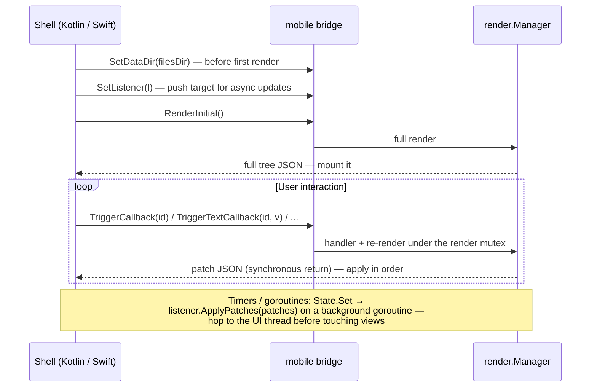

# Native Android & iOS

The native targets run your Go app inside a thin platform shell: Go renders
and diffs; Kotlin/Swift apply patches to real platform views. The connection
is the `mobile` package — a gomobile-bindable bridge that narrows the
framework surface to strings, bools, and one single-method interface
(gomobile cannot bind function parameters, generics, or maps).

## The contract

Your app package registers itself in an `init`:

```go
func init() { mobile.Register(core.NewContext(), App) }

// gomobile only links a bound package that exports at least one bindable
// symbol; App (function-typed) is not bindable, so export something trivial:
func AppName() string { return "My App" }
```

The shell then drives the bridge:



**Delivery guarantee:** each render pass produces its diff exactly once, on
exactly one of the two paths (synchronous return or push). Apply everything
you receive from either path, in arrival order, and the native tree stays
consistent. Patch semantics — positional paths, ordering rules — are in
[Reconciliation](../concepts/reconciliation.md#patches).

| Bridge function | Purpose |
|---|---|
| `Register(ctx, root)` | Install the app (from Go `init`). Re-registering closes the previous manager |
| `SetDataDir(path)` | Writable sandbox dir for Go-side persistence (Application Support on iOS, `filesDir` on Android). Call before `RenderInitial` |
| `SetListener(l)` | Attach the async push target (`ApplyPatches(string)`) |
| `RenderInitial()` | Full tree JSON for the first mount |
| `TriggerCallback(id)` / `TriggerTextCallback` / `TriggerBoolCallback` / `TriggerIntCallback` | Event dispatch; returns the resulting patches |
| `RenderAgain()` | Escape hatch for shells that drive rendering themselves |
| `SetSystemEventListener(l)` | Sink for app→host system events (`toast`, `open_url`, `audio`); `OnSystemEvent(name, payloadJSON)` |
| `ReportHostEvent(name, payloadJSON)` | Host→app events that answer no callback (`audio_status`, `lifecycle`); returns the resulting patches like `Trigger*` |

## Building — Android

Prerequisites: Android SDK + NDK, and gomobile:

```bash
go install golang.org/x/mobile/cmd/gomobile@latest golang.org/x/mobile/cmd/gobind@latest
gomobile init
```

Then:

```bash
android/build.sh ./examples/todoapp   # any package whose init calls mobile.Register
```

The script binds `./mobile` plus your app package into
`android/app/libs/grmob.aar` (it defaults `ANDROID_HOME` /
`ANDROID_NDK_HOME` to the standard macOS locations if unset). Open
`android/` in Android Studio and run the `app` module — the Kotlin shell in
`android/app/src` implements the renderer against the bridge contract above.

From the command line, use the committed Gradle wrapper (it downloads its own
pinned Gradle, so no system install is required):

```bash
cd android && ./gradlew assembleDebug
adb install -r app/build/outputs/apk/debug/app-debug.apk
```

## Building — iOS

Requires **full Xcode** (not just Command Line Tools) — gomobile drives
`xcodebuild`:

```bash
sudo xcode-select -s /Applications/Xcode.app
ios/build.sh ./examples/todoapp
```

This produces the xcframework consumed by the Xcode project under `ios/`
(`project.yml` / SwiftUI shell in `ios/GrMob`).

## Shipping a different app

Both build scripts take the app package as their first argument. Any Go
package whose `init` calls `mobile.Register` (and exports one bindable
symbol) drops into the same shells — that is the whole integration contract,
and it's why the examples are structured as packages, not mains.

## Text grids

`core.TextGrid` renders one monospace `Text` per row: Compose builds an
`AnnotatedString` of `SpanStyle` runs in `FontFamily.Monospace`, SwiftUI an
`AttributedString` in the `.monospaced` design. Rows never wrap; a grid wider
than the screen scrolls horizontally. Both natives draw a dim run by fading
its colour, so a dim run with no colour of its own (and no grid `TextColor`)
renders at full weight.

## Audio

`core.AudioLoad`, `AudioPlay`, `AudioPause`, `AudioToggle`, `AudioSeek`,
`AudioSkip`, `AudioSetRate` and `AudioStop` drive one player per process,
behind the platform's own media session — so background playback, the
lock-screen card, headset buttons and CarPlay/Android Auto come from the OS
rather than from the app. A screen reads the player with `hooks.UseAudio`,
which re-renders it on every status tick:

```go
status := hooks.UseAudio(ctx)
core.Slider(status.Position, 0, status.Duration, nil,
    core.OnSliderChangeEnd(core.AudioSeek))
core.Button(map[bool]string{true: "Pause", false: "Play"}[status.State == core.AudioPlaying],
    core.AudioToggle)
```

Two channels carry it:

```
app ──SendSystemEvent("audio", {command: load|play|pause|seek|skip|rate|stop})──▶ shell
app ◀──ReportHostEvent("audio_status", {url, state, position, duration, rate, error})── shell
```

The second is new with this feature and generic: `core.ReceiveHostEvent`
fans any named host→app event out to `core.OnHostEvent` subscribers after
core's own consumers, and `mobile.ReportHostEvent` is its one bridge entry
point (`GrMobWASM.HostEvent` in the browser). Shells dispatch it on the same
serial executor as `Trigger*` calls and apply the returned patches the same
way. The app lifecycle rides the same channel; see [Lifecycle](#lifecycle).

| Shell | Player | Session | Background |
|---|---|---|---|
| Android | Media3 ExoPlayer in `GrMobAudioService` (a `MediaSessionService`), driven through a `MediaController` from `AudioPlayer.kt` | Media3's own notification | `FOREGROUND_SERVICE_MEDIA_PLAYBACK` + `WAKE_LOCK`; the service is declared in the manifest |
| iOS | `AVPlayer` in `AudioPlayer.swift` | `MPNowPlayingInfoCenter` + `MPRemoteCommandCenter` | `UIBackgroundModes: [audio]` (project.yml) and a `.playback` audio session |
| Browser | `HTMLAudioElement` in `grmob-runtime.js` | the Media Session API | the tab |

Status arrives twice a second while playing. `AudioLoad` and `AudioStop`
update `core.CurrentAudioStatus` optimistically (loading / idle) so the very
next render already shows the right track; everything else is the shell's
word. `examples/mobileapp`'s Audio tab exercises the whole surface.

## Lifecycle

`core.CurrentLifecycle()` reports whether the app is on screen —
`LifecycleActive`, `LifecycleInactive` or `LifecycleBackground` —
`core.OnLifecycle` subscribes to transitions, and `hooks.UseLifecycle`
re-renders a component on each one. The case that put it on the roadmap is
a client reconnecting on resume: a phone that spent an hour in the
background comes back with a dead socket, and without this the app learns
that from its first failed write rather than from the foregrounding itself.

```go
// Wherever the connection lives, outside the tree:
core.OnLifecycle(func(s core.LifecycleState) {
    if s == core.LifecycleActive { conn.Resume() }
})
```

The vocabulary is SwiftUI's `ScenePhase`, the most finely divided of the
three hosts; the others map onto it:

| Shell | Source | active | inactive | background |
|---|---|---|---|---|
| iOS | `scenePhase`, read at the `App` (`AppLifecycle.swift`) | `.active` | `.inactive` | `.background` |
| Android | `ProcessLifecycleOwner` (`AppLifecycle.kt`) | `ON_RESUME` | `ON_PAUSE` | `ON_STOP` |
| Browser | Page Visibility API (`grmob-runtime.js`) | visible | — | hidden |

Android deliberately observes the *process*, not the Activity: an Activity
is torn down and rebuilt on every rotation, and an app subscribed to
reconnect on resume would redial every time the phone turned. The process
owner delays `ON_PAUSE`/`ON_STOP` by a short grace period and cancels them
when another Activity of the app takes over, so they mean "the user left".

It travels as the `"lifecycle"` host event with one key, `state`; core
consumes it into the record before app subscribers to the raw event run,
the same ordering `audio_status` has, and drops a repeat of the current
state, so subscribers hear transitions only. The initial state is active —
an app that has just started is on screen — and a shell that disagrees says
so with its first report. `mobile/verify` holds the three shells' spellings
of the event and its states to core's.

## Persistence on device

Go code cannot discover the writable sandbox path itself — it is an OS-level
fact only the shell knows. The shell passes it via `SetDataDir` before the
first render; Go code reads it with `mobile.DataDir()` and opens its store
lazily on first render (the bound package's `init` runs before `SetDataDir`,
so don't open stores in `init`). With no data dir set — web preview, tests —
`DataDir()` returns `""` and persistence-aware apps run in-memory. See the
[tutorial's persistence chapter](../tutorial-todo.md) for the bytdb store
pattern.

## How the layout model reaches each platform

Go declares CSS-flavored layout; neither native toolkit speaks it natively.
Four of the mappings are worth knowing because they are where the platforms
needed real work rather than a lookup table.

### `FlexGrow` — proportional weights

Compose has `Modifier.weight`, which is proportional by construction, so a Row
child with `FlexGrow(3)` beside one with `FlexGrow(1)` has always split the
leftover space 75/25 there.

SwiftUI has no weight. The renderer used to give every grower a
`.frame(maxWidth: .infinity)`, which makes a stack split leftover space
**equally** — so the same declaration rendered 50/50 on iOS and 75/25 on
Android. `GrMobFlexStack`, a hand-written SwiftUI `Layout`, now runs the CSS
algorithm directly (`flex-basis: auto`, proportional grow, proportional
shrink) and replaces `HStack`/`VStack` for `Row`/`Column`. Two things came
along with it: `justify-content` is exact rather than emulated with hidden
`Spacer`s (`space-around` and `space-evenly` are different values again), and
the stack keeps SwiftUI's hug-unless-something-claims-the-space behavior, so
layouts that predate it render unchanged.

### `AlignItems: "stretch"`

A stretched child is *sized* to the container's cross axis, not *placed*
along it, so neither toolkit's alignment enum can express it — both have
start/center/end and nothing else.

- **iOS** — `GrMobFlexStack` proposes the full cross extent to each child.
- **Android** — the container hands each child a `fillMaxWidth()` (Column) or
  `fillMaxHeight()` (Row); a stretched Row is additionally pinned to
  `IntrinsicSize.Max` so its children stretch to the tallest sibling rather
  than to the whole screen. Intrinsic measurement is why a `List` inside a
  stretched `Row` is unsupported — a lazy list cannot report an intrinsic
  height. Give that Row an explicit `Height` instead.

Both renderers apply it to lazy lists too, where it is the only flex property
that means anything (a scrolling axis has no leftover space to divide).

**Stretch is the default on the vertical containers.** A `Column`, `List` or
`Scroll` with no `AlignItems` and no `Align` stretches its children, on both
natives, because that is the CSS default (`align-items: stretch`) and
therefore what the two DOM targets have always drawn: an `Input` in a Column
runs the full width in the browser, and on a phone it used to hug its
placeholder. Two kinds of child keep their own width, exactly as on the web:
one with an explicit `Width`, and one whose `Display` is inline — which is
how the bundled themes make `Button` and `Badge` hug their content (the web
runtime turns that into `width: fit-content`); `components.Button{FullWidth:
true}` asks for the stretch back. An explicit `AlignItems(AlignFlexStart)`
still packs. Rows keep their top-aligned default: the intrinsic-height
measurement above has real costs inside a List, so nothing turns it on
unasked.

### `ContentMode` on `Image`

```go
core.ImageWithMode(url, core.ContentModeFill, core.Width("64px"), core.Height("64px"))
```

`core.Image` keeps its old signature and its old rendering; the mode is a
required argument on the `WithMode` builder rather than an option buried in a
style list.

| `core.ContentMode` | SwiftUI | Compose | CSS |
|---|---|---|---|
| `Fit` (default) | `scaledToFit()` | `ContentScale.Fit` | `object-fit: contain` |
| `Fill` | `scaledToFill().clipped()` | `ContentScale.Crop` | `object-fit: cover` |
| `Stretch` | `resizable()` | `ContentScale.FillBounds` | `object-fit: fill` |
| `Center` | intrinsic size, clipped | `ContentScale.None` | `object-fit: none` |

`Fill` and `Center` crop on every target — an unclipped image would paint over
its siblings.

Note the three value columns have nothing in common: SwiftUI modifier chains,
Compose `ContentScale` cases, CSS keywords. Only the first column — the mode
names — is shared by all four renderers, so the DOM pair can be checked by
comparing tables while the natives can only be checked for **coverage**: does
every mode core declares have an arm of its own?

Coverage is the half that matters here, because both natives fold the
unrecognized case into `Fit` (neither SwiftUI nor Compose has CSS's "unset" to
fall back to). Without a check, adding a fifth `ContentMode` would draw as
`Fit` on iOS and Android while both DOM targets fell back to the browser
default — four renderers, two behaviors, no error anywhere.

`mobile/verify/contentmode_test.go` closes that. It reads the `switch mode` in
`Renderer.swift` and the `when (mode)` in `Renderer.kt` as text and holds their
arms up against `core.ContentModes()`. Reading rather than compiling is not a
shortcut: `default` and `else` make a string switch exhaustive by construction,
so "you forgot a mode" is not a type error in either language and never will
be — only something comparing the arms with Go's list can notice. Doing that in
Go is what puts the check inside a plain `go test ./...`, where it runs without
Xcode, without the Android SDK, and without anyone remembering a `run.sh`.

The price is a shape both functions must keep, stated in a comment beside each:
one arm per line, string literals first on the line, the catch-all last, and
every mode listed explicitly — including the one the catch-all would have
handled anyway. Every violation fails as a named error saying what changed,
rather than as an empty comparison that agrees with everything.

### `Alignment`, `JustifyContent` and `AlignItems`

The same coverage argument, applied to the three alignment types — and this
time it found live bugs rather than a hypothetical one.

These are unlike `ContentMode` in one way that matters. `htmlout` and the WASM
runtime emit `justify-content` and `align-items` **verbatim**: core's spellings
*are* the CSS ones, so the DOM pair cannot be wrong about a value it never
interprets. All of the drift risk is native, where eleven `switch`/`when`
dispatches across three files each turn a string into a SwiftUI or Compose
value, and each ends in a catch-all that renders *something*. A value with no
arm does not error — it packs to the start.

| core | iOS | Android |
|---|---|---|
| `JustifyContent` | `GrMobFlexSolver.leading` + `.gap` (arithmetic) | `horizontalArrangement` / `verticalArrangement` |
| `AlignItems` | `GrMobFlexSolver.crossOffset`, `crossAlignmentH` | Row / Column / List cross alignment |
| `Alignment` (as text) | `grMobTextAlignment` | `textStyle`'s `textAlign` |

`mobile/verify/alignment_test.go` holds each of them to `core.JustifyContents()`,
`core.AlignItemsValues()` or `core.TextAlignments()`. Two details are worth
knowing:

- **The iOS solver answers `justify-content` with two dispatches**, one for the
  offset before the run of children and one for the gap between them, and each
  returns 0 for the half the other owns. They are checked *separately*: a union
  of their arms would pass if each half answered for values it has no business
  answering for, and the arrangement that makes the solver readable is that each
  states its own complete opinion.
- **Several cross-axis dispatches serve two vocabularies at once.** `Style.Align`
  doubles as the fallback a container reads when `AlignItems` is unset, so a
  Column's switch legitimately carries `"start"`/`"end"` arms that are
  `core.Alignment` values, not `AlignItems` ones. Those are *permitted, not
  required* — `GrMobRow` deliberately declines the fallback, because `Align` is
  a text-alignment concept and has never been read for a Row's vertical axis.
  All four targets now draw that line in the same place: the DOM pair reads
  the same fallback through `htmlout/crossaxis.go`'s tables, gated to the
  same three container types and declining `Row` the same way (see
  [WebAssembly](wasm.md#the-cross-axis-fallback)).

#### What this found

`Align` was the worst-behaved prop in the framework: one value, four behaviors.
`core.Align(core.AlignJustify)` justified the text on Compose, rendered leading
on SwiftUI, exported no declaration at all from `htmlout`, and did nothing
whatsoever on the web — the WASM runtime **never read `Style.Align` in any
form**. All four are now held to `core.TextAlignments()`, and the web target
reads the prop at all for the first time (see
[WebAssembly](wasm.md#text-alignment)).

Coverage means a target has *said* what it does with a value, not that it can
honor it. SwiftUI genuinely cannot justify text — `TextAlignment` has three
members — so `grMobTextAlignment` carries an explicit `"justify"` arm that
falls back to leading and names the limit. An explicit arm is an answer;
silence is not.

`Align(AlignStretch)` on a Column was a second divergence, and one no coverage
test can reach: it stretched on iOS and did nothing on Android, because Compose
tested `alignItems` alone where SwiftUI consulted the `Align` fallback. That is
an equality test, not a dispatch — there are no arms to hold up against a list —
so it was found by reading and fixed by hand (`isColumnStretch`). The switch
checks reach the switches, and that is all they reach.

`Align(AlignStretch)` on a `List` was the same story again, this time with the
natives in perfect agreement — on the wrong answer. Each List's placement
dispatch reads the `Align` fallback, and its `"stretch"` arm defers to the fill
modifier in the item loop; each item loop tested `alignItems` alone. The value
took the arm's word for a fill that never happened: rows placed at the start
edge and stretched nowhere, while a Column with the identical style stretched.
Both loops now read the fallback-aware helper (`crossAxisValue` on iOS,
`isColumnStretch` on Android — a List's cross axis is horizontal like a
Column's), and `TestListStretchFillReadsTheAlignFallback` pins the loop to the
helper and the helper to the fallback — the one stretch equality a test now
reaches.

#### Known divergence, left alone

Compose's five distributing `Arrangement`s take no spacing argument, so a `Row`
with both a `Gap` and a `JustifyContent` loses the gap on Android. CSS treats
gap as a minimum that `justify-content` adds to, and the iOS solver does the
same (it carries `spacing` separately from `justify`).
`Arrangement.spacedBy(gap, alignment)` would fix the three packing values;
nothing expresses gap-plus-distribution for the `space-*` three without a custom
`Arrangement`. Not attempted, because it is a rendering change on the one target
this repo cannot build.

### `AccessibilityRole`

`core.AccessibilityRole(role)` becomes traits on iOS and semantics properties
on Android, and on both it is a partial mapping by design: `heading` and
`columnheader` become `.isHeader` / `heading()`, `button` becomes `.isButton`
/ `Role.Button`, `link` and `search` become `.isLink` and `.isSearchField`
(no Compose analog for either — its `Role` has no Link), and `status` /
`alert` become Compose live regions (no SwiftUI analog). The remaining nine — the tabular set, the collection pair and the landmarks —
have no vocabulary on either platform and do nothing there while working on
both web targets.

Both renderers *name* every role anyway, in a `switch`/`when` with explicit
empty arms, so a role that does nothing is on record rather than lost in a
catch-all — and `mobile/verify/role_test.go` holds both dispatches against
`core.Roles()` under a plain `go test ./...`. See
[Styling & Theming](../concepts/styling-and-theming.md#accessibilityrole).

### `Disabled`

`core.Disabled(bool)` becomes the platform's own inert state — `enabled =
false` on Android, `.disabled(true)` on iOS — and propagates to the subtree on
both, so one declaration can freeze a whole section. Full contract, including
why it deliberately changes no colors and why it must not also be announced
through the accessibility label, in
[Styling & Theming](../concepts/styling-and-theming.md#disabled).

## Testing without a device

`render.Manager` and the bridge are plain Go — the exact call sequence a
shell makes runs in a test (`examples/todoapp/app_test.go`,
`mobile/bridge_test.go`). Most development happens at that level; the
simulator/emulator is for final verification.

`ios/verify/run.sh` goes one step further without needing Xcode or a
simulator: Go generates a bridge transcript from the demo app, Swift replays
it through the real `GrMobNode`/`GrMobStyle`/`TreeStore` files and deep-
compares the resulting tree against Go's final render, and the view layer
(`Renderer.swift`, `GrMobFlexStack` included) is then type-checked. Only Go
and the Xcode Command Line Tools are required.

`mobile/verify` needs even less — just Go. It holds the checks that have to
hold in *both* native renderers at once, which is why they live under
`mobile/` (the bridge surface both shells are written against) rather than in
either platform's own harness. Its checks read native source as text, so they
run under `go test ./...` alongside everything else: `ContentMode` coverage was
the first, and the three alignment types are now held the same way — twelve
dispatches across `Renderer.swift`, `GrMobFlex.swift` and `Renderer.kt`, plus
one array literal.

The price is a shape those dispatches must keep, stated in a comment beside
each: one arm per line, string literals first on the line, the catch-all last,
and every value listed explicitly — including the ones the catch-all would have
handled anyway. Those redundant arms are the point and must not be tidied away;
a value that falls through is indistinguishable from one nobody considered.
