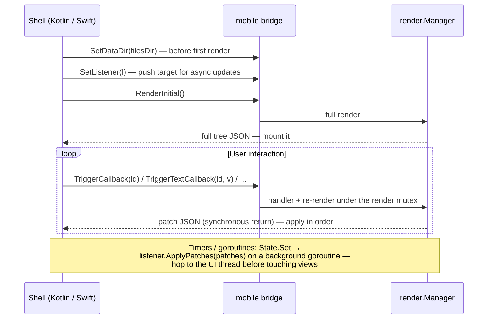

# Native Android & iOS

The native targets run your Go app inside a thin platform shell: Go renders
and diffs; Kotlin/Swift apply patches to real platform views. The connection
is the `mobile` package — a gomobile-bindable bridge that narrows the
framework surface to strings, bools, and one single-method interface
(gomobile cannot bind function parameters, generics, or maps).

## The contract

Your app package registers itself in an `init`:

```go
func init() { mobile.Register(core.NewContext(), App) }

// gomobile only links a bound package that exports at least one bindable
// symbol; App (function-typed) is not bindable, so export something trivial:
func AppName() string { return "My App" }
```

The shell then drives the bridge:



**Delivery guarantee:** each render pass produces its diff exactly once, on
exactly one of the two paths (synchronous return or push). Apply everything
you receive from either path, in arrival order, and the native tree stays
consistent. Patch semantics — positional paths, ordering rules — are in
[Reconciliation](../concepts/reconciliation.md#patches).

| Bridge function | Purpose |
|---|---|
| `Register(ctx, root)` | Install the app (from Go `init`). Re-registering closes the previous manager |
| `SetDataDir(path)` | Writable sandbox dir for Go-side persistence (`Documents` on iOS, `filesDir` on Android). Call before `RenderInitial` |
| `SetListener(l)` | Attach the async push target (`ApplyPatches(string)`) |
| `RenderInitial()` | Full tree JSON for the first mount |
| `TriggerCallback(id)` / `TriggerTextCallback` / `TriggerBoolCallback` / `TriggerIntCallback` | Event dispatch; returns the resulting patches |
| `RenderAgain()` | Escape hatch for shells that drive rendering themselves |

## Building — Android

Prerequisites: Android SDK + NDK, and gomobile:

```bash
go install golang.org/x/mobile/cmd/gomobile@latest golang.org/x/mobile/cmd/gobind@latest
gomobile init
```

Then:

```bash
android/build.sh ./examples/todoapp   # any package whose init calls mobile.Register
```

The script binds `./mobile` plus your app package into
`android/app/libs/grmob.aar` (it defaults `ANDROID_HOME` /
`ANDROID_NDK_HOME` to the standard macOS locations if unset). Open
`android/` in Android Studio and run the `app` module — the Kotlin shell in
`android/app/src` implements the renderer against the bridge contract above.

## Building — iOS

Requires **full Xcode** (not just Command Line Tools) — gomobile drives
`xcodebuild`:

```bash
sudo xcode-select -s /Applications/Xcode.app
ios/build.sh ./examples/todoapp
```

This produces the xcframework consumed by the Xcode project under `ios/`
(`project.yml` / SwiftUI shell in `ios/GrMob`).

## Shipping a different app

Both build scripts take the app package as their first argument. Any Go
package whose `init` calls `mobile.Register` (and exports one bindable
symbol) drops into the same shells — that is the whole integration contract,
and it's why the examples are structured as packages, not mains.

## Persistence on device

Go code cannot discover the writable sandbox path itself — it is an OS-level
fact only the shell knows. The shell passes it via `SetDataDir` before the
first render; Go code reads it with `mobile.DataDir()` and opens its store
lazily on first render (the bound package's `init` runs before `SetDataDir`,
so don't open stores in `init`). With no data dir set — web preview, tests —
`DataDir()` returns `""` and persistence-aware apps run in-memory. See the
[tutorial's persistence chapter](../tutorial-todo.md) for the bytdb store
pattern.

## How the layout model reaches each platform

Go declares CSS-flavored layout; neither native toolkit speaks it natively.
Four of the mappings are worth knowing because they are where the platforms
needed real work rather than a lookup table.

### `FlexGrow` — proportional weights

Compose has `Modifier.weight`, which is proportional by construction, so a Row
child with `FlexGrow(3)` beside one with `FlexGrow(1)` has always split the
leftover space 75/25 there.

SwiftUI has no weight. The renderer used to give every grower a
`.frame(maxWidth: .infinity)`, which makes a stack split leftover space
**equally** — so the same declaration rendered 50/50 on iOS and 75/25 on
Android. `GrMobFlexStack`, a hand-written SwiftUI `Layout`, now runs the CSS
algorithm directly (`flex-basis: auto`, proportional grow, proportional
shrink) and replaces `HStack`/`VStack` for `Row`/`Column`. Two things came
along with it: `justify-content` is exact rather than emulated with hidden
`Spacer`s (`space-around` and `space-evenly` are different values again), and
the stack keeps SwiftUI's hug-unless-something-claims-the-space behavior, so
layouts that predate it render unchanged.

### `AlignItems: "stretch"`

A stretched child is *sized* to the container's cross axis, not *placed*
along it, so neither toolkit's alignment enum can express it — both have
start/center/end and nothing else.

- **iOS** — `GrMobFlexStack` proposes the full cross extent to each child.
- **Android** — the container hands each child a `fillMaxWidth()` (Column) or
  `fillMaxHeight()` (Row); a stretched Row is additionally pinned to
  `IntrinsicSize.Max` so its children stretch to the tallest sibling rather
  than to the whole screen. Intrinsic measurement is why a `List` inside a
  stretched `Row` is unsupported — a lazy list cannot report an intrinsic
  height. Give that Row an explicit `Height` instead.

Both renderers apply it to lazy lists too, where it is the only flex property
that means anything (a scrolling axis has no leftover space to divide).

### `ContentMode` on `Image`

```go
core.ImageWithMode(url, core.ContentModeFill, core.Width("64px"), core.Height("64px"))
```

`core.Image` keeps its old signature and its old rendering; the mode is a
required argument on the `WithMode` builder rather than an option buried in a
style list.

| `core.ContentMode` | SwiftUI | Compose | CSS |
|---|---|---|---|
| `Fit` (default) | `scaledToFit()` | `ContentScale.Fit` | `object-fit: contain` |
| `Fill` | `scaledToFill().clipped()` | `ContentScale.Crop` | `object-fit: cover` |
| `Stretch` | `resizable()` | `ContentScale.FillBounds` | `object-fit: fill` |
| `Center` | intrinsic size, clipped | `ContentScale.None` | `object-fit: none` |

`Fill` and `Center` crop on every target — an unclipped image would paint over
its siblings.

### `Disabled`

`core.Disabled(bool)` becomes the platform's own inert state — `enabled =
false` on Android, `.disabled(true)` on iOS — and propagates to the subtree on
both, so one declaration can freeze a whole section. Full contract, including
why it deliberately changes no colors and why it must not also be announced
through the accessibility label, in
[Styling & Theming](../concepts/styling-and-theming.md#disabled).

## Testing without a device

`render.Manager` and the bridge are plain Go — the exact call sequence a
shell makes runs in a test (`examples/todoapp/app_test.go`,
`mobile/bridge_test.go`). Most development happens at that level; the
simulator/emulator is for final verification.

`ios/verify/run.sh` goes one step further without needing Xcode or a
simulator: Go generates a bridge transcript from the demo app, Swift replays
it through the real `GrMobNode`/`GrMobStyle`/`TreeStore` files and deep-
compares the resulting tree against Go's final render, and the view layer
(`Renderer.swift`, `GrMobFlexStack` included) is then type-checked. Only Go
and the Xcode Command Line Tools are required.
