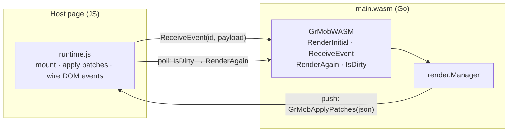

# WebAssembly

The WASM target runs the same app in a browser: Go (compiled to
WebAssembly) renders and diffs; a small JS runtime applies patches to the
DOM. It is the fastest way to *see* an app during development — no
simulator, instant reload.

## Building

The entry point is the `wasm` package, which mounts a registered app (it
imports the app package for its `init` side effect — edit the import to
switch apps):

```bash
GOOS=js GOARCH=wasm go build -o main.wasm ./wasm
```

Serve `main.wasm` alongside Go's `wasm_exec.js` (from
`$(go env GOROOT)/lib/wasm/`) and a host page.

## The host-page contract

The Go side registers a `GrMobWASM` global with four functions:

| Function | Purpose |
|---|---|
| `GrMobWASM.RenderInitial()` | Mounts (or re-mounts) the app; returns the full tree JSON. Re-mounting closes the previous manager first, so timers from the old instance can't leak |
| `GrMobWASM.ReceiveEvent(id, payloadJSON)` | Delivers a user event: `payloadJSON` is `{"value": ...}` and the value's type picks the callback kind |
| `GrMobWASM.RenderAgain()` | Re-renders and returns the diff — the polling path |
| `GrMobWASM.IsDirty()` | Whether state changed since the last render — poll this to know when `RenderAgain` is worth calling |

And it looks for one optional global the page can provide:

- **`GrMobApplyPatches(patchesJSON)`** — if defined as a function at mount
  time, async state changes (timers, goroutines) are **pushed** to it as
  patch JSON, and the page never needs the `IsDirty` polling loop. Pages
  without it keep polling — the manager never consumes a diff unless a
  listener is attached, so nothing is lost either way.



Event wiring on the DOM side uses the callback-ID attributes the tree
carries (`data-onclick`, `data-onchange`, `data-ontoggle`): the runtime
listens for interactions, reads the ID, and calls `ReceiveEvent` with it.

### Node types and tags

Which element a node becomes is one table, stated once in Go
(`htmlout/tag.go`) and restated in `grmob-runtime.js` because the runtime is
the side that calls `createElement`. `Text` is a `<span>`, `Button` a
`<button>`, `Image` an ``, `TextArea` a `<textarea>`, the four form
inputs an `<input>`, and every container — `Row`, `Column`, `Card`, `Box`,
`Scroll`, `SafeArea`, `List`, `Modal`, `TabView`, `Spacer`, `CameraView` — a
`<div>`. What distinguishes a `Row` from a `Column` is the flex declarations,
not the element, which is why the runtime keeps the Go type in
`data-node-type` instead of reading it back off the tag.

The two copies are compared by `TestRuntimeTagsMatchGo` in `wasm/verify`, the
same way the `<input>` type table below is, so a row added on one side fails
`go test ./...` until it is added on both.

**One deliberate divergence.** `Fragment` and `Theme` are grouping nodes with
no box of their own, and `htmlout` renders them transparently — their children
land directly in the parent — as do both natives. This runtime boxes them in a
`<div>`, because patches are addressed positionally (`TargetID` is
`"root/1/0"`, resolved against the `data-node-path` attributes written while
walking `node.Children`), so its DOM has to stay isomorphic to the node tree.
The cost is real: inside a flex parent that `<div>` becomes the single flex
item and swallows the gap and alignment meant for the children. Closing it
means teaching the addressing scheme about nodes with no element. The
divergence is named in `htmlout/tag.go` and pinned by the same test, so it
reads as a decision rather than as drift.

### Form controls

Four Go node types share the `<input>` tag, so the runtime writes a `type`
attribute to tell them apart — the only thing that makes a checkbox draw as a
checkbox rather than a text box:

| Node type | Rendered as | State prop |
|---|---|---|
| `Input` | `<input type="text">` | `value` |
| `InputPassword` | `<input type="password">` | `value` |
| `NumericInput` | `<input type="number">` | `value` |
| `Checkbox` | `<input type="checkbox">` | `checked` |
| `TextArea` | `<textarea>` | `value`, `rows` |

Go states that table once, in `htmlout/inputtype.go`; the runtime restates it
in JavaScript because it is the side that actually sets the attribute and
cannot call into Go to ask. The two are not kept in step by hand — a Go test
in `wasm/verify` parses the runtime's literal out of `grmob-runtime.js` and
compares it against `htmlout.InputTypes()`, so a change to either side fails
`go test ./...` until it is made to both.

All four of the runtime's lookup tables — tags, `<input>` types, and the
`object-fit` and `text-align` values below — are parsed by the same helper,
which is why they are written in the same shape: a flat object literal in a
named function, subscripted by that function's own argument, with a
`|| "<fallback>"` default that the parse checks too.

### Image content modes

`core.ContentMode` maps onto CSS `object-fit`: `fit` → `contain`, `fill` →
`cover`, `stretch` → `fill`, `center` → `none`. `htmlout/objectfit.go` is the
authority and `TestRuntimeObjectFitsMatchGo` pins the runtime's copy to it.

Go's table holds the bare value rather than the whole declaration, because
that is the half the two sides share: `htmlout` joins `object-fit:` onto it
for a style attribute, the runtime assigns it to `el.style.objectFit`.

An absent or unrecognized mode yields `""`, and the runtime assigns that,
**clearing** the property — which is what a patch removing an Image's
`contentMode` needs, so the image falls back to the browser's default instead
of keeping the last mode it was handed.

Coverage is checkable here in a way the tag table's is not: `ContentMode` is a
named type with four declared constants, and `core.ContentModes()` — itself
pinned to that `const` block by a test that reads the file's syntax tree —
gives `TestObjectFitsCoversEveryContentMode` a list to check against. The tag
table has no equivalent, because node types are string literals scattered
across core's construction sites.

That same list now holds all four renderers, not just this pair. The natives
map `ContentMode` onto SwiftUI and Compose vocabularies with no CSS in them, so
they cannot be compared as tables; `mobile/verify/contentmode_test.go` reads
their `switch`/`when` arms out of the source and checks coverage alone. See
[Native platforms](native.md#contentmode-on-image). (`replay_test.mjs` holds a third
copy on purpose: a conformance test has to state the rule independently, or
it only proves the implementation agrees with itself.)

### Text alignment

`core.Alignment` maps onto CSS `text-align`: `start` → `left`, `center` →
`center`, `end` → `right`, `justify` → `justify`. `htmlout/textalign.go` is the
authority and `TestRuntimeTextAlignsMatchGo` pins the runtime's copy to it.

This is the newest of the four tables and the only one that was added to
**close** a gap rather than to pin a copy that already existed. Until it did,
this runtime did not read `style.Align` at all, in any form — so every
`core.Align` on the web target was silently dropped, while `htmlout` emitted a
declaration for three of the six values and both natives set one. Four
renderers, three behaviors, and one of them was "nothing".

Only four of the six `Alignment`s are in the table. `AlignStretch` and
`AlignBaseline` name a cross-axis placement rather than a text alignment, and
CSS `text-align` has no such keyword; they reach the property through
`Style.Align`'s *other* role — the fallback a native container reads when
`AlignItems` is unset — and fall through to `""`, which clears it.
`core.TextAlignments()` is the list that says so, and both natives are held to
the same one (see [Native platforms](native.md#alignment-justifycontent-and-alignitems)).

`start` maps to the physical `left` rather than to CSS's direction-aware
`start`, which is what this exporter has always emitted. It is worth knowing
that this is itself a divergence — both natives use the direction-aware
spelling — so an RTL locale would left-align on the web and trailing-align on
iOS and Android from the same `core.AlignStart`. No table comparison can see
it: the two DOM copies agree with each other exactly.

`justify-content` and `align-items` need no table at all. Core's spellings
*are* the CSS ones, so both DOM renderers pass them through verbatim and
neither can be wrong about a value it never interprets — which is why the
alignment coverage checks are entirely native.

`checked` and `rows` are set as element *properties*, not attributes. A
`checked` attribute is only the control's default state — the browser stops
consulting it the moment the user touches the box — and the live property is
what Go is describing. `rows` is limited to positive numbers in the DOM, so
a non-positive count leaves the browser's own default rather than being
assigned; `core.TextArea` always supplies a positive one.

## Testing without a browser

`wasm/verify/run.sh` is the WASM analog of `ios/verify`, and needs only Go
and Node — no npm, no lockfile, no `node_modules`, no network.

It does two things. `gen.go` drives real example apps through
`render.Manager` and records the initial tree, every patch batch, and the
final tree; Node then mounts that transcript through the **actual**
`wasm/grmob-runtime.js` (loaded with `node:vm` against a minimal DOM in
`dom.mjs`), applies the batches, walks the resulting DOM back into a tree and
compares it with Go's final render. Alongside it, unit tests cover the
per-element logic no transcript reaches — the return key's Enter filter, the
void envelope it sends, `enterkeyhint`, the form-control types and state
above, and the focus command's frame deferral and epoch guard.

What it cannot answer is anything that needs real rendering: whether
`enterkeyhint` actually relabels a soft keyboard, whether `focus()` opens
one, or anything about layout. Those still need a browser, exactly as the
iOS view layer still needs a simulator.

```
$ sh wasm/verify/run.sh
..................................
```

## Permissions

Hardware permission requests (camera, microphone, geolocation) route through
an optional `GrMobRequestPermission(name, callback)` page global, letting
the host page bridge to browser permission APIs.

## Same engine, same rules

The WASM runtime drives the very same `render.Manager` the native shells
use — pass boundaries, callback purging, and [debug mode](../concepts/debug-mode.md)
all behave identically. An app that runs clean in the browser preview is
running the same Go code it will run on the phone; only the renderer
differs.
