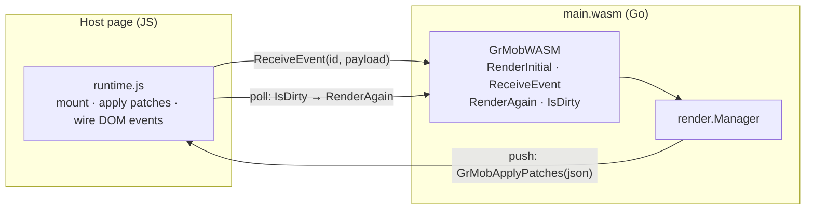

# WebAssembly

The WASM target runs the same app in a browser: Go (compiled to
WebAssembly) renders and diffs; a small JS runtime applies patches to the
DOM. It is the fastest way to *see* an app during development — no
simulator, instant reload.

## Building

The entry point is the `wasm` package, which mounts a registered app (it
imports the app package for its `init` side effect — edit the import to
switch apps):

```bash
GOOS=js GOARCH=wasm go build -o main.wasm ./wasm
```

Serve `main.wasm` alongside Go's `wasm_exec.js` (from
`$(go env GOROOT)/lib/wasm/`) and a host page.

## The host-page contract

The Go side registers a `GrMobWASM` global with four functions:

| Function | Purpose |
|---|---|
| `GrMobWASM.RenderInitial()` | Mounts (or re-mounts) the app; returns the full tree JSON. Re-mounting closes the previous manager first, so timers from the old instance can't leak |
| `GrMobWASM.ReceiveEvent(id, payloadJSON)` | Delivers a user event: `payloadJSON` is `{"value": ...}` and the value's type picks the callback kind |
| `GrMobWASM.RenderAgain()` | Re-renders and returns the diff — the polling path |
| `GrMobWASM.IsDirty()` | Whether state changed since the last render — poll this to know when `RenderAgain` is worth calling |

And it looks for one optional global the page can provide:

- **`GrMobApplyPatches(patchesJSON)`** — if defined as a function at mount
  time, async state changes (timers, goroutines) are **pushed** to it as
  patch JSON, and the page never needs the `IsDirty` polling loop. Pages
  without it keep polling — the manager never consumes a diff unless a
  listener is attached, so nothing is lost either way.



Event wiring on the DOM side uses the callback-ID attributes the tree
carries (`data-onclick`, `data-onchange`, `data-ontoggle`): the runtime
listens for interactions, reads the ID, and calls `ReceiveEvent` with it.

## Permissions

Hardware permission requests (camera, microphone, geolocation) route through
an optional `GrMobRequestPermission(name, callback)` page global, letting
the host page bridge to browser permission APIs.

## Same engine, same rules

The WASM runtime drives the very same `render.Manager` the native shells
use — pass boundaries, callback purging, and [debug mode](../concepts/debug-mode.md)
all behave identically. An app that runs clean in the browser preview is
running the same Go code it will run on the phone; only the renderer
differs.
