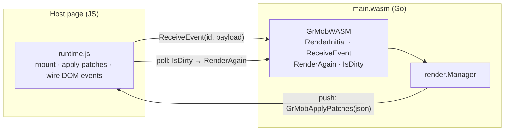

# WebAssembly

The WASM target runs the same app in a browser: Go (compiled to
WebAssembly) renders and diffs; a small JS runtime applies patches to the
DOM. It is the fastest way to *see* an app during development — no
simulator, instant reload.

## Building

The entry point is the `wasm` package, which mounts a registered app (it
imports the app package for its `init` side effect — edit the import to
switch apps):

```bash
GOOS=js GOARCH=wasm go build -o main.wasm ./wasm
```

Serve `main.wasm` alongside Go's `wasm_exec.js` (from
`$(go env GOROOT)/lib/wasm/`) and a host page.

The repository's own route does both: `./build.sh` writes `wasm/main.wasm`
with `-trimpath -ldflags='-s -w'` and refreshes `wasm/wasm_exec.js` from the
toolchain, and `go run ./serve` hosts `wasm/` on port 8080. Those are the
files the site workflow publishes to
<https://rohanthewiz.github.io/grmob/>, so the local page and the live one
are the same bytes.

The shipped host page (`wasm/index.html`) frames the app in a phone-sized
screen rather than letting it fill the browser window. That changes one
thing for the runtime: a `Scroll` node on a bare page never had to scroll —
the document did — so `grmob-runtime.js` gives it no `overflow`. Inside a
fixed-height screen the page adds the rule itself
(`#app [data-node-type="Scroll"] { flex: 1 1 0; min-height: 0; overflow-y:
auto }`), which is what makes the node the viewport the natives make of it.
A hand-rolled host that constrains the app's height needs the same rule.

The same page shows how an app and its host can share vocabulary the
framework does not define: the tutorial's deep links are a `"route"` host
event in (`GrMobWASM.HostEvent("route", {"lesson": "2.3"})`, sent at boot
and on `hashchange`) and a `"route"` system event out, which the page
catches by wrapping the runtime's `GrMobSystemEvent` before the module is
instantiated and turns into `history.replaceState`. Neither name is known to
`grmob-runtime.js` or to the natives, which is the point — see
`examples/tutorial/deeplink.go`.

## The host-page contract

The Go side registers a `GrMobWASM` global with these functions:

| Function | Purpose |
|---|---|
| `GrMobWASM.RenderInitial()` | Mounts (or re-mounts) the app; returns the full tree JSON. Re-mounting closes the previous manager first, so timers from the old instance can't leak |
| `GrMobWASM.ReceiveEvent(id, payloadJSON)` | Delivers a user event: `payloadJSON` is `{"value": ...}` and the value's type picks the callback kind |
| `GrMobWASM.RenderAgain()` | Re-renders and returns the diff — the polling path |
| `GrMobWASM.IsDirty()` | Whether state changed since the last render — poll this to know when `RenderAgain` is worth calling |
| `GrMobWASM.Shutdown()` | Closes the manager (stopping every hook-owned timer) and lets `main` return, so the module exits and `go.run`'s promise settles. The hot-reload hook — see [Hot reload](#hot-reload) |

And it looks for one global the page provides:

- **`GrMobApplyPatches(patchesJSON)`** — if defined as a function at mount
  time, async state changes (timers, goroutines) are **pushed** to it as
  patch JSON, on the state write's own schedule.

  The shipped `wasm/grmob-runtime.js` always defines it (at page level,
  before the module is instantiated, so the host's startup check finds it),
  so every page on the shipped runtime is on the push path. It is optional
  only in the *protocol* sense: a hand-rolled host may omit it and fall back
  to the `IsDirty` poll, and nothing is lost either way — the manager never
  consumes a diff unless a listener is attached.

  The fallback is a genuine downgrade, not just extra work. The poll rides
  `requestAnimationFrame`, which is fully suspended in a hidden tab, so a
  `UseInterval` clock freezes the moment the tab loses visibility even
  though the Go ticker keeps running. The push channel does not.



Event wiring on the DOM side uses the callback-ID attributes the tree
carries (`data-onclick`, `data-onchange`, `data-ontoggle`): the runtime
listens for interactions, reads the ID, and calls `ReceiveEvent` with it.


**Host events.** The runtime reports host→app traffic that answers no
callback — the audio player's status ticks, and the page's visibility —
through `GrMobWASM.HostEvent(name, payloadJSON)`, which `wasm/main.go`
installs beside `ReceiveEvent`. A page that copies the runtime needs nothing
more: the `"audio"` system event is handled inside `grmob-runtime.js`
(`GrMob.audio`, an `HTMLAudioElement` plus the Media Session API), the
`"lifecycle"` event is reported from `visibilitychange` (visible is
`active`, hidden is `background`; a page has no `inactive`), and consumers'
state writes reach the screen through the push channel. See
[Native — Audio](native.md#audio) and [Native — Lifecycle](native.md#lifecycle)
for the shapes.

### Node types and tags

Which element a node becomes is one table, stated once in Go
(`htmlout/tag.go`) and restated in `grmob-runtime.js` because the runtime is
the side that calls `createElement`. `Text` is a `<span>`, `Button` a
`<button>`, `Image` an ``, `TextArea` a `<textarea>`, `Select` a
`<select>`, the four form inputs an `<input>`, and every container — `Row`,
`Column`, `Card`, `Box`, `ZStack`, `Scroll`, `SafeArea`, `List`, `Modal`,
`TabView`, `Spacer`, `CameraView` — a `<div>`. What distinguishes a `Row` from a `Column` is the flex declarations,
not the element, which is why the runtime keeps the Go type in
`data-node-type` instead of reading it back off the tag.

The two copies are compared by `TestRuntimeTagsMatchGo` in `wasm/verify`, the
same way the `<input>` type table below is, so a row added on one side fails
`go test ./...` until it is added on both.

**One deliberate divergence.** `Fragment` and `Theme` are grouping nodes with
no box of their own, and `htmlout` renders them transparently — their children
land directly in the parent — as do both natives. This runtime boxes them in a
`<div>`, because patches are addressed positionally (`TargetID` is
`"root/1/0"`, resolved against the `data-node-path` attributes written while
walking `node.Children`), so its DOM has to stay isomorphic to the node tree.
The cost is real: inside a flex parent that `<div>` becomes the single flex
item and swallows the gap and alignment meant for the children. Closing it
means teaching the addressing scheme about nodes with no element. The
divergence is named in `htmlout/tag.go` and pinned by the same test, so it
reads as a decision rather than as drift.

### Stack containers

A `<div>` is block flow. Both natives have no such mode — a Compose
`Row`/`Column` and a SwiftUI `HStack`/`VStack` are stacks by construction, and
`Box`, `Card`, `Scroll`, `SafeArea` and `List` all route through one of them —
so a DOM target either opts into the same default or diverges from the other
two. Block flow runs inline children together on one line (`Text` is a
`<span>`) and ignores `gap`, `justify-content` and `align-items` outright.

`htmlout/stack.go` is the authority. `stackAxisFor` answers both halves of the
question at once — whether a type stacks, and along which axis — so `Row` maps
to `row` and `Column`, `Card`, `Box`, `Scroll`, `SafeArea`, `List` and
`TabView` to `column`. A type outside the table becomes a flex container only
if its own `Style` asks, which is what keeps a `Text` carrying `Align` in its
ordinary text role from being turned into a container by its own alignment.

`Modal` and `Spacer` are absent on purpose: `Modal` carries a fixed-overlay
chassis that sets `display` itself and toggles it through the `visible` prop,
and `Spacer` is a sized void with no children.

`ZStack` is absent for a different reason: it is a container, and not a flex
one. See the next section.

### The overlay

`core.ZStack` draws its children on top of one another, and `overlayTypes` in
`htmlout/stack.go` is the table that says so — restated as `OVERLAY_TYPES` in
the runtime and compared by `TestRuntimeOverlayTypesMatchGo`. A one-member
table rather than a `nodeType === "ZStack"` in each renderer, for the reason
every other table here exists: the question is asked on both DOM targets and
answered in two languages.

It is a **single-cell CSS grid**, not `position: absolute`. An absolutely
positioned child is out of flow and contributes nothing to its parent's size,
so an unsized overlay would collapse to nothing here while a SwiftUI `ZStack`
and a Compose `Box` both size to their largest child. Placing every child in
row 1, column 1 keeps them in flow: the track sizes to the widest and tallest
of them, the rest are drawn in the same cell.

That declaration goes on the **children**, which is the interesting half — a
layer has no idea it is a layer, so the container has to stamp it. `htmlout`
imposes it through the same `imposed` channel that hides a TabView's unselected
pages; the runtime runs `syncOverlay` after the children exist, and
`syncTouchedOverlays` after every patch batch, walking up from each touched
element the way the TabView and end-reached passes do. Without that second
pass a layer arriving in an `add` patch would be auto-placed into its own
implicit grid row — below the stack rather than on it, which reads as a layout
quirk rather than a missing declaration.

The stack is centred on both axes (`align-items` and `justify-items`, the
*items* properties — the content pair would place the single track inside the
container, which on an auto-sized container does nothing). And the flex
promotion test is skipped for it entirely: a `ZStack` carrying a `Gap` must not
become a flex container, which would silently cost it the overlay.

`syncOverlay` writes a second declaration per layer: the `justify-self` /
`align-self` pair for its `core.StackAlign`, from `STACK_PLACEMENTS` (Go's
`stackPlacements`, compared by `TestRuntimeStackPlacementsMatchGo`). The value
reaches the element as `data-stack-align`, stamped by `applyStyle`, because the
placement is the *stack's* to impose and a layer has no idea it is a layer —
the same split `htmlout` makes.

The pair is written on **every** layer, the unplaced ones included, and that
totality does two jobs. A layer whose `StackAlign` is dropped by a patch goes
back to the middle instead of keeping the corner it had; and a layer's own
`Style.AlignSelf` — flexbox's property, which a grid item honours too — can no
longer move it in contradiction of the centring contract.

`TabView` was absent too, on the weaker grounds that neither web target had
ever defaulted it to flex and leaving it out kept the two agreeing — but they
were agreeing on the wrong layout, since both natives build it from a vertical
stack (a Compose `Column` around a `TabRow`, a SwiftUI `VStack` around a
hand-rolled bar). Its row states that axis, and `mobile/verify`'s
`TestNativeTabViewIsAColumnStack` holds the claim against the two renderers.
What goes *inside* that stack is the next section.

### Tab views

`core.TabView`'s wire contract is four things: a `tabs` prop (label/icon
pairs), a controlled `selectedIndex`, an optional `onTabChange` callback ID,
and one child per page. Both natives consume all four — `Renderer.kt` draws a
Material `TabRow` above the selected page, `Renderer.swift` a hand-rolled bar
above the same. The two DOM targets read *none* of them until recently: a
`TabView` was a bare box holding every page at once, with no bar and no way to
switch, so an app whose navigation is a `TabView` had no navigation at all on
the web and its screens stacked one under the other.

Both now draw the bar and hide the unselected pages. `buildTabBar` and
`syncTabView` are this runtime's half; `htmlout/tabview.go` is the exporter's,
and carries the shared reasoning. The chrome is authored twice rather than
shared, exactly as the `Modal` chassis is — a declaration list is a Go string
on one side and a property object on the other — with
`TestRuntimeDrawsTheSameTabChrome` pinning the half that is a contract rather
than a look: the roles, the ARIA state and the `data-` attributes.

```html
<div data-node-type="TabView" data-node-path="root/1" style="display:flex; flex-direction:column">
  <div data-grmob-chrome="tabbar" role="tablist" data-ontabchange="int_cb_0">
    <button type="button" id="grmob-root-1-tab-0" role="tab" aria-selected="true"
            data-tab-index="0" aria-controls="grmob-root-1-panel-0">Home</button>
    <button type="button" id="grmob-root-1-tab-1" role="tab" aria-selected="false"
            data-tab-index="1" aria-controls="grmob-root-1-panel-1">Search</button>
  </div>
  <div data-node-path="root/1/0" id="grmob-root-1-panel-0"
       role="tabpanel" aria-labelledby="grmob-root-1-tab-0">…</div>   <!-- the selected page -->
  <div data-node-path="root/1/1" id="grmob-root-1-panel-1"
       role="tabpanel" aria-labelledby="grmob-root-1-tab-1" style="…; display:none">…</div>
</div>
```

**The tabs and the pages point at each other.** A `role="tablist"` of
`role="tab"`s is a well-formed strip on its own, but it says nothing about
*which region of the screen* each tab governs. That relationship is
`aria-controls` and `aria-labelledby`, both of which are IDREFs, so the wiring
cannot be expressed without ids — and ids are document-global, so two
`TabView`s on one page must not both call their first tab `tab-0`.

The scope is therefore derived from the node path, the identity that is already
unique per element here: a `TabView` at `root/1` names its first tab
`grmob-root-1-tab-0` and its first page `grmob-root-1-panel-0`. The uniqueness
is exactly the uniqueness this runtime's addressing already rests on — if two
live elements could share a `data-node-path`, every patch aimed at either is
already going to the wrong one. Deriving it this way also makes the ids the
*same strings* `htmlout` writes rather than merely the same shape, so the
contract the two web targets share is the literal id.

A page opts out of being a panel six ways, each a case where wiring it would
say something false:

| The page… | Why it is left alone |
|---|---|
| has no tab at its index | a `tabpanel` outside a tab set, with nothing for the `aria-controls` to sit on |
| renders as an element that already has a role (`<button>`, ``, `<input>`) | `role="tabpanel"` would *replace* the role the browser gave it — see `GENERIC_TAGS`, pinned to Go's `genericTags` by `TestRuntimeGenericTagsMatchGo` |
| carries a `core.AccessibilityRole` other than `RoleGroup` | the author already said what it is, and the same theft applies |
| is a node type that states its own role (a `Modal` is a `dialog`) | the same theft, one layer down — and the attribute has one slot |
| is `AccessibilityHidden` | the author severed the relationship on purpose |
| carries a `core.AccessibilityID` | the author's own string is in the slot the wiring needs for the panel id, and something else on the page is pointing at it — taking it would break a relationship rather than replace a word |

`RoleGroup` is the one role that is **not** theft to replace, and the exemption
is load-bearing rather than a nicety. A group says these things belong together
and this is what they are called; a `tabpanel` says all of that *and* which tab
shows it, so writing one over the other adds a fact. And both web targets
*supply* a group to any named page whether the author asked or not
([`RoleGroup`](../concepts/styling-and-theming.md#rolegroup-and-the-one-role-you-get-without-asking)),
so treating it as authored would silently stop every page with an
`AccessibilityLabel` from being wired at all.

The role case shares one attribute between several writers — the author's
`core.AccessibilityRole`, the group the exporter supplies, a `Modal`'s own
chassis, and this wiring — so the runtime tells them apart by value: `tabpanel`
is not one of `core.Role`'s spellings and is not a chassis role, so an element
carrying it got it from the wiring and nothing else ever did. That is what lets
the sync clear its own mark without clearing the author's, and it is pinned by
`TestNoRoleCollidesWithTheTabPanelWiring`. When it does clear the mark it puts
back what the exporter would have left — `group` on a named page, nothing on an
unnamed one — because a page that stops being wired must not fall back into the
silence the group role exists to close.

In each case the tab drops its `aria-controls` too: a dangling IDREF — a tab
announcing a region that is not there — is worse than a tab that has simply not
said what it governs. And `aria-labelledby` is omitted from a page carrying its
own `AccessibilityLabel`, because the reference wins over `aria-label` in the
accessible-name calculation and would silently discard the name the app author
chose.

`htmlout` applies the same rules and asks one more question this runtime does
not have to: *which* element stands in for the page. It drops the box for
a `Fragment` or a `Theme` (see the tag table's exemption below), so a page that
is one of those is wired on the single element standing in for it, or not at
all when there are several. Here page *i* is always exactly the element in
child slot *i*.

**The bar is chrome, not a node.** It carries no `data-node-path`, no patch is
ever addressed to it, and it is marked `data-grmob-chrome` so the two places
that turn a *node* child index into a *DOM* child index can skip it
(`chromeOffset`, read by the `add` and `add-child` patches). Chrome always
precedes the node children, which keeps that conversion a fixed offset rather
than a search — and is the order a screen reader wants anyway. It is the same
trick a `TextGrid` row's runs use, one step harder: those spans sit under a
node with no children of its own, so nothing ever had to count past them.

**The pages are hidden, not dropped**, which is where the two DOM targets both
differ from the natives. This runtime cannot drop a page: `TargetID`s are
positional, so its DOM has to stay isomorphic to the node tree. `htmlout`
could — it is a static snapshot with no patches to address — but an export
that silently lost every screen but one would be a worse document, and a
divergence between the two web targets for no gain.

**The selection is derived state**, and so is the wiring. `syncTabView`
recomputes both, and `patch()`
calls it once per batch for every `TabView` the batch could have disturbed,
rather than teaching each patch case about tabs. Three different patches
invalidate it: an `update-props` carrying a new `selectedIndex` (which is what
a tab switch *is* — `core.SelectedIndex` is controlled state, so the switch
arrives as a prop patch and never as a rebuilt subtree), an `update-style` on a
page (`styleFromGrMob` is total, so it assigns a `display` on every pass and
overwrites the hiding), and
an `add`/`remove`/`replace` that changes which children there are. Every one of
those can invalidate the panel wiring as well — a style patch can set
`AccessibilityHidden`, a props patch can shrink the `tabs` strip out from under
a page, a `replace` can swap a `<div>` page for a `<button>` — which is why the
wiring rides on the same pass rather than growing a mechanism of its own. It is
written *or removed* on every sync, for the reason `styleFromGrMob` is total: a
guarded write would leave a role and a dangling reference standing after the
reason for them was gone. Nothing paints in between: a batch is one synchronous
run. Restoring a page means
putting back the `display` the style pass computed, not clearing the
declaration — hence `data-base-display`, recorded wherever this runtime decides
one; a `Column` page cleared to `""` would come back in block flow.

Three things are deliberately not done. A panel is not given a **`tabindex`**,
which the ARIA authoring practices suggest for a panel containing nothing
focusable: `tabindex` changes the page's real tab order, which is a behavioral
change to an app author's node rather than a statement about it, and this pass
is deliberately semantic only. The **icon** half of a `core.TabItem` is
drawn by no target (Compose's `Tab` is built with `text = { Text(label) }`, the
SwiftUI bar with a `Text` of the label), so drawing it here would make the web
the outlier rather than close a gap. And an **out-of-range `selectedIndex`** is
not clamped: it selects no tab and shows no page, which is what
`children.indices.contains` in Swift and `getOrNull` in Kotlin do for the page,
and what the Swift bar's plain `i == selected` does for the indicator.

The read that matters is the one inside the total function. `styleFromGrMob`
and `styleValue` assign every property they manage on every call, so a
`display` they do not write is a `display` they erase — which means the table
has to be consulted there, or an update-style patch would drop a container into
block flow the first time anything restyled it.

`htmlout` reads the table a second time when it builds the element
(`renderNode`), because a static export has no patch path for a total function
to be total *for*. The runtime does not: `createElement` calls `applyStyle` for
every node, passing an empty object where there is no `Style`, so one call site
plants the default and restates it. `TestRuntimeStackAxesMatchGo` compares the
tables and `TestRuntimeAppliesTheStackDefault` pins the reads.

`Fragment` and `Theme` are the one exemption, the same one the tag table
makes: this runtime boxes them in real `<div>`s to keep positional patch
addressing valid, and a box that were not a stack would swallow its parent's
layout like any other block-flow div. `htmlout` emits no element for them at
all, so its table has no such rows.

### Form controls

Four Go node types share the `<input>` tag, so the runtime writes a `type`
attribute to tell them apart — the only thing that makes a checkbox draw as a
checkbox rather than a text box:

| Node type | Rendered as | State prop |
|---|---|---|
| `Input` | `<input type="text">` | `value` |
| `InputPassword` | `<input type="password">` | `value` |
| `NumericInput` | `<input type="number">` | `value` |
| `Checkbox` | `<input type="checkbox">` | `checked` |
| `TextArea` | `<textarea>` | `value`, `rows` |

Go states that table once, in `htmlout/inputtype.go`; the runtime restates it
in JavaScript because it is the side that actually sets the attribute and
cannot call into Go to ask. The two are not kept in step by hand — a Go test
in `wasm/verify` parses the runtime's literal out of `grmob-runtime.js` and
compares it against `htmlout.InputTypes()`, so a change to either side fails
`go test ./...` until it is made to both.

All of the runtime's lookup tables — tags, `<input>` types, the `object-fit`
and `text-align` values below, and the cross-axis pair that follows them — are
parsed by the same helper, which is why they are written in the same shape: a
flat object literal in a named function, subscripted by that function's own
argument, with a `|| "<fallback>"` default that the parse checks too.

### Image content modes

`core.ContentMode` maps onto CSS `object-fit`: `fit` → `contain`, `fill` →
`cover`, `stretch` → `fill`, `center` → `none`. `htmlout/objectfit.go` is the
authority and `TestRuntimeObjectFitsMatchGo` pins the runtime's copy to it.

Go's table holds the bare value rather than the whole declaration, because
that is the half the two sides share: `htmlout` joins `object-fit:` onto it
for a style attribute, the runtime assigns it to `el.style.objectFit`.

An absent or unrecognized mode yields `""`, and the runtime assigns that,
**clearing** the property — which is what a patch removing an Image's
`contentMode` needs, so the image falls back to the browser's default instead
of keeping the last mode it was handed.

Coverage is checkable here in a way the tag table's is not: `ContentMode` is a
named type with four declared constants, and `core.ContentModes()` — itself
pinned to that `const` block by a test that reads the file's syntax tree —
gives `TestObjectFitsCoversEveryContentMode` a list to check against. The tag
table has no equivalent, because node types are string literals scattered
across core's construction sites.

That same list now holds all four renderers, not just this pair. The natives
map `ContentMode` onto SwiftUI and Compose vocabularies with no CSS in them, so
they cannot be compared as tables; `mobile/verify/contentmode_test.go` reads
their `switch`/`when` arms out of the source and checks coverage alone. See
[Native platforms](native.md#contentmode-on-image). (`replay_test.mjs` holds a third
copy on purpose: a conformance test has to state the rule independently, or
it only proves the implementation agrees with itself.)

### Text alignment

`core.Alignment` maps onto CSS `text-align`: `start` → `start`, `center` →
`center`, `end` → `end`, `justify` → `justify`. `htmlout/textalign.go` is the
authority and `TestRuntimeTextAlignsMatchGo` pins the runtime's copy to it.

This was the first table added to **close** a gap rather than to pin a copy
that already existed (the cross-axis pair below is the second). Until it did,
this runtime did not read `style.Align` at all, in any form — so every
`core.Align` on the web target was silently dropped, while `htmlout` emitted a
declaration for three of the six values and both natives set one. Four
renderers, three behaviors, and one of them was "nothing".

Only four of the six `Alignment`s are in the table. `AlignStretch` and
`AlignBaseline` name a cross-axis placement rather than a text alignment, and
CSS `text-align` has no such keyword; they reach the property through
`Style.Align`'s *other* role — the fallback a vertical-stacking container
reads when `AlignItems` is unset, the next section's table — and fall through
to `""`, which clears it.
`core.TextAlignments()` is the list that says so, and both natives are held to
the same one (see [Native platforms](native.md#alignment-justifycontent-and-alignitems)).

`start` and `end` are CSS's direction-aware keywords, matching the spelling
both natives use (SwiftUI `.leading`/`.trailing`, Compose
`TextAlign.Start`/`.End`). The exporter originally emitted the physical
`left`/`right`, which rendered identically in LTR documents but left-aligned
in RTL locales while both natives trailing-aligned — from the same
`core.AlignStart`. No table comparison can see which spelling is right: the
two DOM copies agree with each other under either one, so the choice lives in
`htmlout/textalign.go`'s doc and here, not in a test. The table maps every
text alignment to itself, but it still earns its keep as a filter — the
identity must not extend to the two cross-axis values.

`justify-content` and `align-items` themselves need no table. Core's spellings
*are* the CSS ones, so both DOM renderers pass them through verbatim and
neither can be wrong about a value it never interprets.

### The cross-axis fallback

`Style.Align`'s second role has a pair of tables of its own, and they closed
the last alignment behavior the DOM pair did not share with the natives. When
`AlignItems` is unset on a vertical-stacking container — `Column`, `Card`,
`Box`, `SafeArea` or `List` — both natives fall back to `Align` for
cross-axis placement
(`crossAxisValue` in `Renderer.swift`, the `alignItems.ifEmpty { align }`
reads in `Renderer.kt`), and until these tables existed neither DOM target
did: `Align: "center"` centered the children on device and only the *text* on
the web, and `Align: "stretch"` filled rows on device while the web agreed
only wherever block flow happened to produce the same picture.

`htmlout/crossaxis.go` is the authority for both halves. `crossAxisAlignFor`
maps the four cross-axis `Alignment`s onto the `AlignItems` spellings
(`start` → `flex-start`, and so on), because the fallback means "behave as if
that `AlignItems` had been set" — its census holds the values to exactly
`core.AlignItemsValues()`. `alignFallbackAxisFor` is the gate saying which
node types consult the fallback at all: exactly the containers the natives
read it for, and pointedly not `Row`, whose vertical cross axis `Align` has
never applied to on any target. `Box` and `SafeArea` joined the gate when the
natives stopped drawing them as overlays and started routing them through
their `Column` path, which is where the fallback is read. `TestRuntimeCrossAxisAlignsMatchGo`
and `TestRuntimeAlignFallbackAxesMatchGo` pin the runtime's copies, and a
source pin holds `styleFromGrMob` to actually reading them, with `AlignItems`
taking precedence.

`justify` and `baseline` have no rows. No native cross-axis dispatch answers
for either (`baseline` falls through to start-packing), so a row — and CSS
`align-items` genuinely has a `baseline` keyword someone could be tempted to
"complete" the table with — would move two targets out of four.

`checked` and `rows` are set as element *properties*, not attributes. A
`checked` attribute is only the control's default state — the browser stops
consulting it the moment the user touches the box — and the live property is
what Go is describing. `rows` is limited to positive numbers in the DOM, so
a non-positive count leaves the browser's own default rather than being
assigned; `core.TextArea` always supplies a positive one.

### The user-agent border, and the third value totality needs

`styleFromGrMob` assigns every property it manages on every call, so a field
back at its zero value clears the declaration an earlier patch left behind. For
almost every property "cleared" is the empty string, which drops the inline
declaration and lets the cascade decide.

`border` is the exception, and it is where the two DOM renderers used to
disagree with both natives. Compose and SwiftUI draw a border only when the
style carries a width **and** a color; the web guard was the same, but its
negative arm handed the element back to the user-agent stylesheet — and a
`<button>` has a 2px outset rule there. No `core.BorderWidth(0)` could remove
it, because emitting nothing is exactly what left the browser in charge. The
visible cost was `components.Button`'s ghost emphasis, documented as "outlined
without the rule" and drawing one on both web targets.

So the property has three values rather than two: the styled border, `""` for
an element the browser draws nothing on, and `"none"` for one it does.
`BORDER_RESET_TYPES` is the set — pinned to Go's `borderResetTypes` by
`TestRuntimeBorderResetTypesMatchGo` — and it holds `Button`, `Input`,
`InputPassword`, `NumericInput`, `TextArea` and `Select`.

### Every node is styled, including one with no `Style`

The border reset is also where the create path's one asymmetry showed up.
`createElement` used to call `applyStyle` only for a node that carried a
`Style`, and made up the difference with three branches of its own — a
`TextGrid` chassis, a stack default, an overlay default — which between them
covered every type-keyed answer `styleFromGrMob` gives *except* the border. So
a `<button>` with no `Style` kept the browser's rule, while the patch path,
which has always called `applyStyle` unconditionally, took it away the moment
anything gave that button a `Style`: one node drawn two ways depending on
whether it had been touched.

Nothing `core` builds is ever styleless — every widget reads a theme base — so
only a hand-assembled tree could reach it. The fix was to make the call total
rather than to document the gap: `applyStyle(el, node.Style || {}, node.Type)`,
and the three branches went with it. `styleless_test.mjs` holds the four
node-type answers a styleless node now gets.

`Modal`'s chassis moved with them, into `styleFromGrMob` beside the grid's,
where a set of node-type defaults has to live to survive an update-style patch.
Each line is `out.x = out.x || …`, which is how the runtime says what `htmlout`
gets from the cascade by writing `modalChassis` ahead of the author's
declarations: **the author wins**. `htmlout.ModalChassis()` is the shared
statement of the nine, and `TestRuntimeModalChassisMatchesGo` compares them —
including the `||` itself, since a plain assignment would pass a value
comparison while making the runtime the one target where a hand-built `Modal`'s
own `Style` loses. It used to be worse than that: the chassis was assigned at
creation, the total pass cleared position, centring and z-index straight back
off, and nothing put them back.

`display` is the exemption, on both targets and for the same reason from
opposite directions. It is the open/closed state, written from the `visible`
prop; `htmlout` writes the whole declaration list at once from props it can
see, while the runtime's style pass never sees a prop — so `styleFromGrMob`
**deletes** the key rather than assigning it, and `Object.assign` leaves an
absent property alone. That is the one hole in the totality rule, and it is
what stops a restyle from slamming an open dialog shut.

#### What a second exemption would have to satisfy

"Abstain by deleting the key" is a technique available to any property now, so
the rule for using it is written down rather than left to be inferred from the
one case. Three conditions, and the second is the one that is easy to miss:

1. **Some prop owns the property.** Totality is not being dropped, it is being
   handed over — there has to be someone to hand it to, and it has to be a
   prop, because a `Style` field would have been assigned by the function.
2. **That owner writes the property in every state, not just the interesting
   one.** `visible ? "flex" : "none"` qualifies; a prop that assigns only when
   it is truthy does not, because the value it wrote last would then stand
   forever — which is the stale-declaration bug totality exists to prevent,
   moved one channel over rather than fixed.
3. **The exemption is keyed on the node type,** so the property stays total for
   every other node.

`wasm/verify/totality_test.mjs` states the exemptions as a table and checks all
three against it. The source scan there is the load-bearing part: an abstention
deletes the key *before* the declarations reach the element, so a node built
with the property in its `Style` never receives it either — which makes an
exemption invisible to any test that does not drive the prop that owns it.
Reading the source is what turns "somebody added a `delete`" into a failing
change; the table is what says which deletions are answers rather than
accidents.

### The reset is keyed by node type

It is keyed by **node type**, not by tag, and the text fields are why. Five
node types share `<input>` and only three of them want the reset: a checkbox's
border *is* the control and a range track has none, so a tag-keyed set would
have swept both in. The fields could not join at all until both bundled themes
gave `Components.Input` and `Components.TextArea` a frame of their own —
resetting a border nothing replaces is levelling down, and until then the
browser's rule was the only thing drawing a web text field. Both themes now
state one, so all four targets draw the same edge from the same field, and a
theme that states none renders a borderless field on the web exactly as it
always did on both phones.

Keeping the reset inside the same expression rather than in a guard of its own
is what preserves totality — a guarded write would leave the old border
standing on a button that stopped having one.

`Select` joined last, and it is the row this set was left holding an open
question about long before there was a picker to ask it of. It joins because
neither native builds `core.Select` from a platform picker control — SwiftUI's
`.pickerStyle(.menu)` and Material's `ExposedDropdownMenuBox` each draw a frame
no Go style can remove — so the frame comes from the theme's
`Components.Input` base on three targets out of four, and the web was drawing a
second one underneath. The drop-down indicator is untouched: `border` does not
reach it, and it is what says the control is a picker.

### Pickers and their options

A `<select>`'s `<option>` elements are built from the `options` prop, not from
child nodes — `core.Select` sends the list flattened, exactly as `core.TabView`
sends its tabs. They are **chrome**: they carry no `data-node-path`, no patch
is ever addressed to one, and they are marked `data-grmob-chrome` so the
conformance replay skips them rather than comparing them against Go nodes that
do not exist. Unlike a TabView's bar they are not counted by `chromeOffset`,
because a `Select` has no node children for an option to sit ahead of.

`core.SelectOption.Group` makes consecutive options sharing a heading one
`<optgroup>`, built here and marked `data-grmob-chrome="optgroup"` like the
options inside it. **Runs, not a gather**: the same heading either side of a
different one is two groups, in the order written, because the list's order is
the caller's — it is what a person sees and what the keyboard walks — and
reordering it to tidy the headings is a bigger change than the one being asked
for. `SelectOption.Disabled` sets `option.disabled`, a property rather than an
attribute, exactly as a `<select>`'s value is.

`applySelectOptions` rebuilds the list only when the list itself changed,
keyed on a JSON signature — a length comparison would miss a relabel. That is
not a performance note: replacing a `<select>`'s options resets the control, so
rebuilding on every props patch would close an open drop-down mid-choice, and a
controlled picker gets a props patch on exactly the pass where someone has just
opened it. The value is assigned on every call regardless, and always *after*
the options, because a `<select>` silently ignores a value that matches none of
its current options.

That signature is why `core.Select` writes `group` and `disabled` into an
option's map only when they say something: a key present on every option with
an empty value would have changed every picker's signature the first time the
two fields shipped, rebuilding every list in every app for nothing.

### One attribute, two level fields

`aria-level` is defined for `heading`, `listitem` and `row`.
`core.Style` carries a heading's tier and a nested item's depth as two ints,
because their ranges differ, and `ariaLevel` is where they meet at the one
attribute both become. It switches on the role, which makes the two mutually
exclusive by construction: a node has one role, the arms are disjoint, and no
arrangement of the two fields can produce two values for one slot. Setting both
is not an error — whichever the role does not name is not read.

Both arms drop rather than clamp, and they drop different things: a heading
above 6 has no spelling on any target that can express a tier, while a nesting
depth has no ARIA ceiling at all, so capping it would flatten a legitimate
tree. `TestRuntimeGuardsTheLevelsTheSameWay` pins the dispatch and both ranges;
`a11y_test.mjs` covers the live half, including the case a static export cannot
have — an item that keeps both fields and changes only its role has to swap
which one is written.

### Three state attributes, two style fields

`applyAccessibility` writes `aria-selected`, `aria-pressed` and `aria-expanded`
on **every** call, including when the value is empty. That is the totality rule
the border reset above states, and here it is load-bearing twice over.

`ariaSelected` returns a *pair* rather than a name and a value, because the
caller has to clear the other attribute either way: a node that had been a
`tab` and becomes a `button` must stop being `aria-selected`, or it announces
as a selected tab and a pressed button at once. A role can change between
passes, so writing only the attribute the *new* role asks for leaves the old
one standing.

`ariaExpanded` returns one string — there is no sibling to clear — but the
unconditional write still matters: a disclosure that stops being one has to
lose its attribute, or a section that is gone is announced as open.

The three lists are ARIA's own scoping and are not interchangeable.
`aria-expanded`'s drops `option` and adds `link` and `listbox` relative to
`aria-selected`'s, which is why they are two switches and why
`core.ExpandedState` is a type of its own rather than `SelectedState` reused.
`TestRuntimeGuardsTheSelectedStateTheSameWay` and
`TestRuntimeGuardsTheExpandedStateTheSameWay` hold each dispatch against its
`htmlout` twin; `a11y_test.mjs` covers the live halves, including the patch
sequence a static export cannot have.

### Composite widgets are operable

A `listbox` and a `tablist` are real ARIA *controls*, and the pattern each one
names is larger than the two attributes that declare it: the widget is one stop
in the page's tab order, the arrow keys move between its members, and a roving
`tabindex` says which member holds the stop. `core.Role` states the semantics
and stops there — it is a vocabulary — so for a long time three shipped screens
claimed a pattern that no target implemented: `examples/mobileapp`'s article
list is a listbox of `<div>`s no keyboard could reach at all, and
`examples/social`'s bottom bar and tutorial 4.5 are tab strips a keyboard could
cross only by tabbing through every member.

This runtime supplies the behavioural half, and it needed no new prop and no
change to any of those screens, because everything the pattern wants was
already on the wire:

| what the pattern needs | what already said it |
|---|---|
| which nodes are members of which widget | `role="listbox"`/`"option"`, `role="tablist"`/`"tab"` — a structural role owns what is inside it |
| which member is chosen | `aria-selected`, which a strip already sets on every member and not only the live one |
| which arrow pair moves | `aria-orientation`, which `applyAccessibility` derives from the container's own layout axis |
| what activation means | the `onClick` the author already wired |

What the runtime does with that:

| key | effect |
|---|---|
| arrow along the container's axis | moves to the next or previous member, wrapping at both ends |
| arrow across it | left to the page, so a horizontal strip does not stop a vertical scroll |
| `Home` / `End` | first and last member |
| `Enter` / `Space` | runs the member's own `onClick` — but only for a member that is not already a control the browser activates for itself, since a `<button>` fires a real click on both keys and a synthesized one would run the handler twice |
| anything else, `Tab` included | untouched. A listbox that swallowed `Tab` would trap a keyboard user inside it. |

The arrow pair was, for a while, read straight off the container's resolved
`flex-direction` — correct, and unannounced. ARIA's default for a `tablist` is
horizontal, so a strip laid out as a `Column` took Up/Down while telling a
reader in browse mode that it ran the other way; a `listbox` has the same gap in
mirror, since its default is vertical. Both targets now write
`aria-orientation` from the axis (see below), and this reads it back, so the
behaviour and the announcement are one string rather than two derivations of one
fact.

The tab stop follows two rules, and both were bugs in the version that only
read `aria-selected`: while focus is inside the widget it stays on the member
holding focus, so a user who has arrowed to the third option without choosing
it does not lose their place to an unrelated patch; once focus has left, it
returns to the selected member, which is where ARIA says `Tab` should enter and
where a click that changed the selection has just moved it.

`core.TabView`'s own bar gets all of this for free: the bar is chrome this
runtime draws, it already writes `role="tablist"` and `role="tab"` from the
node type, and it goes through the same table every hand-built strip does.

Two exclusions, for opposite reasons. A `disabled` form control is out of the
rotation entirely — the browser refuses it focus, so arrowing onto it would
move the tab stop somewhere no focus can follow — while a `<div>` carrying
`aria-disabled` stays in, because it is still focusable and ARIA keeps a
disabled option reachable so a user can find out it is there.

**`htmlout` writes none of it, and that is the one deliberate difference
between the two DOM targets.** Everywhere else a divergence between them is a
bug being closed; here a roving `tabindex` without the handler that moves it is
strictly worse than no pattern at all — it takes every member but one out of
the tab order and supplies nothing that reaches the rest, so a static export
would go from three tab stops to one tab stop and two unreachable rows.
`tabindex` is behaviour here, not semantics, and the exporter is not a runtime.
`wasm/verify/keynav_test.go` holds that line from Go; `keynav_test.mjs` covers
the live half.

A `listbox` also answers a printable key by jumping to the next member whose
name starts with it, which is what makes a long one usable at all — the arrows
are fine for three options and useless for a hundred. A repeated character
cycles through the matches and a growing string refines the search, which is
ARIA's own rule and falls out of one line: the query is the first character when
every character is the same and the whole buffer otherwise. A `tablist` has no
typeahead, which is also ARIA's division rather than a shortcut — a strip's
members are all on screen.

That search buffer is the one piece of *state* this section owns. Everything
else is derived from the DOM on demand, which is what makes the rest survive
every patch for nothing; a typed string cannot be derived from anything. It is
kept as small as it can be: one buffer rather than one per widget, since only
one thing has focus at a time, and a timestamp rather than a timer, since a
`setTimeout` would need cancelling on unmount and a widget removed by a patch
has no unmount hook to cancel it from.

Both phones lose nothing and have no arm to add: VoiceOver and TalkBack
navigate a collection by swipe, and neither native has a listbox in its
semantics vocabulary at all.

### Which way a composite runs

`aria-orientation` is written for the three roles ARIA defines it on that
`core.Role` carries — `listbox`, `tablist` and `toolbar` — and its value is the
node's own layout axis: an explicit `FlexDirection` over the node type's own
stacking direction, resolved exactly as `styleFromGrMob` resolves it for the CSS
declaration. So the attribute cannot disagree with the layout, and ARIA's
per-role default covers the one shape that has no axis to read: a role placed on
a node type that is not a stack.

It belongs on **both** web targets, because it is pure semantics — an export of
a vertical tab strip describes it exactly as wrongly as the live one did. What
is particular to this target is that the keyboard now reads the attribute rather
than deriving the axis a second time, which is what closed the divergence
described above. `htmlout/orientation.go` is the Go authority and
`TestRuntimeOrientationTableMatchesGo` holds the two tables together.

`toolbar` takes the announcement and no keyboard: a toolbar's members are not
named by its role the way an `option` and a `tab` are — ARIA lets one hold
buttons, groups, separators and inputs — so there is nothing for an arrow key to
move between without a second claim about the container's contents.

### The value of a valued control

`core.ValueRange` is the fourth accessibility state and the first that is four
attributes at once: `aria-valuenow`, `aria-valuemin`, `aria-valuemax` and
`aria-valuetext`. They travel as one Go field because they are one fact in three
parts — `45` is 45% out of ARIA's implicit `0..100` and step 45 out of `1..50`,
and two `Style`s each merging half a range would state something neither of them
said.

The guard is the narrowest of the four: `aria-valuenow` is defined for `meter`,
`progressbar`, `scrollbar`, `slider`, `spinbutton` and a focusable `separator`,
and `core.Role` carries one of them. `core.Slider` is the near miss and is
deliberately outside it — it exports as `<input type="range">`, which states its
own range natively, so an ARIA one on top would be a second claim free to
contradict the first.

All four are written on every call, for the reason both selection attributes
are: a bar that stops being a `progressbar` must not keep a range. And a stated
role with an unstated range is not corrected — ARIA spells an *indeterminate*
bar by leaving `aria-valuenow` off, so defaulting a `0` in would pin every one
of them at the start.

What it closed: `components.ProgressBar` had nowhere to put its percentage but
the accessible *name*, so a bar ticking from 44 to 45 re-announced "Upload, 45
percent" whole rather than the part that changed, and nothing could act on a
number buried in a string.

## Testing without a browser

`wasm/verify/run.sh` is the WASM analog of `ios/verify`, and needs only Go
and Node — no npm, no lockfile, no `node_modules`, no network.

It does two things. `gen.go` drives real example apps through
`render.Manager` and records the initial tree, every patch batch, and the
final tree; Node then mounts that transcript through the **actual**
`wasm/grmob-runtime.js` (loaded with `node:vm` against a minimal DOM in
`dom.mjs`), applies the batches, walks the resulting DOM back into a tree and
compares it with Go's final render. Alongside it, unit tests cover the
per-element logic no transcript reaches — the return key's Enter filter, the
void envelope it sends, `enterkeyhint`, the form-control types and state
above, and the focus command's frame deferral and epoch guard.

What it cannot answer is anything that needs real rendering: whether
`enterkeyhint` actually relabels a soft keyboard, whether `focus()` opens
one, or anything about layout. Those still need a browser, exactly as the
iOS view layer still needs a simulator.

### The three keyboard facts that do get a browser

`dom.mjs` is a faithful model of the runtime's *bookkeeping* and a poor model
of a browser, which is fine until a claim is about the browser. Three of the
keyboard pattern's are:

- `tabindex="-1"` really takes a `<button>` out of the tab order. This is the
  whole reason a tab strip is one stop rather than five — and in `dom.mjs` the
  attribute is a string nobody reads.
- A disabled control refuses focus.
- `preventDefault` on `ArrowDown` really stops the page scrolling. A listbox
  that moved its active option *and* let the page scroll under it would be
  unusable.

No amount of widening the shim settles those, because a shim can only restate
them: its `focus()` is an assignment and its `defaultPrevented` is a flag it
set itself. So `wasm/verify/browser.mjs` runs them in a real headless Chrome,
driven over the DevTools protocol with Node's built-in `WebSocket` — no npm and
no network, and keys go through `Input.dispatchKeyEvent`, so the tab order is
walked by the browser's own focus algorithm and a scroll is a real scroll.

It runs last in `run.sh` and **skips** when there is no Chrome to launch (or on
a Node older than v21, which has no `WebSocket`), the same stance `ios/verify`
takes toward a missing iPhoneOS SDK. Point `GRMOB_CHROME` at a binary to use
an unusual install.

The split is worth knowing when something fails: `keynav_test.mjs` says the
runtime made the right decision, `browser.mjs` says the browser honoured it.

```
$ sh wasm/verify/run.sh
..................................
```

## Hot reload

`go run ./serve -dev` is the edit loop with the manual steps removed. It runs
`./build.sh` at startup and again whenever a Go file in `./wasm`'s build graph
changes, then swaps the new `main.wasm` into every open page **without a page
load**. A compile error appears as an overlay on top of the still-running
previous build and clears on the next good one. An edit to the host files
(`index.html`, the runtime JS) is a plain page reload, because the runtime
cannot be swapped under a mounted tree.

```
editor saves a .go file
   │
   ▼  (poll, 250 ms; the file set is `go list -deps ./wasm`, re-read after every build)
serve -dev ──▶ ./build.sh ──▶ wasm/main.wasm
   │                 │
   │                 └─ error ──▶ SSE "buildfail" ──▶ overlay on the page
   ▼
SSE "reload" ──▶ page: GrMobWASM.Shutdown()     stop the old module, let it exit
                       GrMobHost.boot()         fetch + instantiate the new one
                       route + scroll replay    same lesson, same place
```

The pieces, and where each lives:

| Piece | Where | Role |
|---|---|---|
| `GrMobWASM.Shutdown` | `wasm/main.go` | closes the `render.Manager` (which closes the context tree and every ticker on it) and releases `main`, so the runtime calls `wasmExit` and the old instance can be collected |
| `GrMobHost.boot` | `wasm/index.html` | the page's own boot, made re-callable; resolves to `{go, exited}` so a caller can await the old module's actual exit before starting the next |
| the watcher, the build, the event stream | `serve/dev.go` | zero dependencies — polling stats, `sh build.sh`, server-sent events |
| the client | `serve/devclient.js` | injected at `</body>` only in dev; the shipped page never carries it |

**What survives a swap is decided by where the state lives.** Go-side state —
every `NewState` slot, the navigation stack, a half-typed input — is heap
memory of the module being discarded, and a WebAssembly heap cannot be
carried across two instances. What survives is state with a representation
*outside* the module: the lesson, because the tutorial reports it to the page
as a `"route"` system event and accepts it back as a host event
([deep links](#the-host-page-contract) above), and the scroll offsets, because
the client reads them off the `Scroll` nodes by path before the swap and
writes them back after. An app that wants more of itself to survive a reload
has exactly that tool, and nothing framework-specific: report it, accept it.

**Why hook slots are not replayed.** The obvious next step — snapshot every
context's slots as JSON before the swap and re-seed them positionally after —
is the mechanism React Fast Refresh and Flutter's hot reload rest on, and it
is deliberately not done here. Slots are addressed by position in call order;
the edit that prompted the reload is precisely the kind of change that
reorders, adds or retypes them, and a stale value landing in the wrong slot
is the same class of failure debug mode's cursor-drift check exists to catch
— an `interface conversion` panic, or worse, a wrong value that renders
plausibly. Flutter can do it because it keeps the heap and patches code; React
can because it re-runs hooks against a preserved fiber and resets on any
signature change. Neither condition holds for a fresh WASM instance. A safe
version would need each hook kind to declare a serializable form, a typed
guard on restore, and a reset on any shape mismatch, which is a design in its
own right; the route/host-event pair covers the case that matters for the
tutorial today.

**Why only WASM.** The natives are a `gomobile bind` product — a `.aar` or
`.xcframework` linked into a host app. Replacing Go code in a running process
would mean loading a second Go runtime into it (the c-shared build cannot be
unloaded, and two runtimes in one process is unsupported), and iOS forbids
loading code at all outside the simulator. The realistic native loop is
rebuild-and-relaunch, and the framework's answer to "see the change now" is
this target: the same `render.Manager`, the same app, in a browser. That is
what the [same engine, same rules](#same-engine-same-rules) claim below is for.

Two details of the swap are worth knowing if you copy the page. `wasm_exec.js`
leaves the runtime's pending scheduler wake-up armed after exit, and when it
fires on an exited program it throws into the console; the client disarms it
(a private field, guarded, so a rename costs one console line per reload and
nothing else). And `Shutdown` runs to completion inside the call that delivered
it — on js/wasm goroutines are scheduled cooperatively inside `resume()`, so
`main` has returned before the call comes back — but the client awaits
`go.run`'s promise rather than relying on that, because it is a property of the
scheduler, not of the contract.

## Permissions

Go's `permission` package reaches the page through the ordinary system-event
channel — `GrMobSystemEvent("permission", …)` in, `GrMobWASM.HostEvent` out —
rather than through a bridge of its own. There is no page global to implement:
the runtime handles both commands itself.

This is the host where the two commands are genuinely different operations and
where one of them mostly cannot be honoured:

| command | what it does |
|---|---|
| `check` | `navigator.permissions.query({name})` — a real read, no UI, answering `granted` / `denied` / `prompt` in exactly the words Go's `Status` carries |
| `request` | there is no such API. A page obtains a capability by *calling the feature*, and the browser puts the prompt up as a side effect |

So a request does the smallest thing that actually prompts and reports whatever
came of it:

| permission | request becomes | check descriptor |
|---|---|---|
| camera | `getUserMedia({video:true})`, tracks stopped | `camera` |
| microphone | `getUserMedia({audio:true})`, tracks stopped | `microphone` |
| location | `geolocation.getCurrentPosition`, result discarded | `geolocation` |
| storage | nothing — reported `unavailable` | none |

**The tracks are stopped the instant the promise resolves.** The prompt is the
point and the stream is not; a resolved `getUserMedia` is a live capture
device, and leaving it running keeps the browser's recording indicator lit for
a page that only wanted an answer.

**`query()` throws for a descriptor it does not know**, rather than resolving
to a state, and browsers disagree about which those are — Firefox has no
`camera` descriptor at all. So the rejection path is a common one, and it
answers `unavailable`: reporting a denial would send the user to a settings
page that has no switch on it.

**A rejected request says two different things through one channel.**
`NotAllowedError` is a refusal (`denied`); `NotFoundError`,
`OverconstrainedError` and `NotReadableError` mean the device is not there
(`unavailable`). Geolocation is the same split — only `PERMISSION_DENIED`
(code 1) is a refusal, while a position failure falls back to a `query`,
because a page may be perfectly authorised and simply indoors.

**Storage has no browser permission at all.** A page reaches files through an
`<input>` or the file-system access API, both of which are a gesture rather
than a permission. It is answered `unavailable` rather than dropped, so a
screen waiting on it stops waiting.

**Every request reads the permission before it reaches for the device.** The
obvious version of the table above calls the feature every time, and it opened
the camera for a moment on a page that already had the camera permission — the
recording indicator lighting up to answer a question the browser had already
written down. So:

| the query says | what happens |
|---|---|
| `granted` | reported. Nothing is opened. |
| `denied` | reported. A `getUserMedia` here rejects immediately with no UI, so the call buys a `NotAllowedError` and nothing else. |
| `prompt` | the feature is called. This is the one state where a request has something to do, and opening the camera *is* the prompt. |
| nothing (no descriptor) | the feature is called, as this always did. A browser that cannot be read can only be asked by asking. |

Note which way that short-circuit differs from the Android shell's, which
deliberately does *not* stop on `denied`: this one is the browser's own live
answer, and that one is bookkeeping the shell keeps itself and which
[auto-reset](native.md#permissions) can make stale.

**And a refusal is read back, because `NotAllowedError` does not say which
refusal it was.** A Block and a dismissed prompt arrive identically and want
different words — one can be asked again, the other wants the user sent to the
site settings. The Permissions API knows: a Block is recorded as `denied`, a
dismissal leaves the state at `prompt`. So the request asks a second time and
reports what it hears; only `prompt` upgrades the answer, since a query
claiming `granted` right after a rejected request is a browser contradicting
itself. Where there is no descriptor to read there is still no way to tell, and
the answer stays `denied` — the direction whose remedy is harmless to offer.

The cost that remains is the browser's and is stated rather than hidden: a
request for a permission the user has not decided on genuinely opens the device
for a moment, because that call is the only thing on this platform that can put
a prompt on screen.

## Same engine, same rules

The WASM runtime drives the very same `render.Manager` the native shells
use — pass boundaries, callback purging, and [debug mode](../concepts/debug-mode.md)
all behave identically. An app that runs clean in the browser preview is
running the same Go code it will run on the phone; only the renderer
differs.

## Text grids

`core.TextGrid` is a `<pre>` of row `<div>`s, each holding one `<span>` per
run. A row's spans are rebuilt whole from its `runs` prop on every patch to
that row and live outside the node tree (no `data-node-path`), so replacing
them never disturbs positional addressing. Dim has no CSS spelling and is
drawn as `opacity:0.6`; the same rules produce htmlout's export.

White space is handled at three levels, and each says something different:

| level | declaration | why |
| --- | --- | --- |
| grid | `white-space: normal` | overrides the `<pre>` default, so the newlines and indentation *between* row elements are formatting, not content |
| row | `white-space: nowrap` | a code line or a terminal row is one line, and must not break between two runs |
| run | `white-space: pre` | a run's own spaces are the only white space in a grid that means anything |

Pushing the significance down to the run is what makes a grid indifferent to
how the markup around it is laid out. `htmlout` re-indents its output for
human readers, and a `white-space: pre` grid read that indentation as text —
every row gained a trailing line break and the grid gained a blank line
between each pair of rows. The exporter has one further wrinkle this runtime
does not: its formatter discards text nodes that are entirely white space, so
a run made only of spaces (an indent, the gap between two coloured tokens, a
terminal's blank cells) is written as `&#32;` character references.
