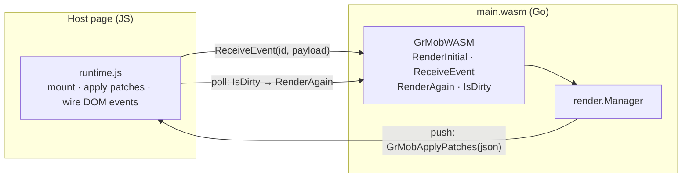

# WebAssembly

The WASM target runs the same app in a browser: Go (compiled to
WebAssembly) renders and diffs; a small JS runtime applies patches to the
DOM. It is the fastest way to *see* an app during development — no
simulator, instant reload.

## Building

The entry point is the `wasm` package, which mounts a registered app (it
imports the app package for its `init` side effect — edit the import to
switch apps):

```bash
GOOS=js GOARCH=wasm go build -o main.wasm ./wasm
```

Serve `main.wasm` alongside Go's `wasm_exec.js` (from
`$(go env GOROOT)/lib/wasm/`) and a host page.

The repository's own route does both: `./build.sh` writes `wasm/main.wasm`
with `-trimpath -ldflags='-s -w'` and refreshes `wasm/wasm_exec.js` from the
toolchain, and `go run ./serve` hosts `wasm/` on port 8080. Those are the
files the site workflow publishes to
<https://rohanthewiz.github.io/grmob/>, so the local page and the live one
are the same bytes.

The shipped host page (`wasm/index.html`) frames the app in a phone-sized
screen rather than letting it fill the browser window. That changes one
thing for the runtime: a `Scroll` node on a bare page never had to scroll —
the document did — so `grmob-runtime.js` gives it no `overflow`. Inside a
fixed-height screen the page adds the rule itself
(`#app [data-node-type="Scroll"] { flex: 1 1 0; min-height: 0; overflow-y:
auto }`), which is what makes the node the viewport the natives make of it.
A hand-rolled host that constrains the app's height needs the same rule.

The same page shows how an app and its host can share vocabulary the
framework does not define: the tutorial's deep links are a `"route"` host
event in (`GrMobWASM.HostEvent("route", {"lesson": "2.3"})`, sent at boot
and on `hashchange`) and a `"route"` system event out, which the page
catches by wrapping the runtime's `GrMobSystemEvent` before the module is
instantiated and turns into `history.replaceState`. Neither name is known to
`grmob-runtime.js` or to the natives, which is the point — see
`examples/tutorial/deeplink.go`.

## The host-page contract

The Go side registers a `GrMobWASM` global with these functions:

| Function | Purpose |
|---|---|
| `GrMobWASM.RenderInitial()` | Mounts (or re-mounts) the app; returns the full tree JSON. Re-mounting closes the previous manager first, so timers from the old instance can't leak |
| `GrMobWASM.ReceiveEvent(id, payloadJSON)` | Delivers a user event: `payloadJSON` is `{"value": ...}` and the value's type picks the callback kind |
| `GrMobWASM.RenderAgain()` | Re-renders and returns the diff — the polling path |
| `GrMobWASM.IsDirty()` | Whether state changed since the last render — poll this to know when `RenderAgain` is worth calling |
| `GrMobWASM.Shutdown()` | Closes the manager (stopping every hook-owned timer) and lets `main` return, so the module exits and `go.run`'s promise settles. The hot-reload hook — see [Hot reload](#hot-reload) |

And it looks for one global the page provides:

- **`GrMobApplyPatches(patchesJSON)`** — if defined as a function at mount
  time, async state changes (timers, goroutines) are **pushed** to it as
  patch JSON, on the state write's own schedule.

  The shipped `wasm/grmob-runtime.js` always defines it (at page level,
  before the module is instantiated, so the host's startup check finds it),
  so every page on the shipped runtime is on the push path. It is optional
  only in the *protocol* sense: a hand-rolled host may omit it and fall back
  to the `IsDirty` poll, and nothing is lost either way — the manager never
  consumes a diff unless a listener is attached.

  The fallback is a genuine downgrade, not just extra work. The poll rides
  `requestAnimationFrame`, which is fully suspended in a hidden tab, so a
  `UseInterval` clock freezes the moment the tab loses visibility even
  though the Go ticker keeps running. The push channel does not.



Event wiring on the DOM side uses the callback-ID attributes the tree
carries (`data-onclick`, `data-onchange`, `data-ontoggle`): the runtime
listens for interactions, reads the ID, and calls `ReceiveEvent` with it.


**Host events.** The runtime reports host→app traffic that answers no
callback — the audio player's status ticks, and the page's visibility —
through `GrMobWASM.HostEvent(name, payloadJSON)`, which `wasm/main.go`
installs beside `ReceiveEvent`. A page that copies the runtime needs nothing
more: the `"audio"` system event is handled inside `grmob-runtime.js`
(`GrMob.audio`, an `HTMLAudioElement` plus the Media Session API), the
`"lifecycle"` event is reported from `visibilitychange` (visible is
`active`, hidden is `background`; a page has no `inactive`), and consumers'
state writes reach the screen through the push channel. See
[Native — Audio](native.md#audio) and [Native — Lifecycle](native.md#lifecycle)
for the shapes.

### Node types and tags

Which element a node becomes is one table, stated once in Go
(`htmlout/tag.go`) and restated in `grmob-runtime.js` because the runtime is
the side that calls `createElement`. `Text` is a `<span>`, `Button` a
`<button>`, `Image` an ``, `TextArea` a `<textarea>`, the four form
inputs an `<input>`, and every container — `Row`, `Column`, `Card`, `Box`,
`Scroll`, `SafeArea`, `List`, `Modal`, `TabView`, `Spacer`, `CameraView` — a
`<div>`. What distinguishes a `Row` from a `Column` is the flex declarations,
not the element, which is why the runtime keeps the Go type in
`data-node-type` instead of reading it back off the tag.

The two copies are compared by `TestRuntimeTagsMatchGo` in `wasm/verify`, the
same way the `<input>` type table below is, so a row added on one side fails
`go test ./...` until it is added on both.

**One deliberate divergence.** `Fragment` and `Theme` are grouping nodes with
no box of their own, and `htmlout` renders them transparently — their children
land directly in the parent — as do both natives. This runtime boxes them in a
`<div>`, because patches are addressed positionally (`TargetID` is
`"root/1/0"`, resolved against the `data-node-path` attributes written while
walking `node.Children`), so its DOM has to stay isomorphic to the node tree.
The cost is real: inside a flex parent that `<div>` becomes the single flex
item and swallows the gap and alignment meant for the children. Closing it
means teaching the addressing scheme about nodes with no element. The
divergence is named in `htmlout/tag.go` and pinned by the same test, so it
reads as a decision rather than as drift.

### Stack containers

A `<div>` is block flow. Both natives have no such mode — a Compose
`Row`/`Column` and a SwiftUI `HStack`/`VStack` are stacks by construction, and
`Box`, `Card`, `Scroll`, `SafeArea` and `List` all route through one of them —
so a DOM target either opts into the same default or diverges from the other
two. Block flow runs inline children together on one line (`Text` is a
`<span>`) and ignores `gap`, `justify-content` and `align-items` outright.

`htmlout/stack.go` is the authority. `stackAxisFor` answers both halves of the
question at once — whether a type stacks, and along which axis — so `Row` maps
to `row` and `Column`, `Card`, `Box`, `Scroll`, `SafeArea`, `List` and
`TabView` to `column`. A type outside the table becomes a flex container only
if its own `Style` asks, which is what keeps a `Text` carrying `Align` in its
ordinary text role from being turned into a container by its own alignment.

`Modal` and `Spacer` are absent on purpose: `Modal` carries a fixed-overlay
chassis that sets `display` itself and toggles it through the `visible` prop,
and `Spacer` is a sized void with no children.

`TabView` was absent too, on the weaker grounds that neither web target had
ever defaulted it to flex and leaving it out kept the two agreeing — but they
were agreeing on the wrong layout, since both natives build it from a vertical
stack (a Compose `Column` around a `TabRow`, a SwiftUI `VStack` around a
hand-rolled bar). Its row states that axis, and `mobile/verify`'s
`TestNativeTabViewIsAColumnStack` holds the claim against the two renderers.
What goes *inside* that stack is the next section.

### Tab views

`core.TabView`'s wire contract is four things: a `tabs` prop (label/icon
pairs), a controlled `selectedIndex`, an optional `onTabChange` callback ID,
and one child per page. Both natives consume all four — `Renderer.kt` draws a
Material `TabRow` above the selected page, `Renderer.swift` a hand-rolled bar
above the same. The two DOM targets read *none* of them until recently: a
`TabView` was a bare box holding every page at once, with no bar and no way to
switch, so an app whose navigation is a `TabView` had no navigation at all on
the web and its screens stacked one under the other.

Both now draw the bar and hide the unselected pages. `buildTabBar` and
`syncTabView` are this runtime's half; `htmlout/tabview.go` is the exporter's,
and carries the shared reasoning. The chrome is authored twice rather than
shared, exactly as the `Modal` chassis is — a declaration list is a Go string
on one side and a property object on the other — with
`TestRuntimeDrawsTheSameTabChrome` pinning the half that is a contract rather
than a look: the roles, the ARIA state and the `data-` attributes.

```html
<div data-node-type="TabView" data-node-path="root/1" style="display:flex; flex-direction:column">
  <div data-grmob-chrome="tabbar" role="tablist" data-ontabchange="int_cb_0">
    <button type="button" id="grmob-root-1-tab-0" role="tab" aria-selected="true"
            data-tab-index="0" aria-controls="grmob-root-1-panel-0">Home</button>
    <button type="button" id="grmob-root-1-tab-1" role="tab" aria-selected="false"
            data-tab-index="1" aria-controls="grmob-root-1-panel-1">Search</button>
  </div>
  <div data-node-path="root/1/0" id="grmob-root-1-panel-0"
       role="tabpanel" aria-labelledby="grmob-root-1-tab-0">…</div>   <!-- the selected page -->
  <div data-node-path="root/1/1" id="grmob-root-1-panel-1"
       role="tabpanel" aria-labelledby="grmob-root-1-tab-1" style="…; display:none">…</div>
</div>
```

**The tabs and the pages point at each other.** A `role="tablist"` of
`role="tab"`s is a well-formed strip on its own, but it says nothing about
*which region of the screen* each tab governs. That relationship is
`aria-controls` and `aria-labelledby`, both of which are IDREFs, so the wiring
cannot be expressed without ids — and ids are document-global, so two
`TabView`s on one page must not both call their first tab `tab-0`.

The scope is therefore derived from the node path, the identity that is already
unique per element here: a `TabView` at `root/1` names its first tab
`grmob-root-1-tab-0` and its first page `grmob-root-1-panel-0`. The uniqueness
is exactly the uniqueness this runtime's addressing already rests on — if two
live elements could share a `data-node-path`, every patch aimed at either is
already going to the wrong one. Deriving it this way also makes the ids the
*same strings* `htmlout` writes rather than merely the same shape, so the
contract the two web targets share is the literal id.

A page opts out of being a panel five ways, each a case where wiring it would
say something false:

| The page… | Why it is left alone |
|---|---|
| has no tab at its index | a `tabpanel` outside a tab set, with nothing for the `aria-controls` to sit on |
| renders as an element that already has a role (`<button>`, ``, `<input>`) | `role="tabpanel"` would *replace* the role the browser gave it — see `GENERIC_TAGS`, pinned to Go's `genericTags` by `TestRuntimeGenericTagsMatchGo` |
| carries a `core.AccessibilityRole` | the author already said what it is, and the same theft applies |
| is a node type that states its own role (a `Modal` is a `dialog`) | the same theft, one layer down — and the attribute has one slot |
| is `AccessibilityHidden` | the author severed the relationship on purpose |

The role case shares one attribute between several writers — the author's
`core.AccessibilityRole`, a `Modal`'s own chassis, and this wiring — so the
runtime tells them apart by value: `tabpanel` is not one of `core.Role`'s
spellings and is not a chassis role, so an element carrying it got it from the
wiring and nothing else ever did. That is
what lets the sync clear its own mark without clearing the author's, and it is
pinned by `TestNoRoleCollidesWithTheTabPanelWiring`.

In each case the tab drops its `aria-controls` too: a dangling IDREF — a tab
announcing a region that is not there — is worse than a tab that has simply not
said what it governs. And `aria-labelledby` is omitted from a page carrying its
own `AccessibilityLabel`, because the reference wins over `aria-label` in the
accessible-name calculation and would silently discard the name the app author
chose.

`htmlout` applies the same three rules and asks one more question this runtime
does not have to: *which* element stands in for the page. It drops the box for
a `Fragment` or a `Theme` (see the tag table's exemption below), so a page that
is one of those is wired on the single element standing in for it, or not at
all when there are several. Here page *i* is always exactly the element in
child slot *i*.

**The bar is chrome, not a node.** It carries no `data-node-path`, no patch is
ever addressed to it, and it is marked `data-grmob-chrome` so the two places
that turn a *node* child index into a *DOM* child index can skip it
(`chromeOffset`, read by the `add` and `add-child` patches). Chrome always
precedes the node children, which keeps that conversion a fixed offset rather
than a search — and is the order a screen reader wants anyway. It is the same
trick a `TextGrid` row's runs use, one step harder: those spans sit under a
node with no children of its own, so nothing ever had to count past them.

**The pages are hidden, not dropped**, which is where the two DOM targets both
differ from the natives. This runtime cannot drop a page: `TargetID`s are
positional, so its DOM has to stay isomorphic to the node tree. `htmlout`
could — it is a static snapshot with no patches to address — but an export
that silently lost every screen but one would be a worse document, and a
divergence between the two web targets for no gain.

**The selection is derived state**, and so is the wiring. `syncTabView`
recomputes both, and `patch()`
calls it once per batch for every `TabView` the batch could have disturbed,
rather than teaching each patch case about tabs. Three different patches
invalidate it: an `update-props` carrying a new `selectedIndex` (which is what
a tab switch *is* — `core.SelectedIndex` is controlled state, so the switch
arrives as a prop patch and never as a rebuilt subtree), an `update-style` on a
page (`styleFromGrMob` is total, so it assigns a `display` on every pass and
overwrites the hiding), and
an `add`/`remove`/`replace` that changes which children there are. Every one of
those can invalidate the panel wiring as well — a style patch can set
`AccessibilityHidden`, a props patch can shrink the `tabs` strip out from under
a page, a `replace` can swap a `<div>` page for a `<button>` — which is why the
wiring rides on the same pass rather than growing a mechanism of its own. It is
written *or removed* on every sync, for the reason `styleFromGrMob` is total: a
guarded write would leave a role and a dangling reference standing after the
reason for them was gone. Nothing paints in between: a batch is one synchronous
run. Restoring a page means
putting back the `display` the style pass computed, not clearing the
declaration — hence `data-base-display`, recorded wherever this runtime decides
one; a `Column` page cleared to `""` would come back in block flow.

Three things are deliberately not done. A panel is not given a **`tabindex`**,
which the ARIA authoring practices suggest for a panel containing nothing
focusable: `tabindex` changes the page's real tab order, which is a behavioral
change to an app author's node rather than a statement about it, and this pass
is deliberately semantic only. The **icon** half of a `core.TabItem` is
drawn by no target (Compose's `Tab` is built with `text = { Text(label) }`, the
SwiftUI bar with a `Text` of the label), so drawing it here would make the web
the outlier rather than close a gap. And an **out-of-range `selectedIndex`** is
not clamped: it selects no tab and shows no page, which is what
`children.indices.contains` in Swift and `getOrNull` in Kotlin do for the page,
and what the Swift bar's plain `i == selected` does for the indicator.

Both DOM renderers read the table twice, and the second read is the
non-obvious one. The first plants the default on the element as it is built
(`createElement`, `renderNode`). The second restates it while serializing the
`Style` (`styleFromGrMob`, `styleValue`), because those functions are *total*:
an update-style patch carries the whole new `Style`, so a `display` they do
not write is a `display` they erase. A runtime that read the table only when
building would stack a container until its first style patch and then drop it
into block flow. `TestRuntimeStackAxesMatchGo` compares the tables and
`TestRuntimeAppliesTheStackDefault` pins both reads.

`Fragment` and `Theme` are the one exemption, the same one the tag table
makes: this runtime boxes them in real `<div>`s to keep positional patch
addressing valid, and a box that were not a stack would swallow its parent's
layout like any other block-flow div. `htmlout` emits no element for them at
all, so its table has no such rows.

### Form controls

Four Go node types share the `<input>` tag, so the runtime writes a `type`
attribute to tell them apart — the only thing that makes a checkbox draw as a
checkbox rather than a text box:

| Node type | Rendered as | State prop |
|---|---|---|
| `Input` | `<input type="text">` | `value` |
| `InputPassword` | `<input type="password">` | `value` |
| `NumericInput` | `<input type="number">` | `value` |
| `Checkbox` | `<input type="checkbox">` | `checked` |
| `TextArea` | `<textarea>` | `value`, `rows` |

Go states that table once, in `htmlout/inputtype.go`; the runtime restates it
in JavaScript because it is the side that actually sets the attribute and
cannot call into Go to ask. The two are not kept in step by hand — a Go test
in `wasm/verify` parses the runtime's literal out of `grmob-runtime.js` and
compares it against `htmlout.InputTypes()`, so a change to either side fails
`go test ./...` until it is made to both.

All of the runtime's lookup tables — tags, `<input>` types, the `object-fit`
and `text-align` values below, and the cross-axis pair that follows them — are
parsed by the same helper, which is why they are written in the same shape: a
flat object literal in a named function, subscripted by that function's own
argument, with a `|| "<fallback>"` default that the parse checks too.

### Image content modes

`core.ContentMode` maps onto CSS `object-fit`: `fit` → `contain`, `fill` →
`cover`, `stretch` → `fill`, `center` → `none`. `htmlout/objectfit.go` is the
authority and `TestRuntimeObjectFitsMatchGo` pins the runtime's copy to it.

Go's table holds the bare value rather than the whole declaration, because
that is the half the two sides share: `htmlout` joins `object-fit:` onto it
for a style attribute, the runtime assigns it to `el.style.objectFit`.

An absent or unrecognized mode yields `""`, and the runtime assigns that,
**clearing** the property — which is what a patch removing an Image's
`contentMode` needs, so the image falls back to the browser's default instead
of keeping the last mode it was handed.

Coverage is checkable here in a way the tag table's is not: `ContentMode` is a
named type with four declared constants, and `core.ContentModes()` — itself
pinned to that `const` block by a test that reads the file's syntax tree —
gives `TestObjectFitsCoversEveryContentMode` a list to check against. The tag
table has no equivalent, because node types are string literals scattered
across core's construction sites.

That same list now holds all four renderers, not just this pair. The natives
map `ContentMode` onto SwiftUI and Compose vocabularies with no CSS in them, so
they cannot be compared as tables; `mobile/verify/contentmode_test.go` reads
their `switch`/`when` arms out of the source and checks coverage alone. See
[Native platforms](native.md#contentmode-on-image). (`replay_test.mjs` holds a third
copy on purpose: a conformance test has to state the rule independently, or
it only proves the implementation agrees with itself.)

### Text alignment

`core.Alignment` maps onto CSS `text-align`: `start` → `start`, `center` →
`center`, `end` → `end`, `justify` → `justify`. `htmlout/textalign.go` is the
authority and `TestRuntimeTextAlignsMatchGo` pins the runtime's copy to it.

This was the first table added to **close** a gap rather than to pin a copy
that already existed (the cross-axis pair below is the second). Until it did,
this runtime did not read `style.Align` at all, in any form — so every
`core.Align` on the web target was silently dropped, while `htmlout` emitted a
declaration for three of the six values and both natives set one. Four
renderers, three behaviors, and one of them was "nothing".

Only four of the six `Alignment`s are in the table. `AlignStretch` and
`AlignBaseline` name a cross-axis placement rather than a text alignment, and
CSS `text-align` has no such keyword; they reach the property through
`Style.Align`'s *other* role — the fallback a vertical-stacking container
reads when `AlignItems` is unset, the next section's table — and fall through
to `""`, which clears it.
`core.TextAlignments()` is the list that says so, and both natives are held to
the same one (see [Native platforms](native.md#alignment-justifycontent-and-alignitems)).

`start` and `end` are CSS's direction-aware keywords, matching the spelling
both natives use (SwiftUI `.leading`/`.trailing`, Compose
`TextAlign.Start`/`.End`). The exporter originally emitted the physical
`left`/`right`, which rendered identically in LTR documents but left-aligned
in RTL locales while both natives trailing-aligned — from the same
`core.AlignStart`. No table comparison can see which spelling is right: the
two DOM copies agree with each other under either one, so the choice lives in
`htmlout/textalign.go`'s doc and here, not in a test. The table maps every
text alignment to itself, but it still earns its keep as a filter — the
identity must not extend to the two cross-axis values.

`justify-content` and `align-items` themselves need no table. Core's spellings
*are* the CSS ones, so both DOM renderers pass them through verbatim and
neither can be wrong about a value it never interprets.

### The cross-axis fallback

`Style.Align`'s second role has a pair of tables of its own, and they closed
the last alignment behavior the DOM pair did not share with the natives. When
`AlignItems` is unset on a vertical-stacking container — `Column`, `Card`,
`Box`, `SafeArea` or `List` — both natives fall back to `Align` for
cross-axis placement
(`crossAxisValue` in `Renderer.swift`, the `alignItems.ifEmpty { align }`
reads in `Renderer.kt`), and until these tables existed neither DOM target
did: `Align: "center"` centered the children on device and only the *text* on
the web, and `Align: "stretch"` filled rows on device while the web agreed
only wherever block flow happened to produce the same picture.

`htmlout/crossaxis.go` is the authority for both halves. `crossAxisAlignFor`
maps the four cross-axis `Alignment`s onto the `AlignItems` spellings
(`start` → `flex-start`, and so on), because the fallback means "behave as if
that `AlignItems` had been set" — its census holds the values to exactly
`core.AlignItemsValues()`. `alignFallbackAxisFor` is the gate saying which
node types consult the fallback at all: exactly the containers the natives
read it for, and pointedly not `Row`, whose vertical cross axis `Align` has
never applied to on any target. `Box` and `SafeArea` joined the gate when the
natives stopped drawing them as overlays and started routing them through
their `Column` path, which is where the fallback is read. `TestRuntimeCrossAxisAlignsMatchGo`
and `TestRuntimeAlignFallbackAxesMatchGo` pin the runtime's copies, and a
source pin holds `styleFromGrMob` to actually reading them, with `AlignItems`
taking precedence.

`justify` and `baseline` have no rows. No native cross-axis dispatch answers
for either (`baseline` falls through to start-packing), so a row — and CSS
`align-items` genuinely has a `baseline` keyword someone could be tempted to
"complete" the table with — would move two targets out of four.

`checked` and `rows` are set as element *properties*, not attributes. A
`checked` attribute is only the control's default state — the browser stops
consulting it the moment the user touches the box — and the live property is
what Go is describing. `rows` is limited to positive numbers in the DOM, so
a non-positive count leaves the browser's own default rather than being
assigned; `core.TextArea` always supplies a positive one.

## Testing without a browser

`wasm/verify/run.sh` is the WASM analog of `ios/verify`, and needs only Go
and Node — no npm, no lockfile, no `node_modules`, no network.

It does two things. `gen.go` drives real example apps through
`render.Manager` and records the initial tree, every patch batch, and the
final tree; Node then mounts that transcript through the **actual**
`wasm/grmob-runtime.js` (loaded with `node:vm` against a minimal DOM in
`dom.mjs`), applies the batches, walks the resulting DOM back into a tree and
compares it with Go's final render. Alongside it, unit tests cover the
per-element logic no transcript reaches — the return key's Enter filter, the
void envelope it sends, `enterkeyhint`, the form-control types and state
above, and the focus command's frame deferral and epoch guard.

What it cannot answer is anything that needs real rendering: whether
`enterkeyhint` actually relabels a soft keyboard, whether `focus()` opens
one, or anything about layout. Those still need a browser, exactly as the
iOS view layer still needs a simulator.

```
$ sh wasm/verify/run.sh
..................................
```

## Hot reload

`go run ./serve -dev` is the edit loop with the manual steps removed. It runs
`./build.sh` at startup and again whenever a Go file in `./wasm`'s build graph
changes, then swaps the new `main.wasm` into every open page **without a page
load**. A compile error appears as an overlay on top of the still-running
previous build and clears on the next good one. An edit to the host files
(`index.html`, the runtime JS) is a plain page reload, because the runtime
cannot be swapped under a mounted tree.

```
editor saves a .go file
   │
   ▼  (poll, 250 ms; the file set is `go list -deps ./wasm`, re-read after every build)
serve -dev ──▶ ./build.sh ──▶ wasm/main.wasm
   │                 │
   │                 └─ error ──▶ SSE "buildfail" ──▶ overlay on the page
   ▼
SSE "reload" ──▶ page: GrMobWASM.Shutdown()     stop the old module, let it exit
                       GrMobHost.boot()         fetch + instantiate the new one
                       route + scroll replay    same lesson, same place
```

The pieces, and where each lives:

| Piece | Where | Role |
|---|---|---|
| `GrMobWASM.Shutdown` | `wasm/main.go` | closes the `render.Manager` (which closes the context tree and every ticker on it) and releases `main`, so the runtime calls `wasmExit` and the old instance can be collected |
| `GrMobHost.boot` | `wasm/index.html` | the page's own boot, made re-callable; resolves to `{go, exited}` so a caller can await the old module's actual exit before starting the next |
| the watcher, the build, the event stream | `serve/dev.go` | zero dependencies — polling stats, `sh build.sh`, server-sent events |
| the client | `serve/devclient.js` | injected at `</body>` only in dev; the shipped page never carries it |

**What survives a swap is decided by where the state lives.** Go-side state —
every `NewState` slot, the navigation stack, a half-typed input — is heap
memory of the module being discarded, and a WebAssembly heap cannot be
carried across two instances. What survives is state with a representation
*outside* the module: the lesson, because the tutorial reports it to the page
as a `"route"` system event and accepts it back as a host event
([deep links](#the-host-page-contract) above), and the scroll offsets, because
the client reads them off the `Scroll` nodes by path before the swap and
writes them back after. An app that wants more of itself to survive a reload
has exactly that tool, and nothing framework-specific: report it, accept it.

**Why hook slots are not replayed.** The obvious next step — snapshot every
context's slots as JSON before the swap and re-seed them positionally after —
is the mechanism React Fast Refresh and Flutter's hot reload rest on, and it
is deliberately not done here. Slots are addressed by position in call order;
the edit that prompted the reload is precisely the kind of change that
reorders, adds or retypes them, and a stale value landing in the wrong slot
is the same class of failure debug mode's cursor-drift check exists to catch
— an `interface conversion` panic, or worse, a wrong value that renders
plausibly. Flutter can do it because it keeps the heap and patches code; React
can because it re-runs hooks against a preserved fiber and resets on any
signature change. Neither condition holds for a fresh WASM instance. A safe
version would need each hook kind to declare a serializable form, a typed
guard on restore, and a reset on any shape mismatch, which is a design in its
own right; the route/host-event pair covers the case that matters for the
tutorial today.

**Why only WASM.** The natives are a `gomobile bind` product — a `.aar` or
`.xcframework` linked into a host app. Replacing Go code in a running process
would mean loading a second Go runtime into it (the c-shared build cannot be
unloaded, and two runtimes in one process is unsupported), and iOS forbids
loading code at all outside the simulator. The realistic native loop is
rebuild-and-relaunch, and the framework's answer to "see the change now" is
this target: the same `render.Manager`, the same app, in a browser. That is
what the [same engine, same rules](#same-engine-same-rules) claim below is for.

Two details of the swap are worth knowing if you copy the page. `wasm_exec.js`
leaves the runtime's pending scheduler wake-up armed after exit, and when it
fires on an exited program it throws into the console; the client disarms it
(a private field, guarded, so a rename costs one console line per reload and
nothing else). And `Shutdown` runs to completion inside the call that delivered
it — on js/wasm goroutines are scheduled cooperatively inside `resume()`, so
`main` has returned before the call comes back — but the client awaits
`go.run`'s promise rather than relying on that, because it is a property of the
scheduler, not of the contract.

## Permissions

Hardware permission requests (camera, microphone, geolocation) route through
an optional `GrMobRequestPermission(name, callback)` page global, letting
the host page bridge to browser permission APIs.

## Same engine, same rules

The WASM runtime drives the very same `render.Manager` the native shells
use — pass boundaries, callback purging, and [debug mode](../concepts/debug-mode.md)
all behave identically. An app that runs clean in the browser preview is
running the same Go code it will run on the phone; only the renderer
differs.

## Text grids

`core.TextGrid` is a `<pre>` of row `<div>`s, each holding one `<span>` per
run. A row's spans are rebuilt whole from its `runs` prop on every patch to
that row and live outside the node tree (no `data-node-path`), so replacing
them never disturbs positional addressing. Dim has no CSS spelling and is
drawn as `opacity:0.6`; the same rules produce htmlout's export.

White space is handled at three levels, and each says something different:

| level | declaration | why |
| --- | --- | --- |
| grid | `white-space: normal` | overrides the `<pre>` default, so the newlines and indentation *between* row elements are formatting, not content |
| row | `white-space: nowrap` | a code line or a terminal row is one line, and must not break between two runs |
| run | `white-space: pre` | a run's own spaces are the only white space in a grid that means anything |

Pushing the significance down to the run is what makes a grid indifferent to
how the markup around it is laid out. `htmlout` re-indents its output for
human readers, and a `white-space: pre` grid read that indentation as text —
every row gained a trailing line break and the grid gained a blank line
between each pair of rows. The exporter has one further wrinkle this runtime
does not: its formatter discards text nodes that are entirely white space, so
a run made only of spaces (an indent, the gap between two coloured tokens, a
terminal's blank cells) is written as `&#32;` character references.
